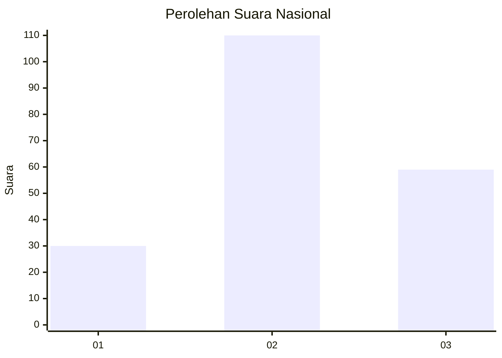
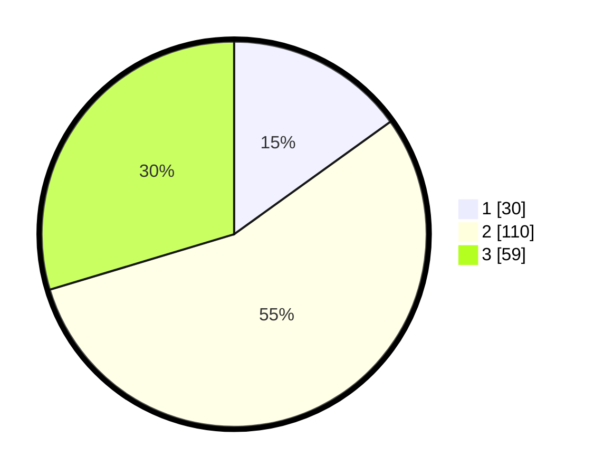

# Hasil

## Grafik

## Tabel

| No. | Nama Paslon    | Suara | Suara (raw) | Persentase |
|:--- |:-------------- | -----:| -----------:| ----------:|
| 1   | ANIES MUHAIMIN | 30    | [30][p-1]   | 15,08      |
| 2   | PRABOWO GIBRAN | 110   | [110][p-2]  | 55,28      |
| 3   | GANJAR MAHFUD  | 59    | [59][p-3]   | 29,65      |

[p-1]: https://github.com/gigit-pemilu/pemilu-2024/blob/main/pilpres/hitung-suara/sub/34-di-yogyakarta/sub/02-bantul/sub/08-bantul/sub/2004-trirenggo/sub/003-tps/sub/paslon-1.txt
[p-2]: https://github.com/gigit-pemilu/pemilu-2024/blob/main/pilpres/hitung-suara/sub/34-di-yogyakarta/sub/02-bantul/sub/08-bantul/sub/2004-trirenggo/sub/003-tps/sub/paslon-2.txt
[p-3]: https://github.com/gigit-pemilu/pemilu-2024/blob/main/pilpres/hitung-suara/sub/34-di-yogyakarta/sub/02-bantul/sub/08-bantul/sub/2004-trirenggo/sub/003-tps/sub/paslon-3.txt

## Foto C Plano

https://sirekap-obj-formc.kpu.go.id/8b71/pemilu/ppwp/34/02/08/20/04/3402082004003-20240221-225356--f1443f5a-4aa9-4cec-afa0-904c70eddff3.jpg

https://sirekap-obj-formc.kpu.go.id/8b71/pemilu/ppwp/34/02/08/20/04/3402082004003-20240221-224918--a4a8208a-005f-4180-b89e-82774f3e726d.jpg

https://sirekap-obj-formc.kpu.go.id/8b71/pemilu/ppwp/34/02/08/20/04/3402082004003-20240221-225427--1869944a-8098-4102-8f80-e7dad2c264d3.jpg

## Metadata

| Key        | Value               |
| ---------- | ------------------- |
| Time Stamp | 2024-02-22 09:00:00 |

