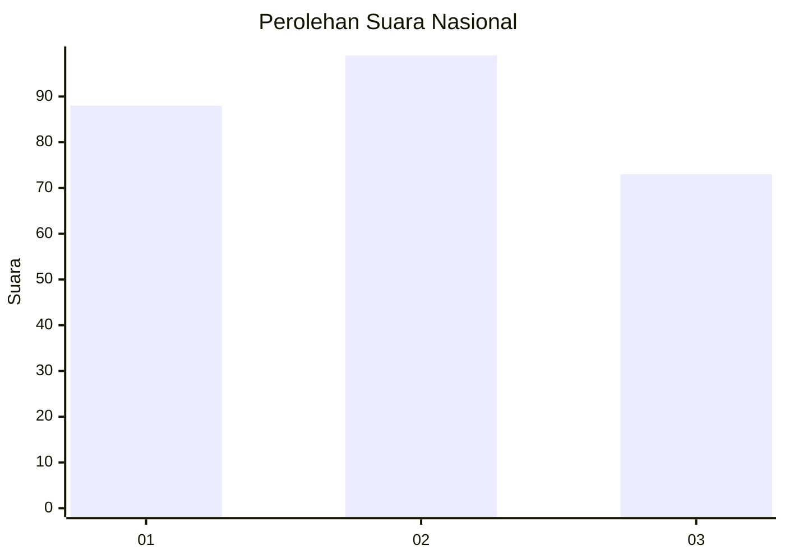
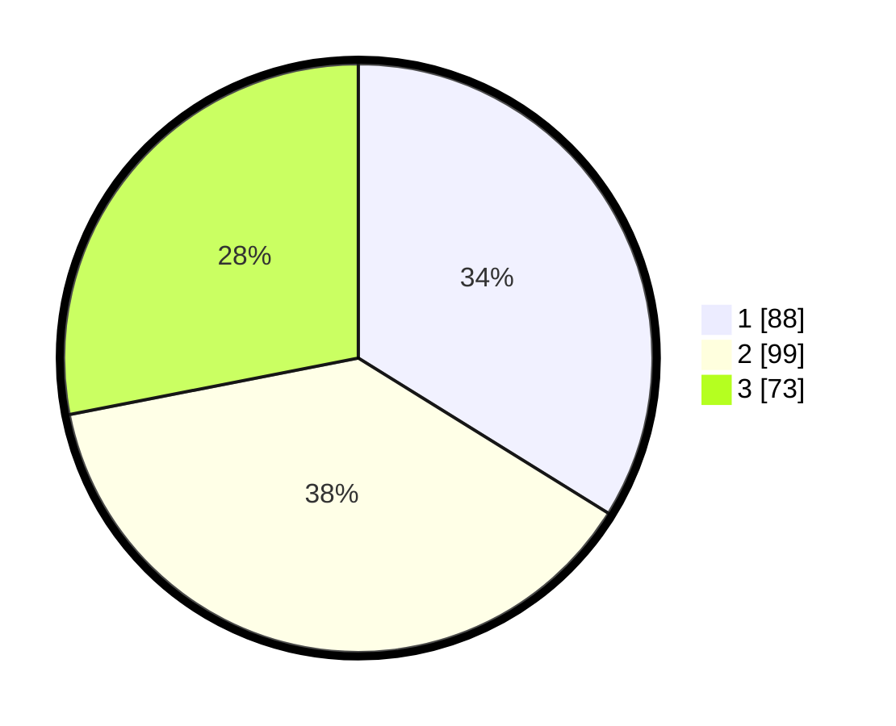

# Hasil

## Grafik

## Tabel

| No. | Nama Paslon    | Suara | Suara (raw) | Persentase |
|:--- |:-------------- | -----:| -----------:| ----------:|
| 1   | ANIES MUHAIMIN | 88    | [88][p-1]   | 33,85      |
| 2   | PRABOWO GIBRAN | 99    | [99][p-2]   | 38,08      |
| 3   | GANJAR MAHFUD  | 73    | [73][p-3]   | 28,08      |

[p-1]: https://github.com/gigit-pemilu/pemilu-2024/blob/main/pilpres/hitung-suara/sub/34-di-yogyakarta/sub/02-bantul/sub/08-bantul/sub/2004-trirenggo/sub/004-tps/sub/paslon-1.txt
[p-2]: https://github.com/gigit-pemilu/pemilu-2024/blob/main/pilpres/hitung-suara/sub/34-di-yogyakarta/sub/02-bantul/sub/08-bantul/sub/2004-trirenggo/sub/004-tps/sub/paslon-2.txt
[p-3]: https://github.com/gigit-pemilu/pemilu-2024/blob/main/pilpres/hitung-suara/sub/34-di-yogyakarta/sub/02-bantul/sub/08-bantul/sub/2004-trirenggo/sub/004-tps/sub/paslon-3.txt

## Foto C Plano

https://sirekap-obj-formc.kpu.go.id/fbe4/pemilu/ppwp/34/02/08/20/04/3402082004004-20240215-012108--a59ec3e3-11ee-4e75-b8b2-77321604154a.jpg

https://sirekap-obj-formc.kpu.go.id/fbe4/pemilu/ppwp/34/02/08/20/04/3402082004004-20240215-012152--9f57f462-2a75-4a16-9cd9-d48929c693a9.jpg

https://sirekap-obj-formc.kpu.go.id/fbe4/pemilu/ppwp/34/02/08/20/04/3402082004004-20240215-012248--a0787128-a6de-4986-9d64-00912659b747.jpg

## Metadata

| Key        | Value               |
| ---------- | ------------------- |
| Time Stamp | 2024-02-24 22:31:28 |

