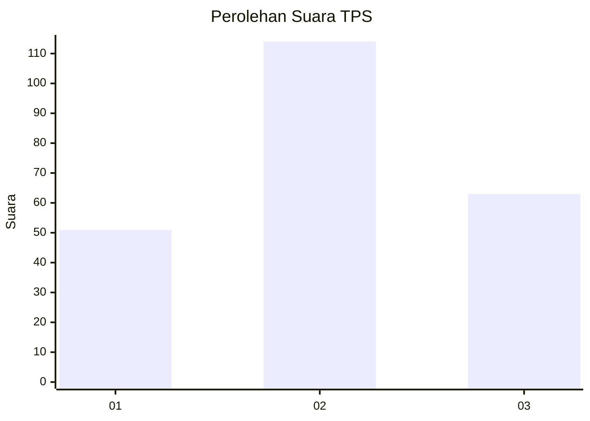
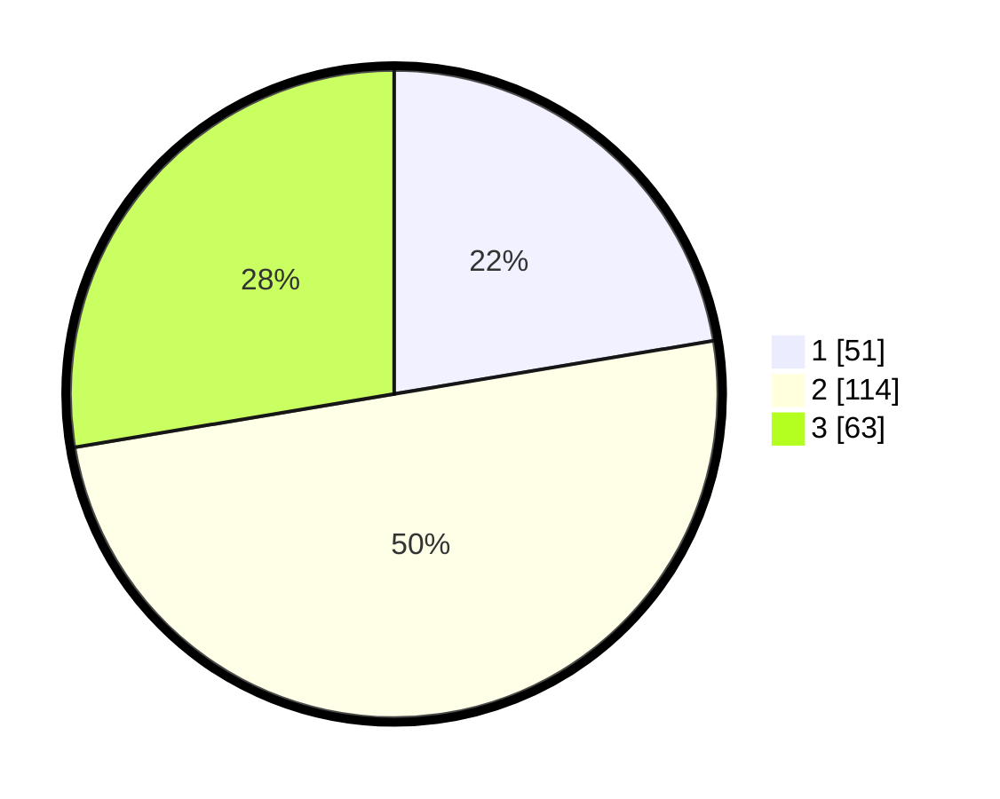

# Hasil

## Grafik

## Tabel

| No. | Nama Paslon    | Suara | Suara (raw) | Persentase |
|:--- |:-------------- | -----:| -----------:| ----------:|
| 1   | ANIES MUHAIMIN | 51    | [51][p-1]   | 22,37      |
| 2   | PRABOWO GIBRAN | 114   | [114][p-2]  | 50,00      |
| 3   | GANJAR MAHFUD  | 63    | [63][p-3]   | 27,63      |

[p-1]: https://github.com/gigit-pemilu/pemilu-2024-34-di-yogyakarta/blob/main/pilpres/hitung-suara/sub/34-di-yogyakarta/sub/02-bantul/sub/08-bantul/sub/2004-trirenggo/sub/005-tps/sub/paslon-1.txt
[p-2]: https://github.com/gigit-pemilu/pemilu-2024-34-di-yogyakarta/blob/main/pilpres/hitung-suara/sub/34-di-yogyakarta/sub/02-bantul/sub/08-bantul/sub/2004-trirenggo/sub/005-tps/sub/paslon-2.txt
[p-3]: https://github.com/gigit-pemilu/pemilu-2024-34-di-yogyakarta/blob/main/pilpres/hitung-suara/sub/34-di-yogyakarta/sub/02-bantul/sub/08-bantul/sub/2004-trirenggo/sub/005-tps/sub/paslon-3.txt

## Foto C Plano

https://sirekap-obj-formc.kpu.go.id/67a9/pemilu/ppwp/34/02/08/20/04/3402082004005-20240214-215557--d9a4fe42-74cc-4bc9-89d3-68c3ca87fb5b.jpg

https://sirekap-obj-formc.kpu.go.id/67a9/pemilu/ppwp/34/02/08/20/04/3402082004005-20240214-210011--2da44c95-cdcd-41fe-be1e-2ee54efc2a88.jpg

https://sirekap-obj-formc.kpu.go.id/67a9/pemilu/ppwp/34/02/08/20/04/3402082004005-20240214-215832--274efabf-a169-452c-9b20-d54170a4bc2c.jpg

## Metadata

| Key        | Value               |
| ---------- | ------------------- |
| Time Stamp | 2024-02-15 00:41:44 |

