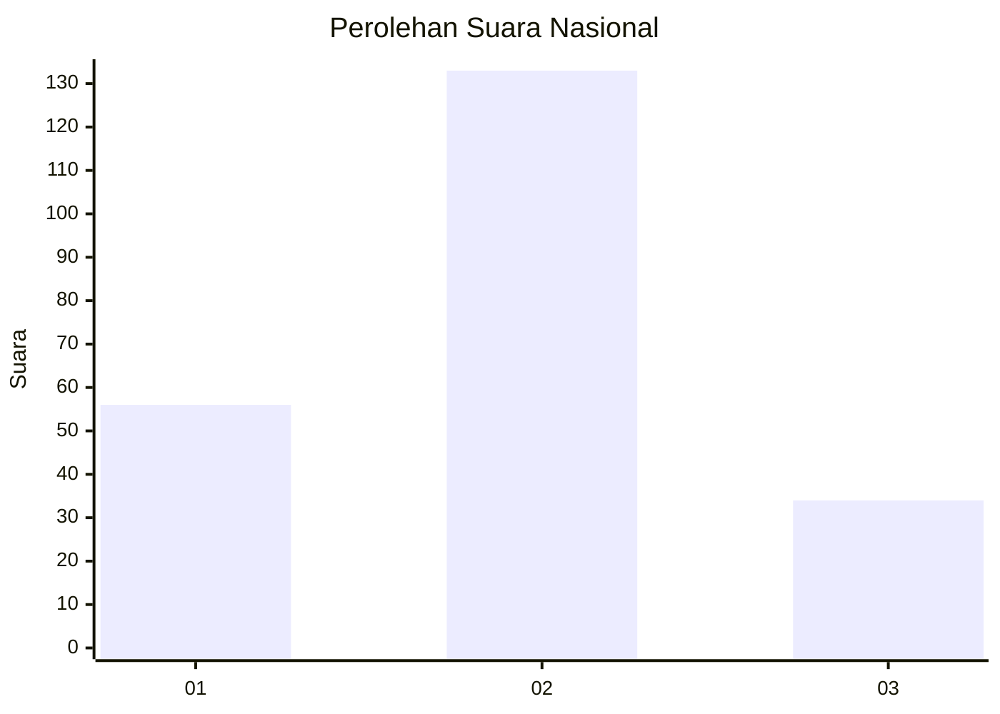

# Hasil

## Grafik

## Tabel

| No. | Nama Paslon    | Suara | Suara (raw) | Persentase |
|:--- |:-------------- | -----:| -----------:| ----------:|
| 1   | ANIES MUHAIMIN | 56    | [56][p-1]   | 25,11      |
| 2   | PRABOWO GIBRAN | 133   | [133][p-2]  | 59,64      |
| 3   | GANJAR MAHFUD  | 34    | [34][p-3]   | 15,25      |

[p-1]: https://github.com/gigit-pemilu/pemilu-2024/blob/main/pilpres/hitung-suara/sub/34-di-yogyakarta/sub/02-bantul/sub/08-bantul/sub/2004-trirenggo/sub/006-tps/sub/paslon-1.txt
[p-2]: https://github.com/gigit-pemilu/pemilu-2024/blob/main/pilpres/hitung-suara/sub/34-di-yogyakarta/sub/02-bantul/sub/08-bantul/sub/2004-trirenggo/sub/006-tps/sub/paslon-2.txt
[p-3]: https://github.com/gigit-pemilu/pemilu-2024/blob/main/pilpres/hitung-suara/sub/34-di-yogyakarta/sub/02-bantul/sub/08-bantul/sub/2004-trirenggo/sub/006-tps/sub/paslon-3.txt

## Foto C Plano

https://sirekap-obj-formc.kpu.go.id/31cf/pemilu/ppwp/34/02/08/20/04/3402082004006-20240215-010700--3ab17f3f-a0c2-41f3-b673-1ef5a3b9329d.jpg

https://sirekap-obj-formc.kpu.go.id/31cf/pemilu/ppwp/34/02/08/20/04/3402082004006-20240215-010801--e353080e-f99b-4e6f-bc69-a1ee7067ff2d.jpg

https://sirekap-obj-formc.kpu.go.id/31cf/pemilu/ppwp/34/02/08/20/04/3402082004006-20240214-205733--fca1000c-2bd9-4169-ac3c-96ee0a7fc34a.jpg

## Metadata

| Key        | Value               |
| ---------- | ------------------- |
| Time Stamp | 2024-02-24 22:31:28 |

