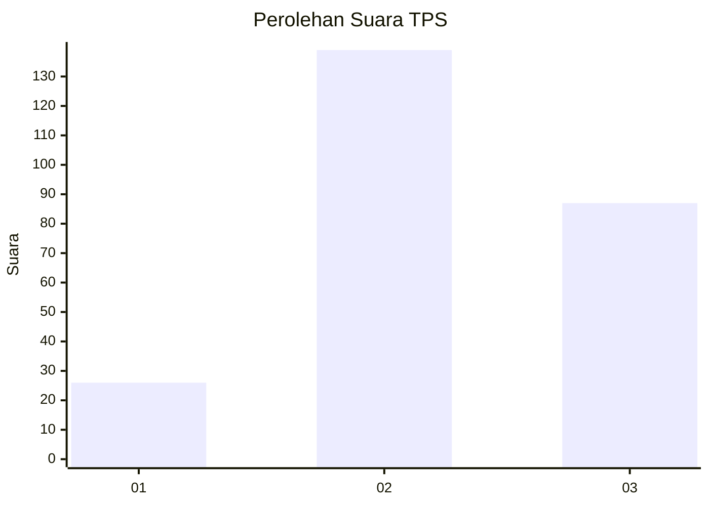
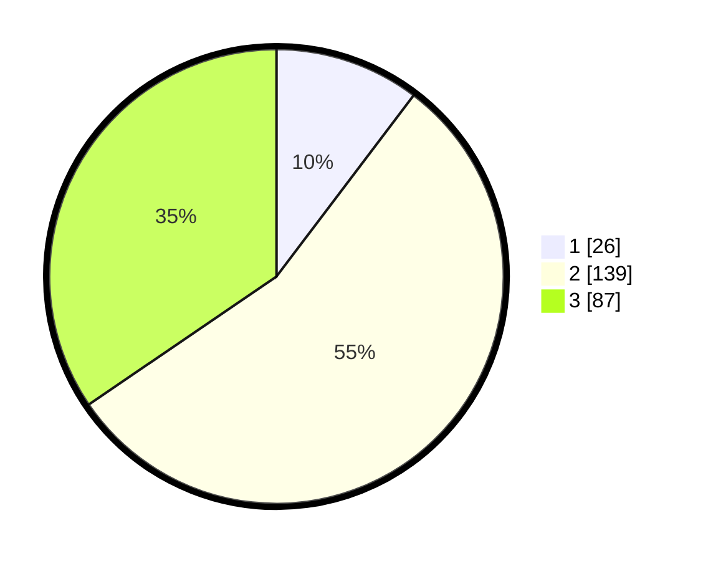

# Hasil

## Grafik

## Tabel

| No. | Nama Paslon    | Suara | Suara (raw) | Persentase |
|:--- |:-------------- | -----:| -----------:| ----------:|
| 1   | ANIES MUHAIMIN | 26    | [26][p-1]   | 10,32      |
| 2   | PRABOWO GIBRAN | 139   | [139][p-2]  | 55,16      |
| 3   | GANJAR MAHFUD  | 87    | [87][p-3]   | 34,52      |

[p-1]: https://github.com/gigit-pemilu/pemilu-2024-34-di-yogyakarta/blob/main/pilpres/hitung-suara/sub/34-di-yogyakarta/sub/02-bantul/sub/08-bantul/sub/2004-trirenggo/sub/009-tps/sub/paslon-1.txt
[p-2]: https://github.com/gigit-pemilu/pemilu-2024-34-di-yogyakarta/blob/main/pilpres/hitung-suara/sub/34-di-yogyakarta/sub/02-bantul/sub/08-bantul/sub/2004-trirenggo/sub/009-tps/sub/paslon-2.txt
[p-3]: https://github.com/gigit-pemilu/pemilu-2024-34-di-yogyakarta/blob/main/pilpres/hitung-suara/sub/34-di-yogyakarta/sub/02-bantul/sub/08-bantul/sub/2004-trirenggo/sub/009-tps/sub/paslon-3.txt

## Foto C Plano

https://sirekap-obj-formc.kpu.go.id/6894/pemilu/ppwp/34/02/08/20/04/3402082004009-20240214-235345--4009ddf6-b612-4fec-8b6e-0320ffc92059.jpg

https://sirekap-obj-formc.kpu.go.id/6894/pemilu/ppwp/34/02/08/20/04/3402082004009-20240214-235426--16b7cc6a-216d-4782-b3c5-262843e53bfb.jpg

https://sirekap-obj-formc.kpu.go.id/6894/pemilu/ppwp/34/02/08/20/04/3402082004009-20240214-235548--480418de-151f-4c51-bee7-6ffdd2f77b3d.jpg

## Metadata

| Key        | Value               |
| ---------- | ------------------- |
| Time Stamp | 2024-02-24 22:31:28 |

