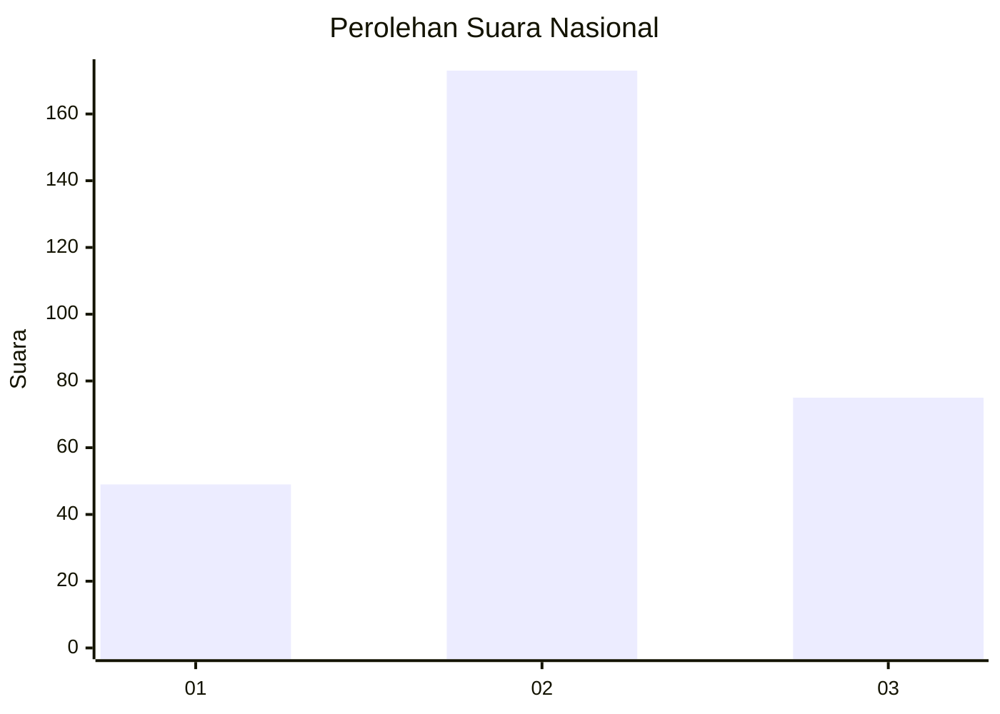
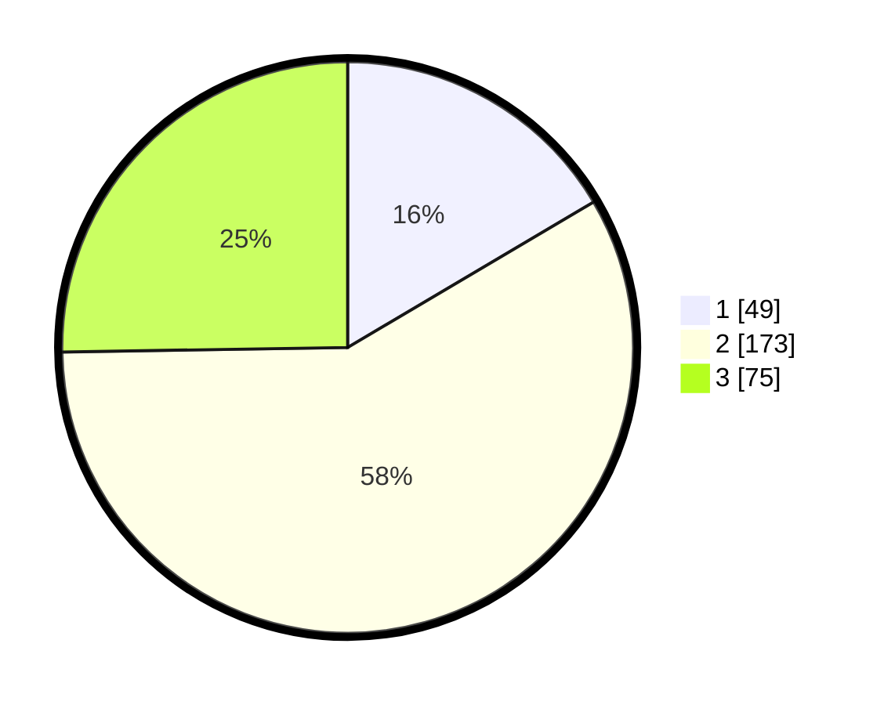

# Hasil

## Grafik

## Tabel

| No. | Nama Paslon    | Suara | Suara (raw) | Persentase |
|:--- |:-------------- | -----:| -----------:| ----------:|
| 1   | ANIES MUHAIMIN | 49    | [49][p-1]   | 16,50      |
| 2   | PRABOWO GIBRAN | 173   | [173][p-2]  | 58,25      |
| 3   | GANJAR MAHFUD  | 75    | [75][p-3]   | 25,25      |

[p-1]: https://github.com/gigit-pemilu/pemilu-2024/blob/main/pilpres/hitung-suara/sub/34-di-yogyakarta/sub/02-bantul/sub/08-bantul/sub/2004-trirenggo/sub/010-tps/sub/paslon-1.txt
[p-2]: https://github.com/gigit-pemilu/pemilu-2024/blob/main/pilpres/hitung-suara/sub/34-di-yogyakarta/sub/02-bantul/sub/08-bantul/sub/2004-trirenggo/sub/010-tps/sub/paslon-2.txt
[p-3]: https://github.com/gigit-pemilu/pemilu-2024/blob/main/pilpres/hitung-suara/sub/34-di-yogyakarta/sub/02-bantul/sub/08-bantul/sub/2004-trirenggo/sub/010-tps/sub/paslon-3.txt

## Foto C Plano

https://sirekap-obj-formc.kpu.go.id/66eb/pemilu/ppwp/34/02/08/20/04/3402082004010-20240215-041613--02bdf5ae-fd16-4cab-a601-be3de158f33a.jpg

https://sirekap-obj-formc.kpu.go.id/66eb/pemilu/ppwp/34/02/08/20/04/3402082004010-20240215-041722--edb27713-5c74-4db6-8b7d-c7adf1fd2d84.jpg

https://sirekap-obj-formc.kpu.go.id/66eb/pemilu/ppwp/34/02/08/20/04/3402082004010-20240221-192458--9d66787a-32b3-4aef-a2b2-8274c5aa111a.jpg

## Metadata

| Key        | Value               |
| ---------- | ------------------- |
| Time Stamp | 2024-02-21 20:00:00 |

