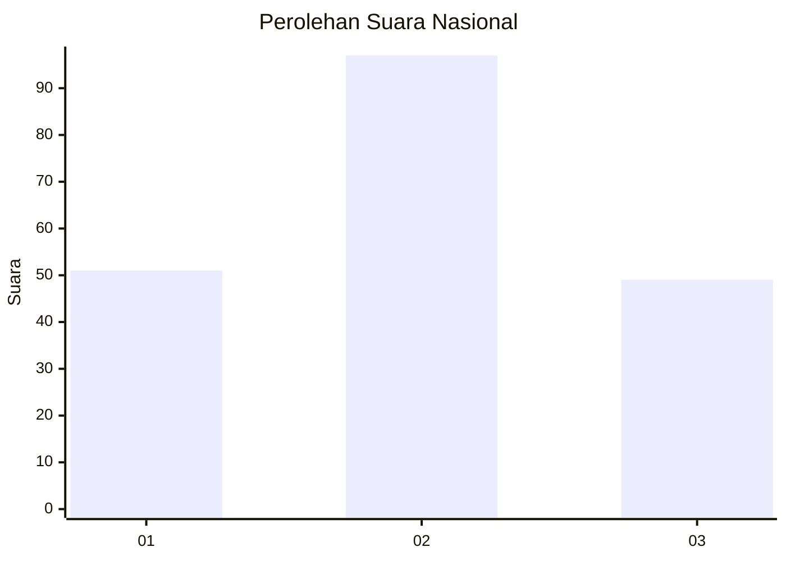
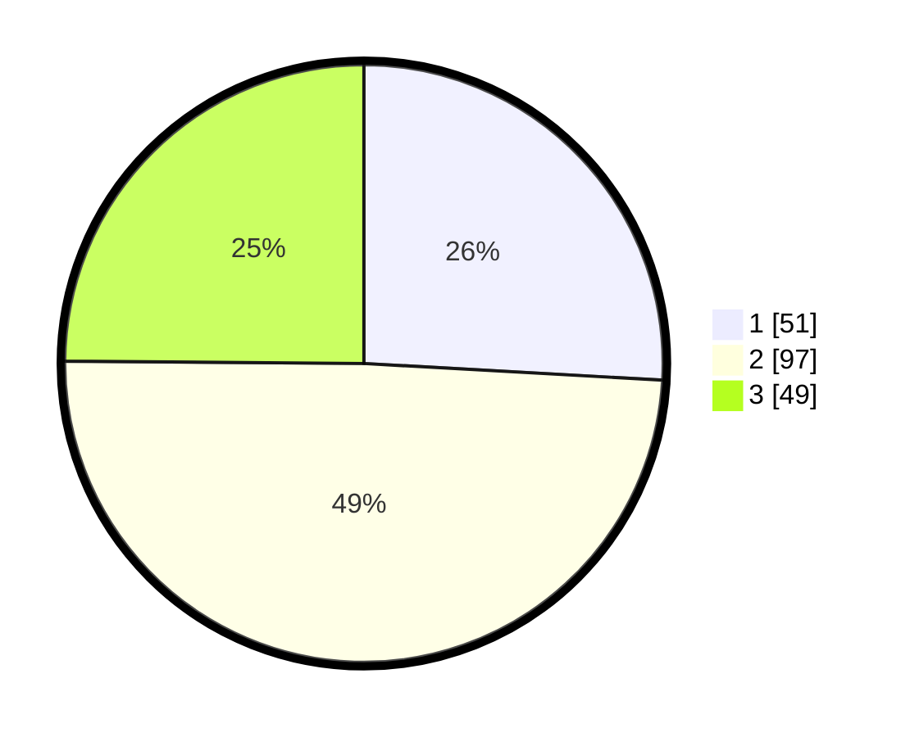

# Hasil

## Grafik

## Tabel

| No. | Nama Paslon    | Suara | Suara (raw) | Persentase |
|:--- |:-------------- | -----:| -----------:| ----------:|
| 1   | ANIES MUHAIMIN | 51    | [51][p-1]   | 25,89      |
| 2   | PRABOWO GIBRAN | 97    | [97][p-2]   | 49,24      |
| 3   | GANJAR MAHFUD  | 49    | [49][p-3]   | 24,87      |

[p-1]: https://github.com/gigit-pemilu/pemilu-2024/blob/main/pilpres/hitung-suara/sub/34-di-yogyakarta/sub/02-bantul/sub/08-bantul/sub/2004-trirenggo/sub/015-tps/sub/paslon-1.txt
[p-2]: https://github.com/gigit-pemilu/pemilu-2024/blob/main/pilpres/hitung-suara/sub/34-di-yogyakarta/sub/02-bantul/sub/08-bantul/sub/2004-trirenggo/sub/015-tps/sub/paslon-2.txt
[p-3]: https://github.com/gigit-pemilu/pemilu-2024/blob/main/pilpres/hitung-suara/sub/34-di-yogyakarta/sub/02-bantul/sub/08-bantul/sub/2004-trirenggo/sub/015-tps/sub/paslon-3.txt

## Foto C Plano

https://sirekap-obj-formc.kpu.go.id/4f41/pemilu/ppwp/34/02/08/20/04/3402082004015-20240214-220053--897da293-cad0-4405-a2e8-7958f518daf4.jpg

https://sirekap-obj-formc.kpu.go.id/4f41/pemilu/ppwp/34/02/08/20/04/3402082004015-20240214-220101--43522c63-05b0-4d05-82e6-de1478f3706c.jpg

https://sirekap-obj-formc.kpu.go.id/4f41/pemilu/ppwp/34/02/08/20/04/3402082004015-20240214-220104--6d0b3349-262d-4941-a3a8-6ac6a5ab3e18.jpg

## Metadata

| Key        | Value               |
| ---------- | ------------------- |
| Time Stamp | 2024-02-21 20:00:00 |

