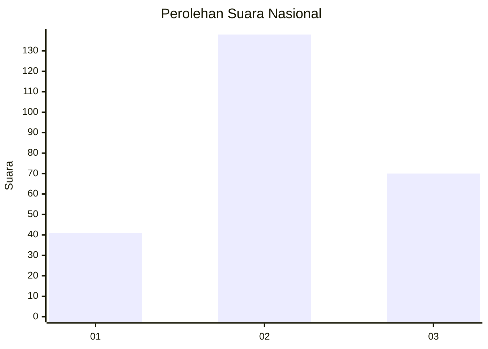
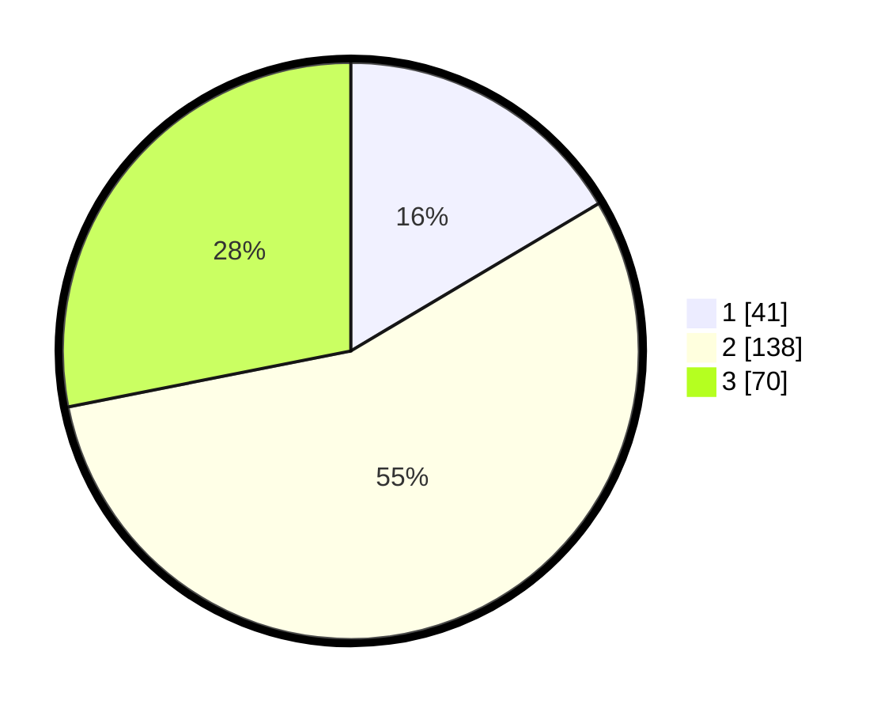

# Hasil

## Grafik

## Tabel

| No. | Nama Paslon    | Suara | Suara (raw) | Persentase |
|:--- |:-------------- | -----:| -----------:| ----------:|
| 1   | ANIES MUHAIMIN | 41    | [41][p-1]   | 16,47      |
| 2   | PRABOWO GIBRAN | 138   | [138][p-2]  | 55,42      |
| 3   | GANJAR MAHFUD  | 70    | [70][p-3]   | 28,11      |

[p-1]: https://github.com/gigit-pemilu/pemilu-2024/blob/main/pilpres/hitung-suara/sub/34-di-yogyakarta/sub/02-bantul/sub/08-bantul/sub/2004-trirenggo/sub/020-tps/sub/paslon-1.txt
[p-2]: https://github.com/gigit-pemilu/pemilu-2024/blob/main/pilpres/hitung-suara/sub/34-di-yogyakarta/sub/02-bantul/sub/08-bantul/sub/2004-trirenggo/sub/020-tps/sub/paslon-2.txt
[p-3]: https://github.com/gigit-pemilu/pemilu-2024/blob/main/pilpres/hitung-suara/sub/34-di-yogyakarta/sub/02-bantul/sub/08-bantul/sub/2004-trirenggo/sub/020-tps/sub/paslon-3.txt

## Foto C Plano

https://sirekap-obj-formc.kpu.go.id/91fe/pemilu/ppwp/34/02/08/20/04/3402082004020-20240215-024646--7eb15230-e551-4c84-90fc-771a5d0e53b4.jpg

https://sirekap-obj-formc.kpu.go.id/91fe/pemilu/ppwp/34/02/08/20/04/3402082004020-20240215-044847--f3fa4f66-5738-4013-8a98-789cd297218e.jpg

https://sirekap-obj-formc.kpu.go.id/91fe/pemilu/ppwp/34/02/08/20/04/3402082004020-20240215-024833--81ee0388-de19-42bb-99d0-cf8579770bac.jpg

## Metadata

| Key        | Value               |
| ---------- | ------------------- |
| Time Stamp | 2024-02-27 16:00:00 |

