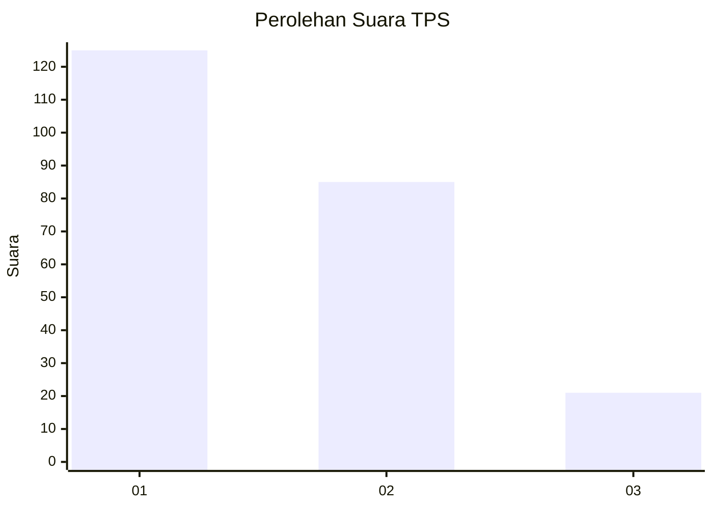
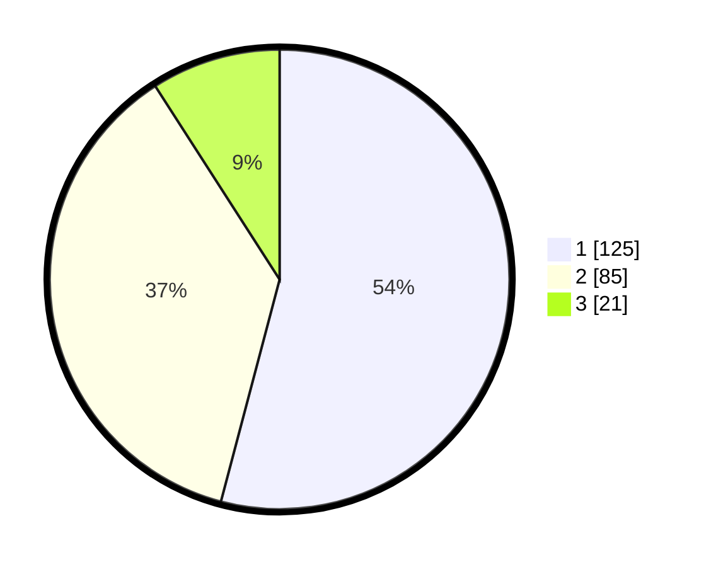

# Hasil

## Grafik

## Tabel

| No. | Nama Paslon    | Suara | Suara (raw) | Persentase |
|:--- |:-------------- | -----:| -----------:| ----------:|
| 1   | ANIES MUHAIMIN | 125   | [125][p-1]  | 54,11      |
| 2   | PRABOWO GIBRAN | 85    | [85][p-2]   | 36,80      |
| 3   | GANJAR MAHFUD  | 21    | [21][p-3]   | 9,09       |

[p-1]: https://github.com/gigit-pemilu/pemilu-2024-34-di-yogyakarta/blob/main/pilpres/hitung-suara/sub/34-di-yogyakarta/sub/02-bantul/sub/08-bantul/sub/2004-trirenggo/sub/021-tps/sub/paslon-1.txt
[p-2]: https://github.com/gigit-pemilu/pemilu-2024-34-di-yogyakarta/blob/main/pilpres/hitung-suara/sub/34-di-yogyakarta/sub/02-bantul/sub/08-bantul/sub/2004-trirenggo/sub/021-tps/sub/paslon-2.txt
[p-3]: https://github.com/gigit-pemilu/pemilu-2024-34-di-yogyakarta/blob/main/pilpres/hitung-suara/sub/34-di-yogyakarta/sub/02-bantul/sub/08-bantul/sub/2004-trirenggo/sub/021-tps/sub/paslon-3.txt

## Foto C Plano

https://sirekap-obj-formc.kpu.go.id/a0d0/pemilu/ppwp/34/02/08/20/04/3402082004021-20240214-220940--94e72f5f-5958-43c3-ba47-98f27928a17c.jpg

https://sirekap-obj-formc.kpu.go.id/a0d0/pemilu/ppwp/34/02/08/20/04/3402082004021-20240214-221101--129ff8da-f9dc-4486-96a5-99e2fa90fe00.jpg

https://sirekap-obj-formc.kpu.go.id/a0d0/pemilu/ppwp/34/02/08/20/04/3402082004021-20240214-220721--dbc2ddc8-f38e-4dfb-9a56-5232ea959e99.jpg

## Metadata

| Key        | Value               |
| ---------- | ------------------- |
| Time Stamp | 2024-02-24 22:31:28 |

