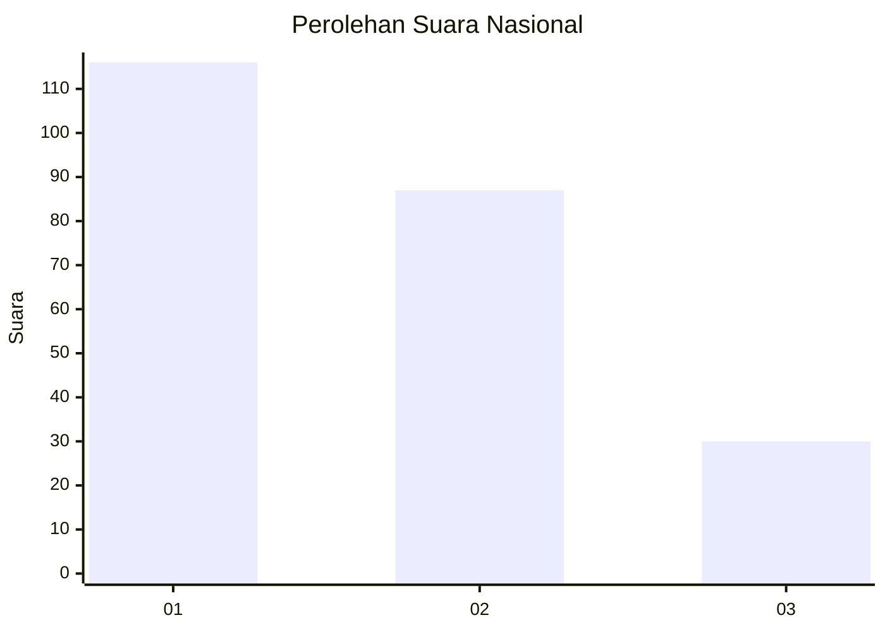
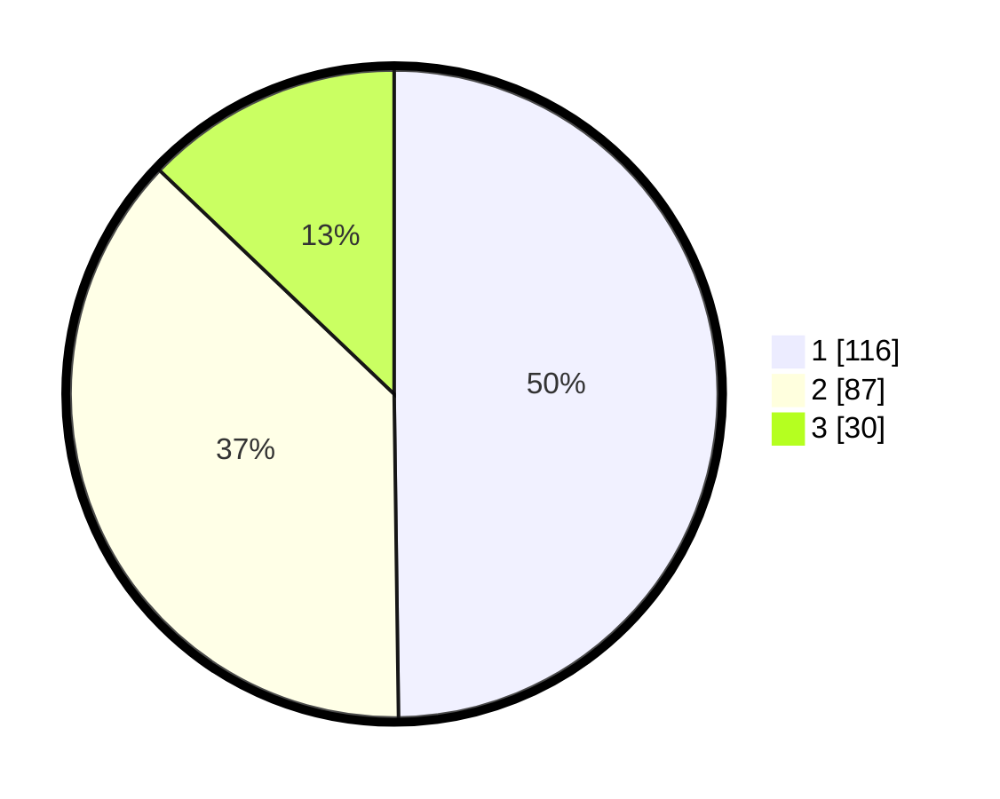

# Hasil

## Grafik

## Tabel

| No. | Nama Paslon    | Suara | Suara (raw) | Persentase |
|:--- |:-------------- | -----:| -----------:| ----------:|
| 1   | ANIES MUHAIMIN | 116   | [116][p-1]  | 49,79      |
| 2   | PRABOWO GIBRAN | 87    | [87][p-2]   | 37,34      |
| 3   | GANJAR MAHFUD  | 30    | [30][p-3]   | 12,88      |

[p-1]: https://github.com/gigit-pemilu/pemilu-2024/blob/main/pilpres/hitung-suara/sub/34-di-yogyakarta/sub/02-bantul/sub/08-bantul/sub/2004-trirenggo/sub/022-tps/sub/paslon-1.txt
[p-2]: https://github.com/gigit-pemilu/pemilu-2024/blob/main/pilpres/hitung-suara/sub/34-di-yogyakarta/sub/02-bantul/sub/08-bantul/sub/2004-trirenggo/sub/022-tps/sub/paslon-2.txt
[p-3]: https://github.com/gigit-pemilu/pemilu-2024/blob/main/pilpres/hitung-suara/sub/34-di-yogyakarta/sub/02-bantul/sub/08-bantul/sub/2004-trirenggo/sub/022-tps/sub/paslon-3.txt

## Foto C Plano

https://sirekap-obj-formc.kpu.go.id/6e17/pemilu/ppwp/34/02/08/20/04/3402082004022-20240214-214038--8ef467fb-1c5b-45ab-beda-0331dfd69c7a.jpg

https://sirekap-obj-formc.kpu.go.id/6e17/pemilu/ppwp/34/02/08/20/04/3402082004022-20240214-214417--35f2614f-e1e0-4b6d-9963-eb90320ba35c.jpg

https://sirekap-obj-formc.kpu.go.id/6e17/pemilu/ppwp/34/02/08/20/04/3402082004022-20240214-214605--82414995-b7d0-45a7-a069-156220d0f1a6.jpg

## Metadata

| Key        | Value               |
| ---------- | ------------------- |
| Time Stamp | 2024-02-24 22:31:28 |

