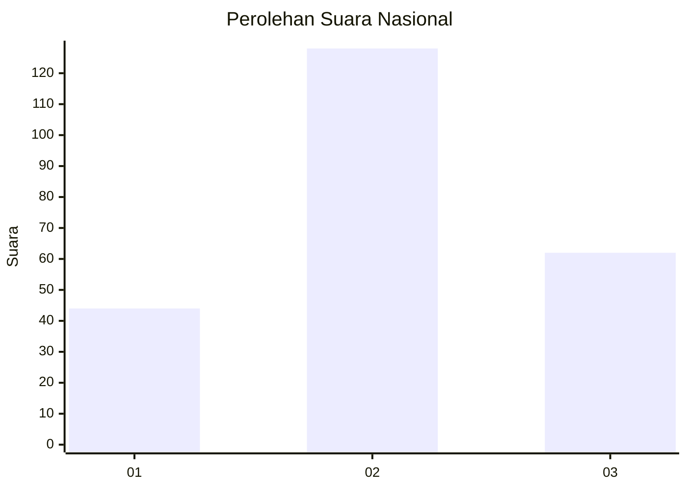
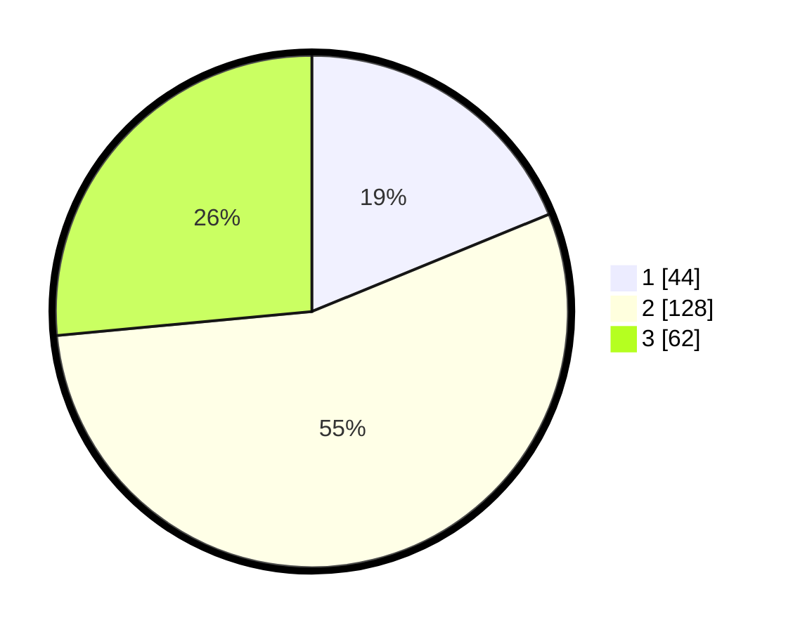

# Hasil

## Grafik

## Tabel

| No. | Nama Paslon    | Suara | Suara (raw) | Persentase |
|:--- |:-------------- | -----:| -----------:| ----------:|
| 1   | ANIES MUHAIMIN | 44    | [44][p-1]   | 18,80      |
| 2   | PRABOWO GIBRAN | 128   | [128][p-2]  | 54,70      |
| 3   | GANJAR MAHFUD  | 62    | [62][p-3]   | 26,50      |

[p-1]: https://github.com/gigit-pemilu/pemilu-2024/blob/main/pilpres/hitung-suara/sub/34-di-yogyakarta/sub/02-bantul/sub/08-bantul/sub/2004-trirenggo/sub/023-tps/sub/paslon-1.txt
[p-2]: https://github.com/gigit-pemilu/pemilu-2024/blob/main/pilpres/hitung-suara/sub/34-di-yogyakarta/sub/02-bantul/sub/08-bantul/sub/2004-trirenggo/sub/023-tps/sub/paslon-2.txt
[p-3]: https://github.com/gigit-pemilu/pemilu-2024/blob/main/pilpres/hitung-suara/sub/34-di-yogyakarta/sub/02-bantul/sub/08-bantul/sub/2004-trirenggo/sub/023-tps/sub/paslon-3.txt

## Foto C Plano

https://sirekap-obj-formc.kpu.go.id/1ddc/pemilu/ppwp/34/02/08/20/04/3402082004023-20240214-233859--3921489f-bcfa-4780-ab7b-c45b455c7d60.jpg

https://sirekap-obj-formc.kpu.go.id/1ddc/pemilu/ppwp/34/02/08/20/04/3402082004023-20240215-003412--db993cfa-f7ab-4d53-938d-0dff68445382.jpg

https://sirekap-obj-formc.kpu.go.id/1ddc/pemilu/ppwp/34/02/08/20/04/3402082004023-20240215-003202--5ba5e6c3-4c7b-4c48-bc50-d0ce871533cd.jpg

## Metadata

| Key        | Value               |
| ---------- | ------------------- |
| Time Stamp | 2024-02-20 12:00:00 |

