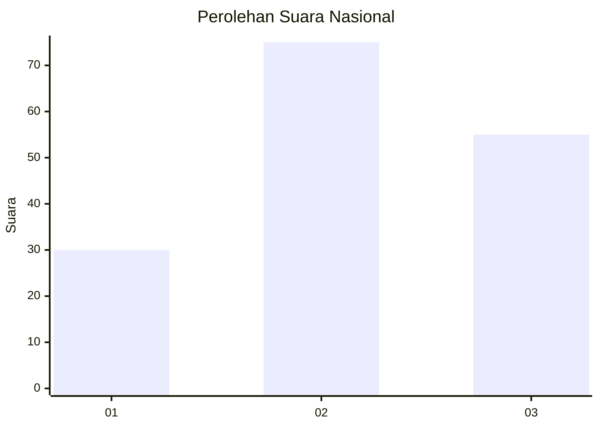
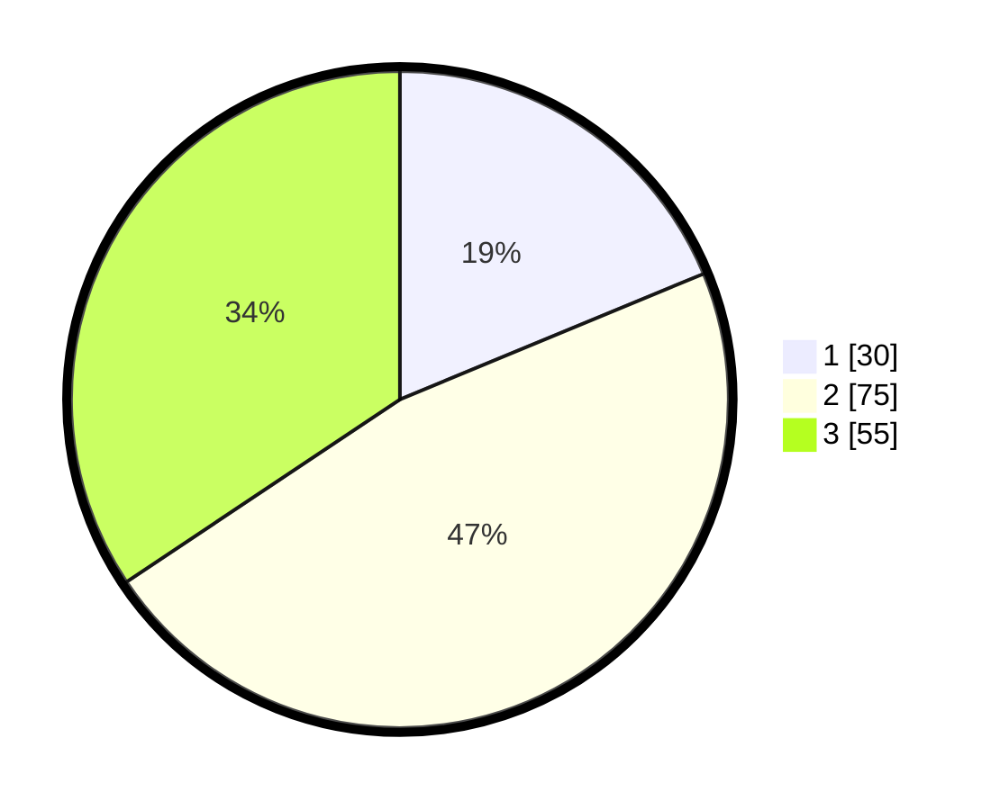

# Hasil

## Grafik

## Tabel

| No. | Nama Paslon    | Suara | Suara (raw) | Persentase |
|:--- |:-------------- | -----:| -----------:| ----------:|
| 1   | ANIES MUHAIMIN | 30    | [30][p-1]   | 18,75      |
| 2   | PRABOWO GIBRAN | 75    | [75][p-2]   | 46,88      |
| 3   | GANJAR MAHFUD  | 55    | [55][p-3]   | 34,38      |

[p-1]: https://github.com/gigit-pemilu/pemilu-2024/blob/main/pilpres/hitung-suara/sub/34-di-yogyakarta/sub/02-bantul/sub/08-bantul/sub/2004-trirenggo/sub/027-tps/sub/paslon-1.txt
[p-2]: https://github.com/gigit-pemilu/pemilu-2024/blob/main/pilpres/hitung-suara/sub/34-di-yogyakarta/sub/02-bantul/sub/08-bantul/sub/2004-trirenggo/sub/027-tps/sub/paslon-2.txt
[p-3]: https://github.com/gigit-pemilu/pemilu-2024/blob/main/pilpres/hitung-suara/sub/34-di-yogyakarta/sub/02-bantul/sub/08-bantul/sub/2004-trirenggo/sub/027-tps/sub/paslon-3.txt

## Foto C Plano

https://sirekap-obj-formc.kpu.go.id/8fc1/pemilu/ppwp/34/02/08/20/04/3402082004027-20240214-230109--bed5d98c-d92f-428f-a4c6-150619b7e8db.jpg

https://sirekap-obj-formc.kpu.go.id/8fc1/pemilu/ppwp/34/02/08/20/04/3402082004027-20240214-230151--e906206c-d378-4d8c-85c6-5a3fb7621e19.jpg

https://sirekap-obj-formc.kpu.go.id/8fc1/pemilu/ppwp/34/02/08/20/04/3402082004027-20240214-230234--d820a999-cbe9-4b07-b684-95af56e3b4ae.jpg

## Metadata

| Key        | Value               |
| ---------- | ------------------- |
| Time Stamp | 2024-02-20 12:00:00 |

