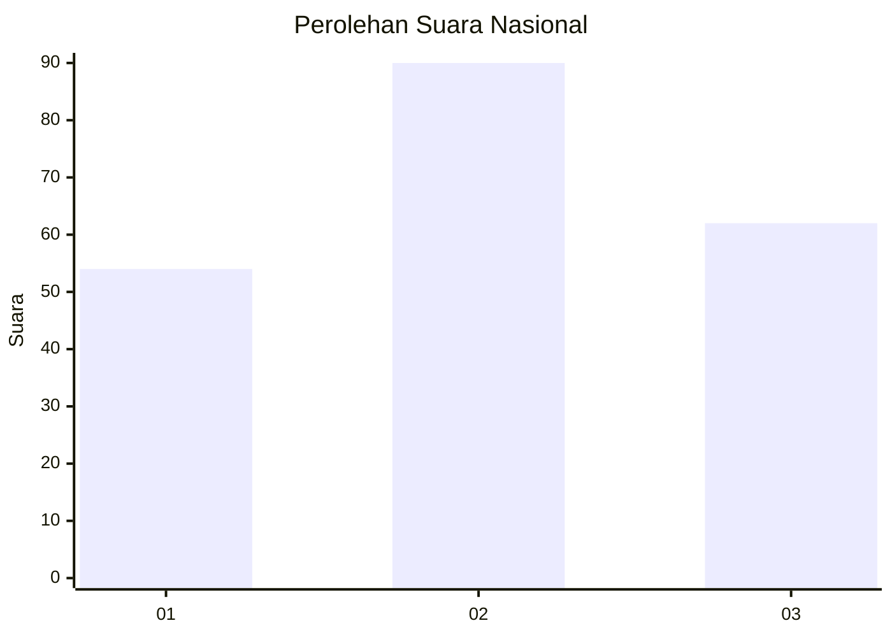
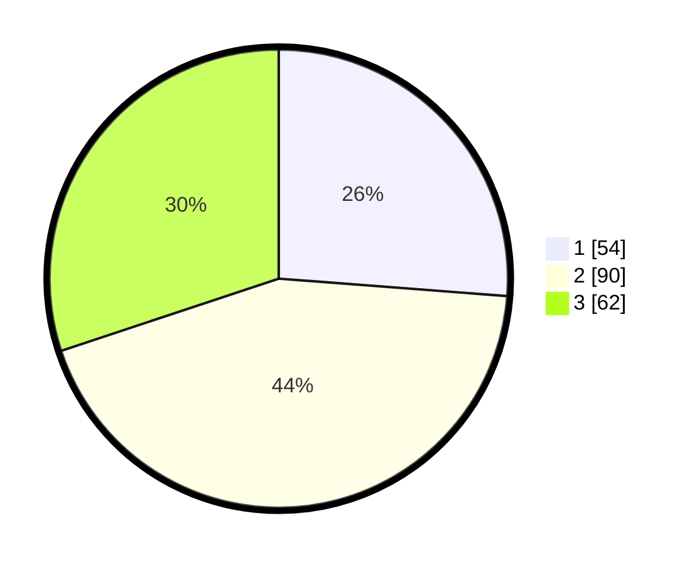

# Hasil

## Grafik

## Tabel

| No. | Nama Paslon    | Suara | Suara (raw) | Persentase |
|:--- |:-------------- | -----:| -----------:| ----------:|
| 1   | ANIES MUHAIMIN | 54    | [54][p-1]   | 26,21      |
| 2   | PRABOWO GIBRAN | 90    | [90][p-2]   | 43,69      |
| 3   | GANJAR MAHFUD  | 62    | [62][p-3]   | 30,10      |

[p-1]: https://github.com/gigit-pemilu/pemilu-2024/blob/main/pilpres/hitung-suara/sub/34-di-yogyakarta/sub/02-bantul/sub/08-bantul/sub/2004-trirenggo/sub/028-tps/sub/paslon-1.txt
[p-2]: https://github.com/gigit-pemilu/pemilu-2024/blob/main/pilpres/hitung-suara/sub/34-di-yogyakarta/sub/02-bantul/sub/08-bantul/sub/2004-trirenggo/sub/028-tps/sub/paslon-2.txt
[p-3]: https://github.com/gigit-pemilu/pemilu-2024/blob/main/pilpres/hitung-suara/sub/34-di-yogyakarta/sub/02-bantul/sub/08-bantul/sub/2004-trirenggo/sub/028-tps/sub/paslon-3.txt

## Foto C Plano

https://sirekap-obj-formc.kpu.go.id/93fb/pemilu/ppwp/34/02/08/20/04/3402082004028-20240214-224419--51ec8c92-f2c5-42ac-b342-edcd8d4289eb.jpg

https://sirekap-obj-formc.kpu.go.id/93fb/pemilu/ppwp/34/02/08/20/04/3402082004028-20240214-224952--47807208-7a87-4ca5-bdb6-14ef0974609a.jpg

https://sirekap-obj-formc.kpu.go.id/93fb/pemilu/ppwp/34/02/08/20/04/3402082004028-20240214-225430--c7ab4737-e6eb-45a6-8a24-c3a846b48394.jpg

## Metadata

| Key        | Value               |
| ---------- | ------------------- |
| Time Stamp | 2024-02-24 22:31:28 |

