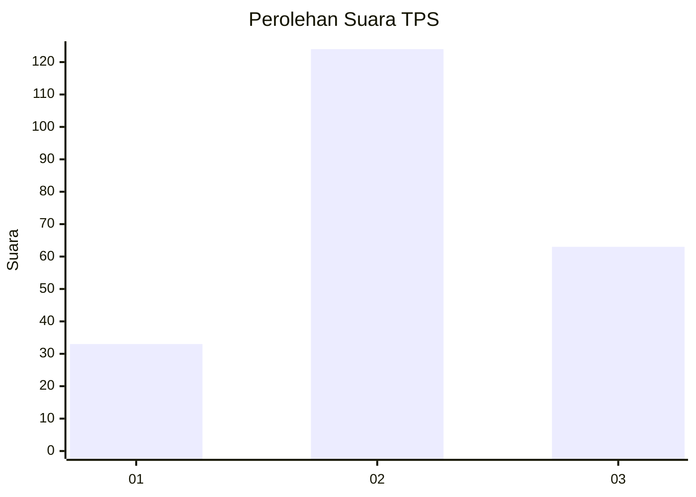
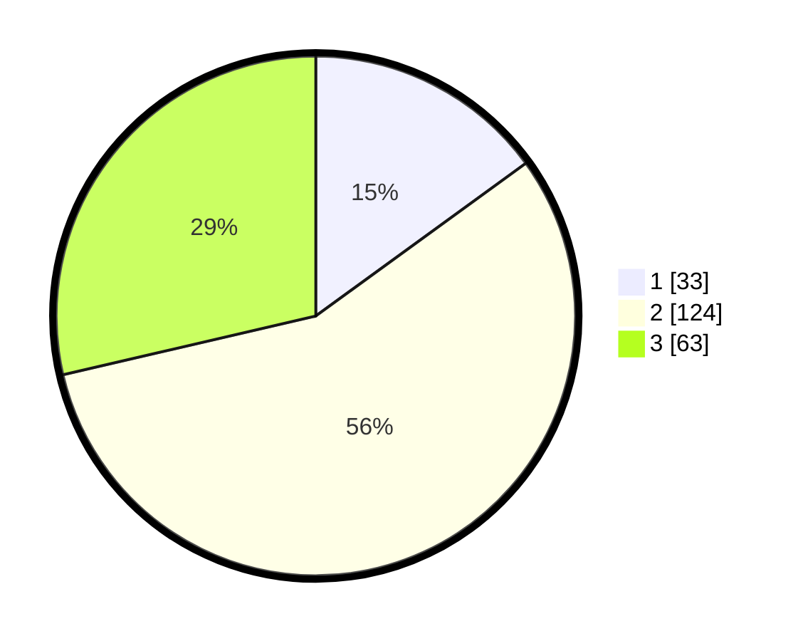

# Hasil

## Grafik

## Tabel

| No. | Nama Paslon    | Suara | Suara (raw) | Persentase |
|:--- |:-------------- | -----:| -----------:| ----------:|
| 1   | ANIES MUHAIMIN | 33    | [33][p-1]   | 15,00      |
| 2   | PRABOWO GIBRAN | 124   | [124][p-2]  | 56,36      |
| 3   | GANJAR MAHFUD  | 63    | [63][p-3]   | 28,64      |

[p-1]: https://github.com/gigit-pemilu/pemilu-2024-34-di-yogyakarta/blob/main/pilpres/hitung-suara/sub/34-di-yogyakarta/sub/02-bantul/sub/08-bantul/sub/2004-trirenggo/sub/029-tps/sub/paslon-1.txt
[p-2]: https://github.com/gigit-pemilu/pemilu-2024-34-di-yogyakarta/blob/main/pilpres/hitung-suara/sub/34-di-yogyakarta/sub/02-bantul/sub/08-bantul/sub/2004-trirenggo/sub/029-tps/sub/paslon-2.txt
[p-3]: https://github.com/gigit-pemilu/pemilu-2024-34-di-yogyakarta/blob/main/pilpres/hitung-suara/sub/34-di-yogyakarta/sub/02-bantul/sub/08-bantul/sub/2004-trirenggo/sub/029-tps/sub/paslon-3.txt

## Foto C Plano

https://sirekap-obj-formc.kpu.go.id/aa7a/pemilu/ppwp/34/02/08/20/04/3402082004029-20240214-235534--bb5f6c0a-8f70-42db-9c50-7aac5bace03f.jpg

https://sirekap-obj-formc.kpu.go.id/aa7a/pemilu/ppwp/34/02/08/20/04/3402082004029-20240214-235603--d88c1146-f689-466e-95da-7a7f63e808f7.jpg

https://sirekap-obj-formc.kpu.go.id/aa7a/pemilu/ppwp/34/02/08/20/04/3402082004029-20240214-233138--17e74fed-5992-4b2d-ad8d-63ba3f24f1f3.jpg

## Metadata

| Key        | Value               |
| ---------- | ------------------- |
| Time Stamp | 2024-02-24 22:31:28 |

