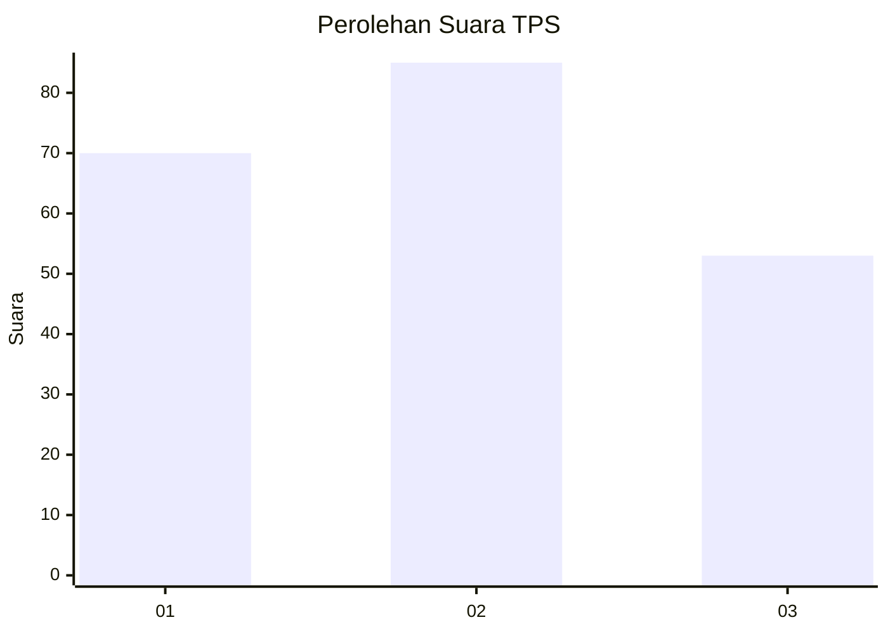
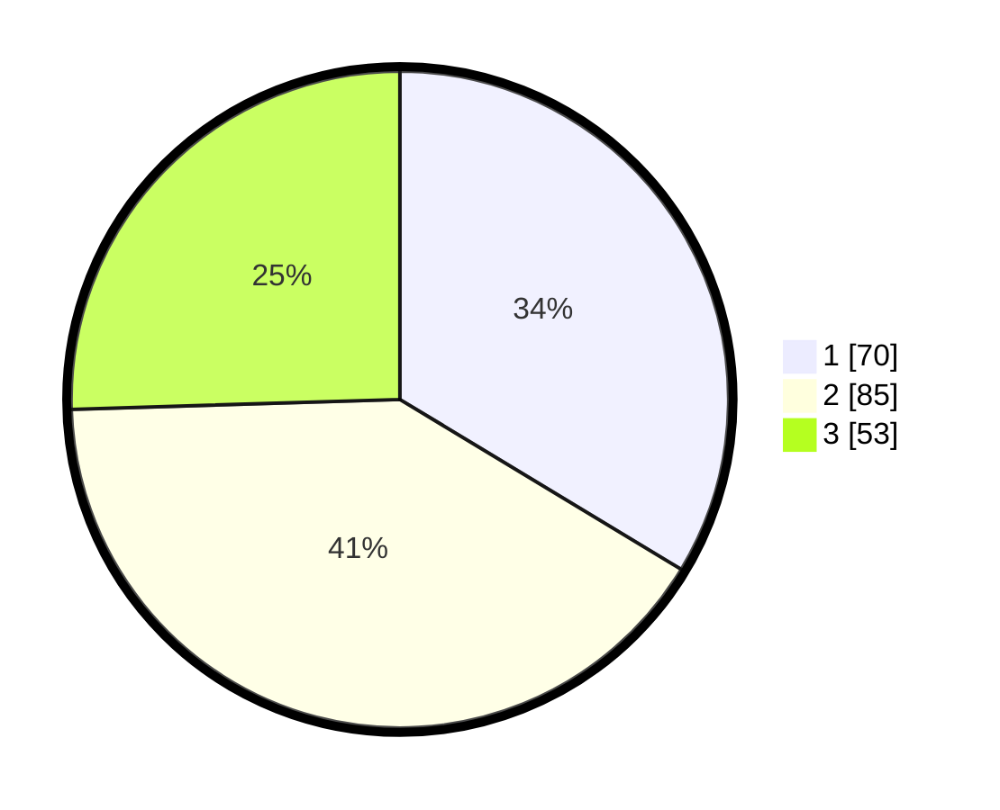

# Hasil

## Grafik

## Tabel

| No. | Nama Paslon    | Suara | Suara (raw) | Persentase |
|:--- |:-------------- | -----:| -----------:| ----------:|
| 1   | ANIES MUHAIMIN | 70    | [70][p-1]   | 33,65      |
| 2   | PRABOWO GIBRAN | 85    | [85][p-2]   | 40,87      |
| 3   | GANJAR MAHFUD  | 53    | [53][p-3]   | 25,48      |

[p-1]: https://github.com/gigit-pemilu/pemilu-2024-34-di-yogyakarta/blob/main/pilpres/hitung-suara/sub/34-di-yogyakarta/sub/02-bantul/sub/08-bantul/sub/2004-trirenggo/sub/033-tps/sub/paslon-1.txt
[p-2]: https://github.com/gigit-pemilu/pemilu-2024-34-di-yogyakarta/blob/main/pilpres/hitung-suara/sub/34-di-yogyakarta/sub/02-bantul/sub/08-bantul/sub/2004-trirenggo/sub/033-tps/sub/paslon-2.txt
[p-3]: https://github.com/gigit-pemilu/pemilu-2024-34-di-yogyakarta/blob/main/pilpres/hitung-suara/sub/34-di-yogyakarta/sub/02-bantul/sub/08-bantul/sub/2004-trirenggo/sub/033-tps/sub/paslon-3.txt

## Foto C Plano

https://sirekap-obj-formc.kpu.go.id/b474/pemilu/ppwp/34/02/08/20/04/3402082004033-20240214-213236--d9d2a119-aacf-464d-8971-1b921462d145.jpg

https://sirekap-obj-formc.kpu.go.id/b474/pemilu/ppwp/34/02/08/20/04/3402082004033-20240214-213335--3683ea31-9170-42f3-a15c-87b92934742e.jpg

https://sirekap-obj-formc.kpu.go.id/b474/pemilu/ppwp/34/02/08/20/04/3402082004033-20240221-200745--d558e347-2686-4664-a84b-00aaf9477a4d.jpg

## Metadata

| Key        | Value               |
| ---------- | ------------------- |
| Time Stamp | 2024-02-21 21:00:04 |

