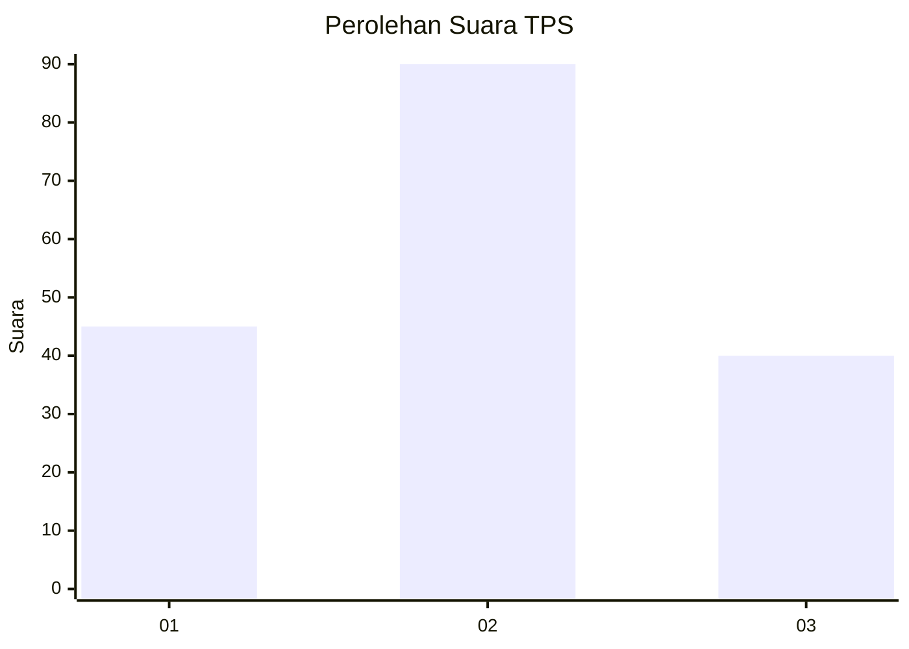
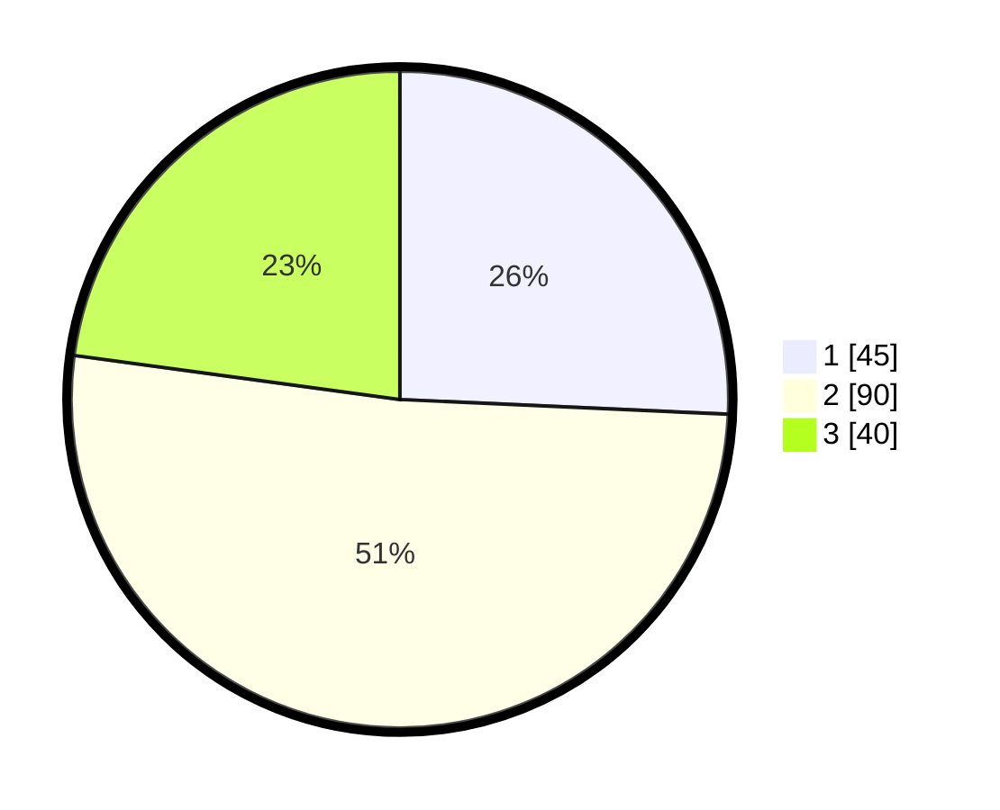

# Hasil

## Grafik

## Tabel

| No. | Nama Paslon    | Suara | Suara (raw) | Persentase |
|:--- |:-------------- | -----:| -----------:| ----------:|
| 1   | ANIES MUHAIMIN | 45    | [45][p-1]   | 25,71      |
| 2   | PRABOWO GIBRAN | 90    | [90][p-2]   | 51,43      |
| 3   | GANJAR MAHFUD  | 40    | [40][p-3]   | 22,86      |

[p-1]: https://github.com/gigit-pemilu/pemilu-2024-34-di-yogyakarta/blob/main/pilpres/hitung-suara/sub/34-di-yogyakarta/sub/02-bantul/sub/08-bantul/sub/2004-trirenggo/sub/036-tps/sub/paslon-1.txt
[p-2]: https://github.com/gigit-pemilu/pemilu-2024-34-di-yogyakarta/blob/main/pilpres/hitung-suara/sub/34-di-yogyakarta/sub/02-bantul/sub/08-bantul/sub/2004-trirenggo/sub/036-tps/sub/paslon-2.txt
[p-3]: https://github.com/gigit-pemilu/pemilu-2024-34-di-yogyakarta/blob/main/pilpres/hitung-suara/sub/34-di-yogyakarta/sub/02-bantul/sub/08-bantul/sub/2004-trirenggo/sub/036-tps/sub/paslon-3.txt

## Foto C Plano

https://sirekap-obj-formc.kpu.go.id/4496/pemilu/ppwp/34/02/08/20/04/3402082004036-20240214-230523--b189cd26-5074-411c-9149-628815dde497.jpg

https://sirekap-obj-formc.kpu.go.id/4496/pemilu/ppwp/34/02/08/20/04/3402082004036-20240214-230605--08a0856a-f294-43c2-bfc6-1a66c1ec1fe0.jpg

https://sirekap-obj-formc.kpu.go.id/4496/pemilu/ppwp/34/02/08/20/04/3402082004036-20240214-231106--0a3a7a70-c99f-4add-a335-fbadea7e7969.jpg

## Metadata

| Key        | Value               |
| ---------- | ------------------- |
| Time Stamp | 2024-02-15 12:00:28 |

