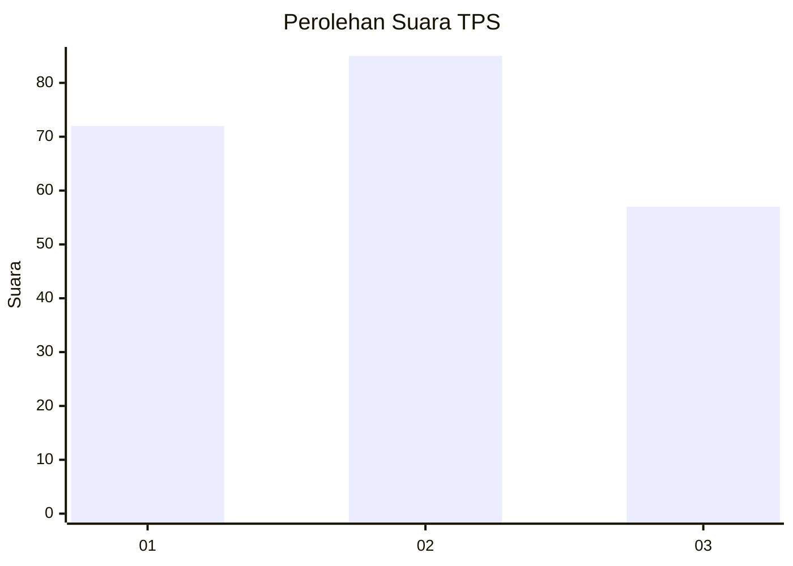
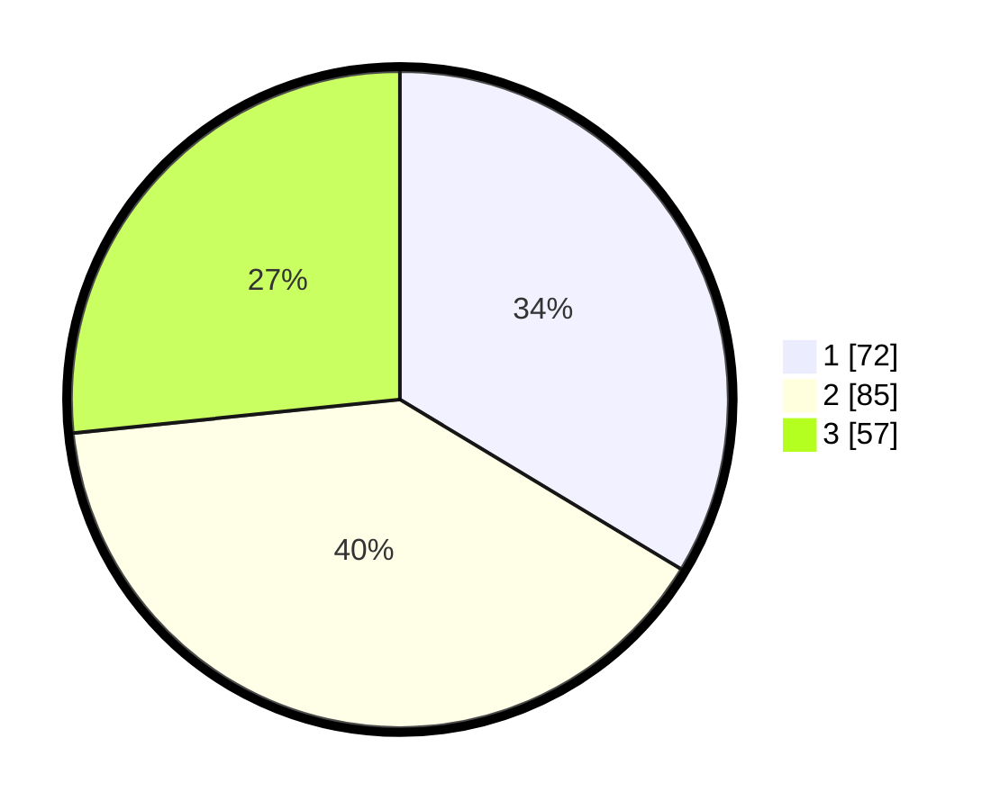

# Hasil

## Grafik

## Tabel

| No. | Nama Paslon    | Suara | Suara (raw) | Persentase |
|:--- |:-------------- | -----:| -----------:| ----------:|
| 1   | ANIES MUHAIMIN | 72    | [72][p-1]   | 33,64      |
| 2   | PRABOWO GIBRAN | 85    | [85][p-2]   | 39,72      |
| 3   | GANJAR MAHFUD  | 57    | [57][p-3]   | 26,64      |

[p-1]: https://github.com/gigit-pemilu/pemilu-2024-34-di-yogyakarta/blob/main/pilpres/hitung-suara/sub/34-di-yogyakarta/sub/02-bantul/sub/08-bantul/sub/2004-trirenggo/sub/038-tps/sub/paslon-1.txt
[p-2]: https://github.com/gigit-pemilu/pemilu-2024-34-di-yogyakarta/blob/main/pilpres/hitung-suara/sub/34-di-yogyakarta/sub/02-bantul/sub/08-bantul/sub/2004-trirenggo/sub/038-tps/sub/paslon-2.txt
[p-3]: https://github.com/gigit-pemilu/pemilu-2024-34-di-yogyakarta/blob/main/pilpres/hitung-suara/sub/34-di-yogyakarta/sub/02-bantul/sub/08-bantul/sub/2004-trirenggo/sub/038-tps/sub/paslon-3.txt

## Foto C Plano

https://sirekap-obj-formc.kpu.go.id/74c6/pemilu/ppwp/34/02/08/20/04/3402082004038-20240214-223634--3915a104-d6e9-4ee7-939d-4f4a584e42e7.jpg

https://sirekap-obj-formc.kpu.go.id/74c6/pemilu/ppwp/34/02/08/20/04/3402082004038-20240221-204241--27725519-cd1c-4b7b-a1fc-766049f9ee0f.jpg

https://sirekap-obj-formc.kpu.go.id/74c6/pemilu/ppwp/34/02/08/20/04/3402082004038-20240214-224040--e7315a30-e60b-4878-a15b-3bcf476d39e7.jpg

## Metadata

| Key        | Value               |
| ---------- | ------------------- |
| Time Stamp | 2024-02-21 21:00:04 |

