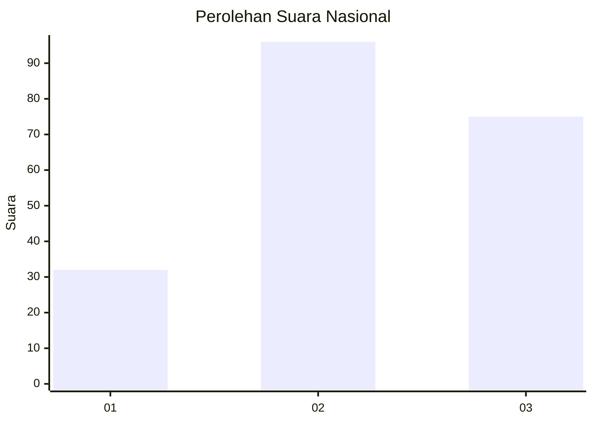
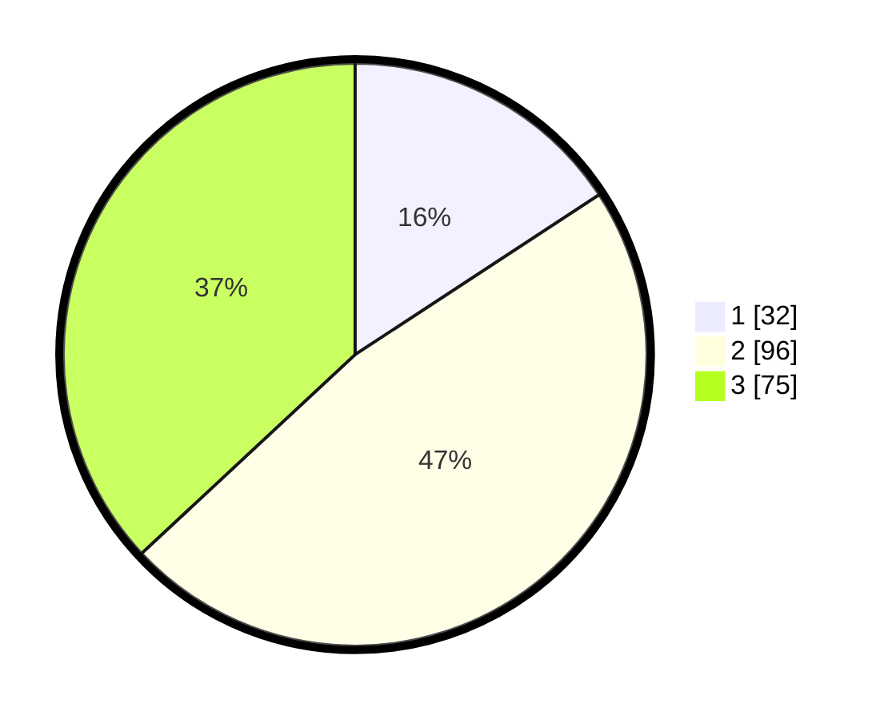

# Hasil

## Grafik

## Tabel

| No. | Nama Paslon    | Suara | Suara (raw) | Persentase |
|:--- |:-------------- | -----:| -----------:| ----------:|
| 1   | ANIES MUHAIMIN | 32    | [32][p-1]   | 15,76      |
| 2   | PRABOWO GIBRAN | 96    | [96][p-2]   | 47,29      |
| 3   | GANJAR MAHFUD  | 75    | [75][p-3]   | 36,95      |

[p-1]: https://github.com/gigit-pemilu/pemilu-2024/blob/main/pilpres/hitung-suara/sub/34-di-yogyakarta/sub/02-bantul/sub/08-bantul/sub/2004-trirenggo/sub/039-tps/sub/paslon-1.txt
[p-2]: https://github.com/gigit-pemilu/pemilu-2024/blob/main/pilpres/hitung-suara/sub/34-di-yogyakarta/sub/02-bantul/sub/08-bantul/sub/2004-trirenggo/sub/039-tps/sub/paslon-2.txt
[p-3]: https://github.com/gigit-pemilu/pemilu-2024/blob/main/pilpres/hitung-suara/sub/34-di-yogyakarta/sub/02-bantul/sub/08-bantul/sub/2004-trirenggo/sub/039-tps/sub/paslon-3.txt

## Foto C Plano

https://sirekap-obj-formc.kpu.go.id/df9b/pemilu/ppwp/34/02/08/20/04/3402082004039-20240215-000049--bfb1d3ec-2aae-43f0-8ca6-b590a336bdde.jpg

https://sirekap-obj-formc.kpu.go.id/df9b/pemilu/ppwp/34/02/08/20/04/3402082004039-20240215-000253--919b8bb5-79e6-4674-9323-fd12b0943d37.jpg

https://sirekap-obj-formc.kpu.go.id/df9b/pemilu/ppwp/34/02/08/20/04/3402082004039-20240215-000450--5294653d-5ea5-4d09-9f18-2a9b5278f3bb.jpg

## Metadata

| Key        | Value               |
| ---------- | ------------------- |
| Time Stamp | 2024-02-24 22:31:28 |

