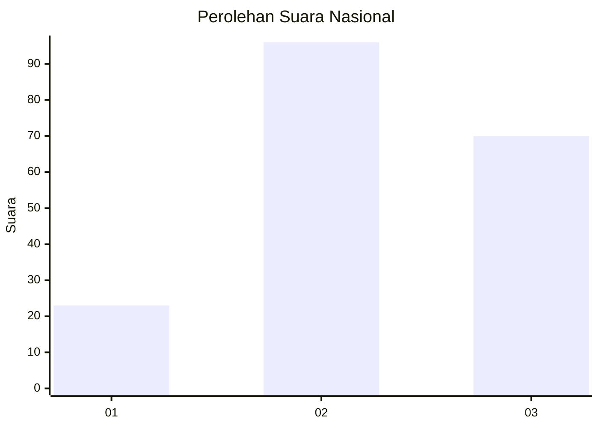
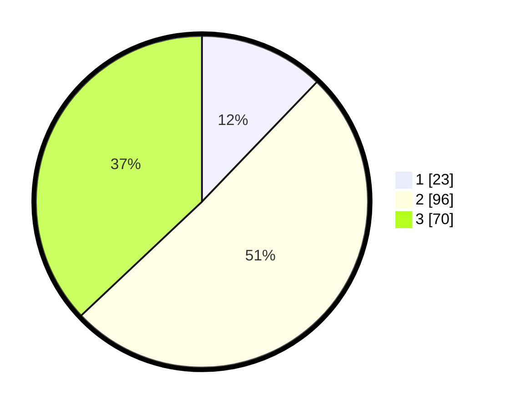

# Hasil

## Grafik

## Tabel

| No. | Nama Paslon    | Suara | Suara (raw) | Persentase |
|:--- |:-------------- | -----:| -----------:| ----------:|
| 1   | ANIES MUHAIMIN | 23    | [23][p-1]   | 12,17      |
| 2   | PRABOWO GIBRAN | 96    | [96][p-2]   | 50,79      |
| 3   | GANJAR MAHFUD  | 70    | [70][p-3]   | 37,04      |

[p-1]: https://github.com/gigit-pemilu/pemilu-2024/blob/main/pilpres/hitung-suara/sub/34-di-yogyakarta/sub/02-bantul/sub/08-bantul/sub/2004-trirenggo/sub/040-tps/sub/paslon-1.txt
[p-2]: https://github.com/gigit-pemilu/pemilu-2024/blob/main/pilpres/hitung-suara/sub/34-di-yogyakarta/sub/02-bantul/sub/08-bantul/sub/2004-trirenggo/sub/040-tps/sub/paslon-2.txt
[p-3]: https://github.com/gigit-pemilu/pemilu-2024/blob/main/pilpres/hitung-suara/sub/34-di-yogyakarta/sub/02-bantul/sub/08-bantul/sub/2004-trirenggo/sub/040-tps/sub/paslon-3.txt

## Foto C Plano

https://sirekap-obj-formc.kpu.go.id/021e/pemilu/ppwp/34/02/08/20/04/3402082004040-20240214-223411--20d8c720-4eca-4676-9ed0-97409da5215d.jpg

https://sirekap-obj-formc.kpu.go.id/021e/pemilu/ppwp/34/02/08/20/04/3402082004040-20240214-223718--f73c61b9-e9c9-4bb2-b383-8462757f426a.jpg

https://sirekap-obj-formc.kpu.go.id/021e/pemilu/ppwp/34/02/08/20/04/3402082004040-20240215-005404--a4d04c70-17a0-47eb-9586-605f8652a094.jpg

## Metadata

| Key        | Value               |
| ---------- | ------------------- |
| Time Stamp | 2024-02-15 12:00:28 |

