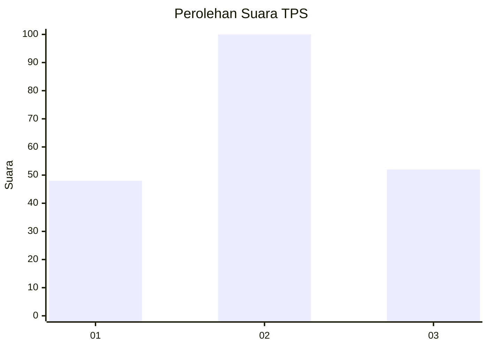
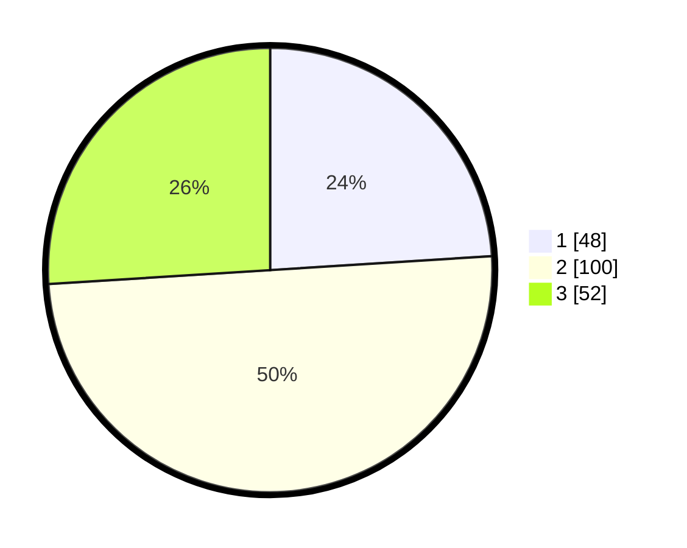

# Hasil

## Grafik

## Tabel

| No. | Nama Paslon    | Suara | Suara (raw) | Persentase |
|:--- |:-------------- | -----:| -----------:| ----------:|
| 1   | ANIES MUHAIMIN | 48    | [48][p-1]   | 24,00      |
| 2   | PRABOWO GIBRAN | 100   | [100][p-2]  | 50,00      |
| 3   | GANJAR MAHFUD  | 52    | [52][p-3]   | 26,00      |

[p-1]: https://github.com/gigit-pemilu/pemilu-2024-34-di-yogyakarta/blob/main/pilpres/hitung-suara/sub/34-di-yogyakarta/sub/02-bantul/sub/08-bantul/sub/2004-trirenggo/sub/042-tps/sub/paslon-1.txt
[p-2]: https://github.com/gigit-pemilu/pemilu-2024-34-di-yogyakarta/blob/main/pilpres/hitung-suara/sub/34-di-yogyakarta/sub/02-bantul/sub/08-bantul/sub/2004-trirenggo/sub/042-tps/sub/paslon-2.txt
[p-3]: https://github.com/gigit-pemilu/pemilu-2024-34-di-yogyakarta/blob/main/pilpres/hitung-suara/sub/34-di-yogyakarta/sub/02-bantul/sub/08-bantul/sub/2004-trirenggo/sub/042-tps/sub/paslon-3.txt

## Foto C Plano

https://sirekap-obj-formc.kpu.go.id/eb24/pemilu/ppwp/34/02/08/20/04/3402082004042-20240218-093949--c0bb4064-727c-45c3-b1dd-d4b7ecd2d96d.jpg

https://sirekap-obj-formc.kpu.go.id/eb24/pemilu/ppwp/34/02/08/20/04/3402082004042-20240218-093957--ccfe2e50-c9b6-445e-a524-c8d6e34411c2.jpg

https://sirekap-obj-formc.kpu.go.id/eb24/pemilu/ppwp/34/02/08/20/04/3402082004042-20240218-094002--06e2f9b3-9f9a-4329-88d2-36c2bc512ad8.jpg

## Metadata

| Key        | Value               |
| ---------- | ------------------- |
| Time Stamp | 2024-02-24 22:31:28 |

