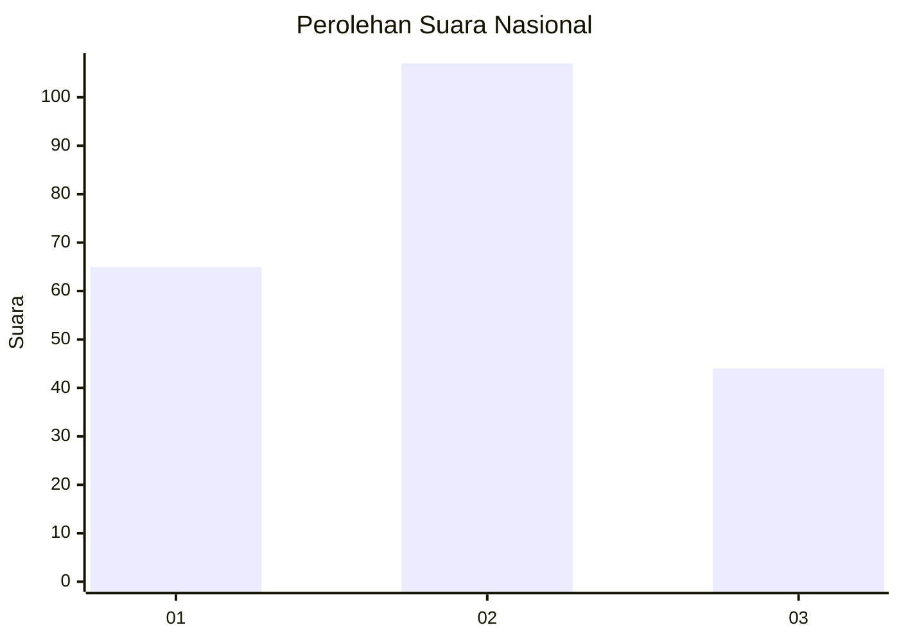
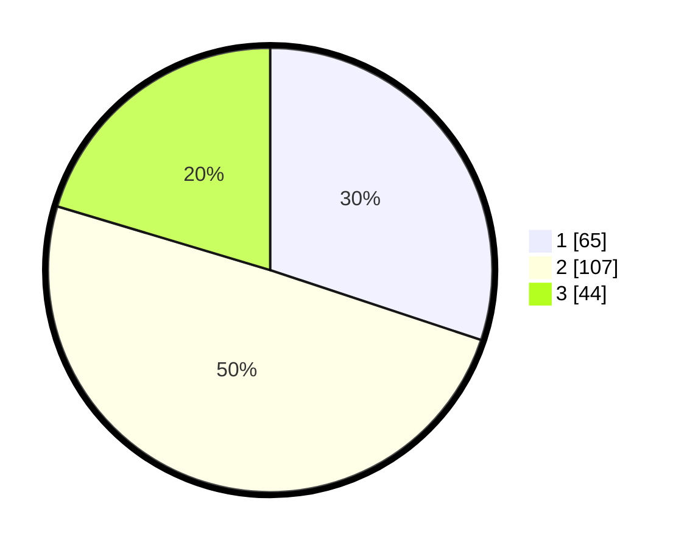

# Hasil

## Grafik

## Tabel

| No. | Nama Paslon    | Suara | Suara (raw) | Persentase |
|:--- |:-------------- | -----:| -----------:| ----------:|
| 1   | ANIES MUHAIMIN | 65    | [65][p-1]   | 30,09      |
| 2   | PRABOWO GIBRAN | 107   | [107][p-2]  | 49,54      |
| 3   | GANJAR MAHFUD  | 44    | [44][p-3]   | 20,37      |

[p-1]: https://github.com/gigit-pemilu/pemilu-2024/blob/main/pilpres/hitung-suara/sub/34-di-yogyakarta/sub/02-bantul/sub/08-bantul/sub/2004-trirenggo/sub/045-tps/sub/paslon-1.txt
[p-2]: https://github.com/gigit-pemilu/pemilu-2024/blob/main/pilpres/hitung-suara/sub/34-di-yogyakarta/sub/02-bantul/sub/08-bantul/sub/2004-trirenggo/sub/045-tps/sub/paslon-2.txt
[p-3]: https://github.com/gigit-pemilu/pemilu-2024/blob/main/pilpres/hitung-suara/sub/34-di-yogyakarta/sub/02-bantul/sub/08-bantul/sub/2004-trirenggo/sub/045-tps/sub/paslon-3.txt

## Foto C Plano

https://sirekap-obj-formc.kpu.go.id/6f52/pemilu/ppwp/34/02/08/20/04/3402082004045-20240214-205430--39105840-a361-46fb-b319-4a23c76e50fe.jpg

https://sirekap-obj-formc.kpu.go.id/6f52/pemilu/ppwp/34/02/08/20/04/3402082004045-20240214-205532--8b88ce77-78e3-459b-96a4-64fba1896b7e.jpg

https://sirekap-obj-formc.kpu.go.id/6f52/pemilu/ppwp/34/02/08/20/04/3402082004045-20240214-205620--00c0c86f-9fa3-43ca-8762-49a728538370.jpg

## Metadata

| Key        | Value               |
| ---------- | ------------------- |
| Time Stamp | 2024-02-25 10:00:00 |

