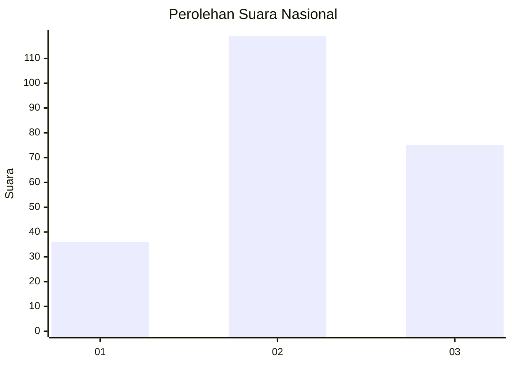
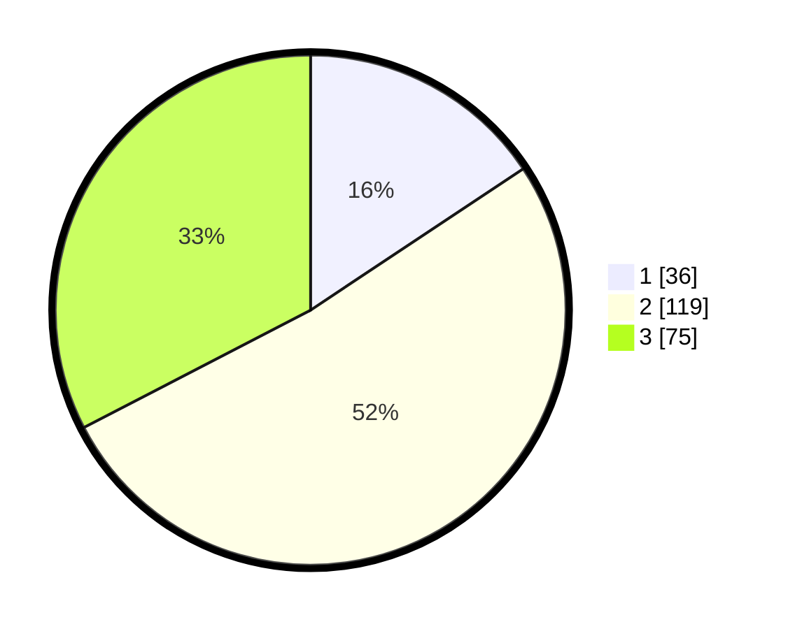

# Hasil

## Grafik

## Tabel

| No. | Nama Paslon    | Suara | Suara (raw) | Persentase |
|:--- |:-------------- | -----:| -----------:| ----------:|
| 1   | ANIES MUHAIMIN | 36    | [36][p-1]   | 15,65      |
| 2   | PRABOWO GIBRAN | 119   | [119][p-2]  | 51,74      |
| 3   | GANJAR MAHFUD  | 75    | [75][p-3]   | 32,61      |

[p-1]: https://github.com/gigit-pemilu/pemilu-2024/blob/main/pilpres/hitung-suara/sub/34-di-yogyakarta/sub/02-bantul/sub/08-bantul/sub/2004-trirenggo/sub/047-tps/sub/paslon-1.txt
[p-2]: https://github.com/gigit-pemilu/pemilu-2024/blob/main/pilpres/hitung-suara/sub/34-di-yogyakarta/sub/02-bantul/sub/08-bantul/sub/2004-trirenggo/sub/047-tps/sub/paslon-2.txt
[p-3]: https://github.com/gigit-pemilu/pemilu-2024/blob/main/pilpres/hitung-suara/sub/34-di-yogyakarta/sub/02-bantul/sub/08-bantul/sub/2004-trirenggo/sub/047-tps/sub/paslon-3.txt

## Foto C Plano

https://sirekap-obj-formc.kpu.go.id/9b6e/pemilu/ppwp/34/02/08/20/04/3402082004047-20240221-211942--95617fb3-ebf6-42f5-809a-2de823b07220.jpg

https://sirekap-obj-formc.kpu.go.id/9b6e/pemilu/ppwp/34/02/08/20/04/3402082004047-20240215-000540--f31c76c8-80c6-47d1-abcb-e52f1642a40c.jpg

https://sirekap-obj-formc.kpu.go.id/9b6e/pemilu/ppwp/34/02/08/20/04/3402082004047-20240215-000722--7b934684-48cc-4b8b-9ff6-7700fb3bc9d1.jpg

## Metadata

| Key        | Value               |
| ---------- | ------------------- |
| Time Stamp | 2024-02-24 22:31:28 |

