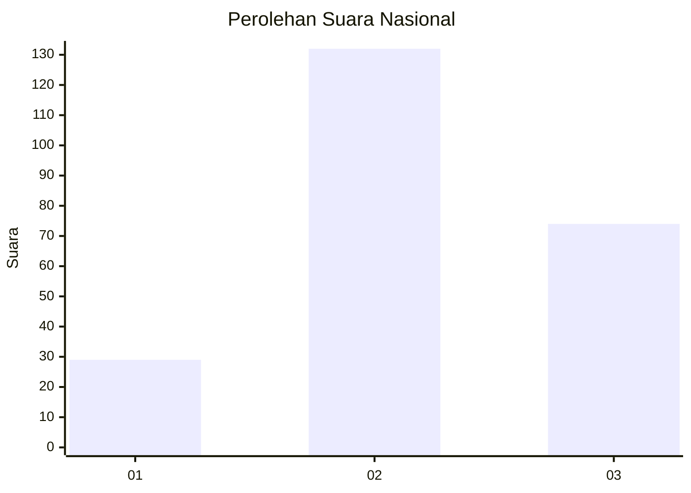
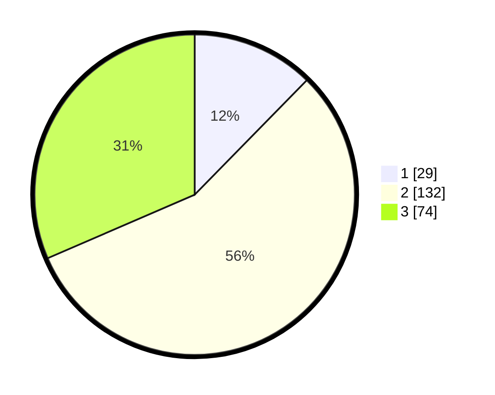

# Hasil

## Grafik

## Tabel

| No. | Nama Paslon    | Suara | Suara (raw) | Persentase |
|:--- |:-------------- | -----:| -----------:| ----------:|
| 1   | ANIES MUHAIMIN | 29    | [29][p-1]   | 12,34      |
| 2   | PRABOWO GIBRAN | 132   | [132][p-2]  | 56,17      |
| 3   | GANJAR MAHFUD  | 74    | [74][p-3]   | 31,49      |

[p-1]: https://github.com/gigit-pemilu/pemilu-2024/blob/main/pilpres/hitung-suara/sub/34-di-yogyakarta/sub/02-bantul/sub/08-bantul/sub/2004-trirenggo/sub/048-tps/sub/paslon-1.txt
[p-2]: https://github.com/gigit-pemilu/pemilu-2024/blob/main/pilpres/hitung-suara/sub/34-di-yogyakarta/sub/02-bantul/sub/08-bantul/sub/2004-trirenggo/sub/048-tps/sub/paslon-2.txt
[p-3]: https://github.com/gigit-pemilu/pemilu-2024/blob/main/pilpres/hitung-suara/sub/34-di-yogyakarta/sub/02-bantul/sub/08-bantul/sub/2004-trirenggo/sub/048-tps/sub/paslon-3.txt

## Foto C Plano

https://sirekap-obj-formc.kpu.go.id/7562/pemilu/ppwp/34/02/08/20/04/3402082004048-20240215-044332--d0e87fd4-7331-4fa8-b592-ddc7ff2aaab5.jpg

https://sirekap-obj-formc.kpu.go.id/7562/pemilu/ppwp/34/02/08/20/04/3402082004048-20240215-044403--57da8ddc-f332-4f91-bfef-53d1420a31d0.jpg

https://sirekap-obj-formc.kpu.go.id/7562/pemilu/ppwp/34/02/08/20/04/3402082004048-20240215-044531--2acc421d-cc68-480d-b42a-4d948bec3542.jpg

## Metadata

| Key        | Value               |
| ---------- | ------------------- |
| Time Stamp | 2024-02-24 22:31:28 |

