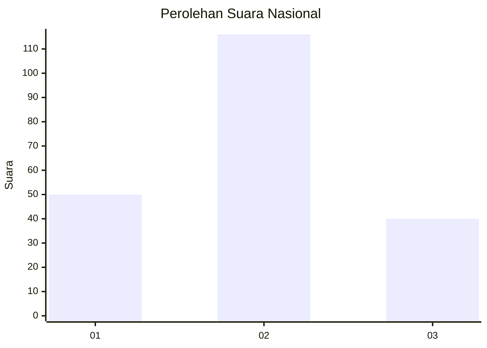
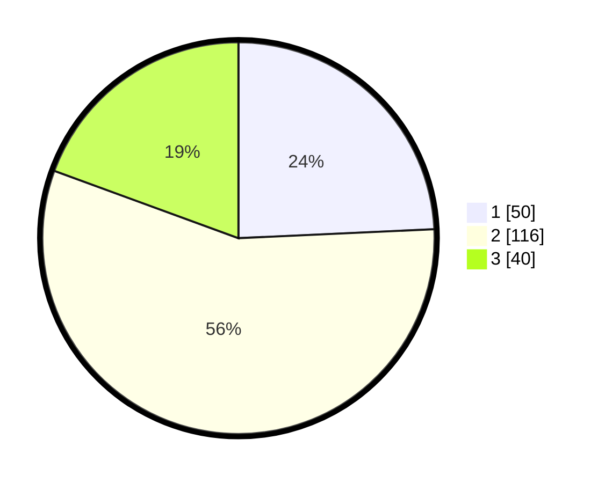

# Hasil

## Grafik

## Tabel

| No. | Nama Paslon    | Suara | Suara (raw) | Persentase |
|:--- |:-------------- | -----:| -----------:| ----------:|
| 1   | ANIES MUHAIMIN | 50    | [50][p-1]   | 24,27      |
| 2   | PRABOWO GIBRAN | 116   | [116][p-2]  | 56,31      |
| 3   | GANJAR MAHFUD  | 40    | [40][p-3]   | 19,42      |

[p-1]: https://github.com/gigit-pemilu/pemilu-2024/blob/main/pilpres/hitung-suara/sub/34-di-yogyakarta/sub/02-bantul/sub/08-bantul/sub/2004-trirenggo/sub/049-tps/sub/paslon-1.txt
[p-2]: https://github.com/gigit-pemilu/pemilu-2024/blob/main/pilpres/hitung-suara/sub/34-di-yogyakarta/sub/02-bantul/sub/08-bantul/sub/2004-trirenggo/sub/049-tps/sub/paslon-2.txt
[p-3]: https://github.com/gigit-pemilu/pemilu-2024/blob/main/pilpres/hitung-suara/sub/34-di-yogyakarta/sub/02-bantul/sub/08-bantul/sub/2004-trirenggo/sub/049-tps/sub/paslon-3.txt

## Foto C Plano

https://sirekap-obj-formc.kpu.go.id/064b/pemilu/ppwp/34/02/08/20/04/3402082004049-20240214-225600--f4acb9e6-6fd8-4057-818c-bd59bd77eb8a.jpg

https://sirekap-obj-formc.kpu.go.id/064b/pemilu/ppwp/34/02/08/20/04/3402082004049-20240214-225246--b254aee8-27e9-4460-b681-a8c7f41b2ab5.jpg

https://sirekap-obj-formc.kpu.go.id/064b/pemilu/ppwp/34/02/08/20/04/3402082004049-20240214-225945--9e2e2601-c091-432c-8f9e-d69fe317998d.jpg

## Metadata

| Key        | Value               |
| ---------- | ------------------- |
| Time Stamp | 2024-02-24 22:31:28 |

