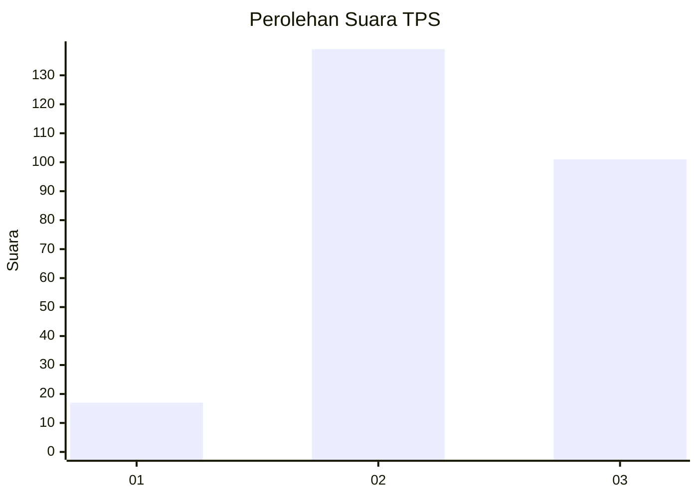
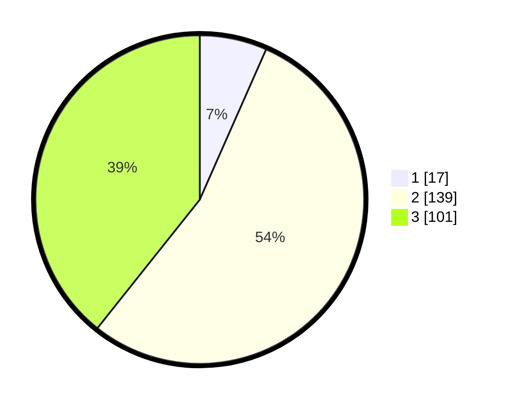

# Hasil

## Grafik

## Tabel

| No. | Nama Paslon    | Suara | Suara (raw) | Persentase |
|:--- |:-------------- | -----:| -----------:| ----------:|
| 1   | ANIES MUHAIMIN | 17    | [17][p-1]   | 6,61       |
| 2   | PRABOWO GIBRAN | 139   | [139][p-2]  | 54,09      |
| 3   | GANJAR MAHFUD  | 101   | [101][p-3]  | 39,30      |

[p-1]: https://github.com/gigit-pemilu/pemilu-2024-34-di-yogyakarta/blob/main/pilpres/hitung-suara/sub/34-di-yogyakarta/sub/02-bantul/sub/08-bantul/sub/2004-trirenggo/sub/052-tps/sub/paslon-1.txt
[p-2]: https://github.com/gigit-pemilu/pemilu-2024-34-di-yogyakarta/blob/main/pilpres/hitung-suara/sub/34-di-yogyakarta/sub/02-bantul/sub/08-bantul/sub/2004-trirenggo/sub/052-tps/sub/paslon-2.txt
[p-3]: https://github.com/gigit-pemilu/pemilu-2024-34-di-yogyakarta/blob/main/pilpres/hitung-suara/sub/34-di-yogyakarta/sub/02-bantul/sub/08-bantul/sub/2004-trirenggo/sub/052-tps/sub/paslon-3.txt

## Foto C Plano

https://sirekap-obj-formc.kpu.go.id/9f17/pemilu/ppwp/34/02/08/20/04/3402082004052-20240214-221005--7ec6c11b-c533-4e1d-9425-8425678fa6fe.jpg

https://sirekap-obj-formc.kpu.go.id/9f17/pemilu/ppwp/34/02/08/20/04/3402082004052-20240214-221136--faaa69e9-0266-4467-953f-cbb7c3ffc83e.jpg

https://sirekap-obj-formc.kpu.go.id/9f17/pemilu/ppwp/34/02/08/20/04/3402082004052-20240214-221342--cbdd821d-7594-40fe-ad47-ce7ca1b135b6.jpg

## Metadata

| Key        | Value               |
| ---------- | ------------------- |
| Time Stamp | 2024-02-22 09:00:00 |

