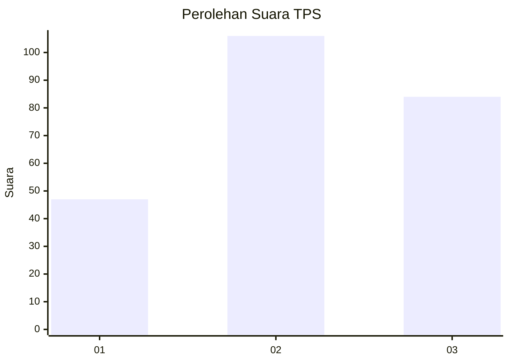
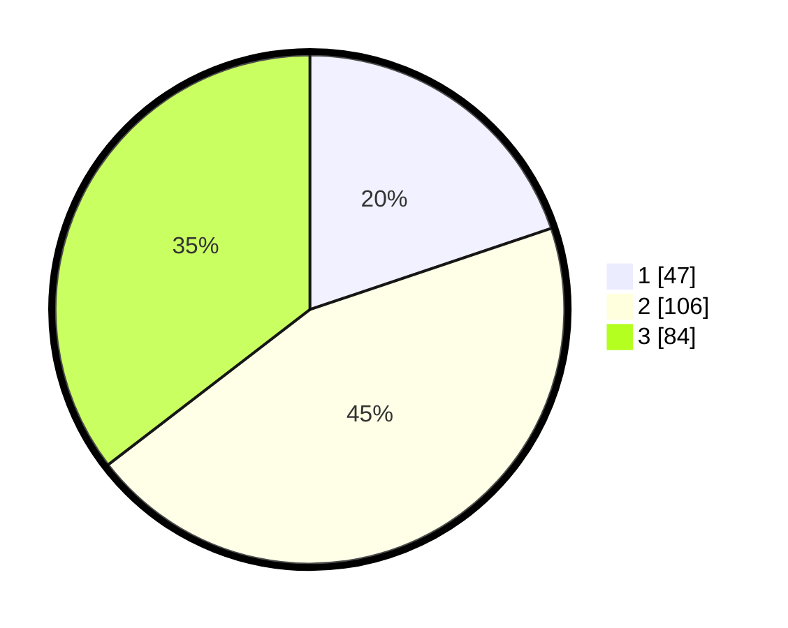

# Hasil

## Grafik

## Tabel

| No. | Nama Paslon    | Suara | Suara (raw) | Persentase |
|:--- |:-------------- | -----:| -----------:| ----------:|
| 1   | ANIES MUHAIMIN | 47    | [47][p-1]   | 19,83      |
| 2   | PRABOWO GIBRAN | 106   | [106][p-2]  | 44,73      |
| 3   | GANJAR MAHFUD  | 84    | [84][p-3]   | 35,44      |

[p-1]: https://github.com/gigit-pemilu/pemilu-2024-34-di-yogyakarta/blob/main/pilpres/hitung-suara/sub/34-di-yogyakarta/sub/02-bantul/sub/08-bantul/sub/2004-trirenggo/sub/055-tps/sub/paslon-1.txt
[p-2]: https://github.com/gigit-pemilu/pemilu-2024-34-di-yogyakarta/blob/main/pilpres/hitung-suara/sub/34-di-yogyakarta/sub/02-bantul/sub/08-bantul/sub/2004-trirenggo/sub/055-tps/sub/paslon-2.txt
[p-3]: https://github.com/gigit-pemilu/pemilu-2024-34-di-yogyakarta/blob/main/pilpres/hitung-suara/sub/34-di-yogyakarta/sub/02-bantul/sub/08-bantul/sub/2004-trirenggo/sub/055-tps/sub/paslon-3.txt

## Foto C Plano

https://sirekap-obj-formc.kpu.go.id/502f/pemilu/ppwp/34/02/08/20/04/3402082004055-20240214-235450--fadf5316-490c-4076-8f38-20707faa135d.jpg

https://sirekap-obj-formc.kpu.go.id/502f/pemilu/ppwp/34/02/08/20/04/3402082004055-20240214-235522--74153d92-73f2-451c-bc84-6d5250226a78.jpg

https://sirekap-obj-formc.kpu.go.id/502f/pemilu/ppwp/34/02/08/20/04/3402082004055-20240214-235542--c75929cf-478f-4139-855a-c5a8e21f35e6.jpg

## Metadata

| Key        | Value               |
| ---------- | ------------------- |
| Time Stamp | 2024-02-16 16:25:10 |

