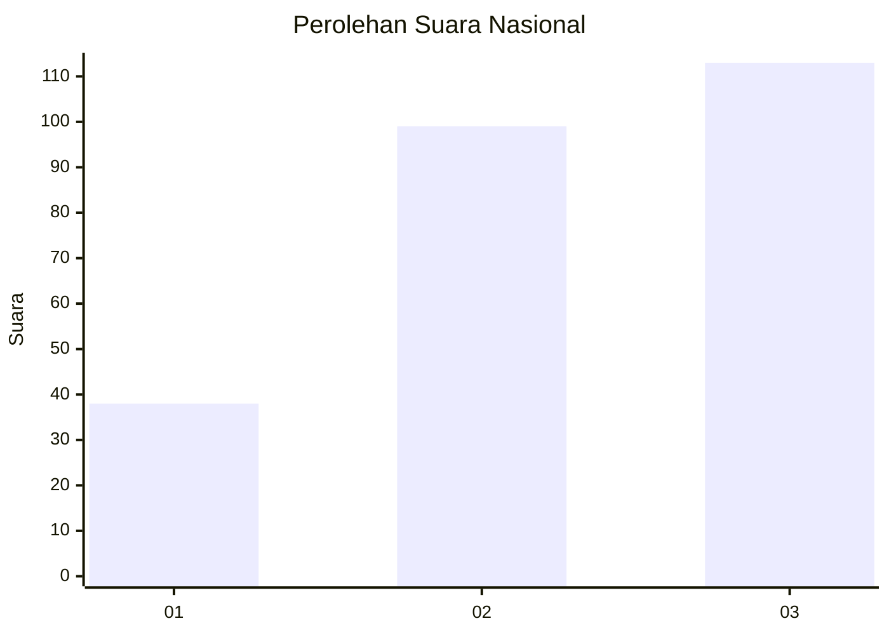
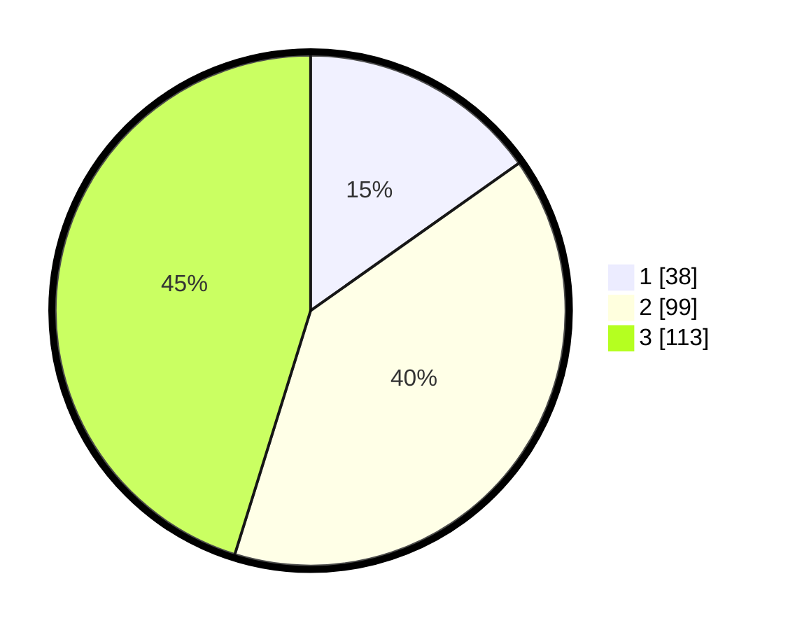

# Hasil

## Grafik

## Tabel

| No. | Nama Paslon    | Suara | Suara (raw) | Persentase |
|:--- |:-------------- | -----:| -----------:| ----------:|
| 1   | ANIES MUHAIMIN | 38    | [38][p-1]   | 15,20      |
| 2   | PRABOWO GIBRAN | 99    | [99][p-2]   | 39,60      |
| 3   | GANJAR MAHFUD  | 113   | [113][p-3]  | 45,20      |

[p-1]: https://github.com/gigit-pemilu/pemilu-2024/blob/main/pilpres/hitung-suara/sub/34-di-yogyakarta/sub/02-bantul/sub/08-bantul/sub/2005-sabdodadi/sub/001-tps/sub/paslon-1.txt
[p-2]: https://github.com/gigit-pemilu/pemilu-2024/blob/main/pilpres/hitung-suara/sub/34-di-yogyakarta/sub/02-bantul/sub/08-bantul/sub/2005-sabdodadi/sub/001-tps/sub/paslon-2.txt
[p-3]: https://github.com/gigit-pemilu/pemilu-2024/blob/main/pilpres/hitung-suara/sub/34-di-yogyakarta/sub/02-bantul/sub/08-bantul/sub/2005-sabdodadi/sub/001-tps/sub/paslon-3.txt

## Foto C Plano

https://sirekap-obj-formc.kpu.go.id/269b/pemilu/ppwp/34/02/08/20/05/3402082005001-20240222-112044--3d799d48-b6a0-4f76-8f77-5a9b8dc7ceae.jpg

https://sirekap-obj-formc.kpu.go.id/269b/pemilu/ppwp/34/02/08/20/05/3402082005001-20240222-112205--2b8817bf-f5ef-4633-9a7f-bb40c1179fbc.jpg

https://sirekap-obj-formc.kpu.go.id/269b/pemilu/ppwp/34/02/08/20/05/3402082005001-20240222-112409--746567ea-5af3-42da-a5a0-c693d1c57899.jpg

## Metadata

| Key        | Value               |
| ---------- | ------------------- |
| Time Stamp | 2024-02-24 22:31:28 |

