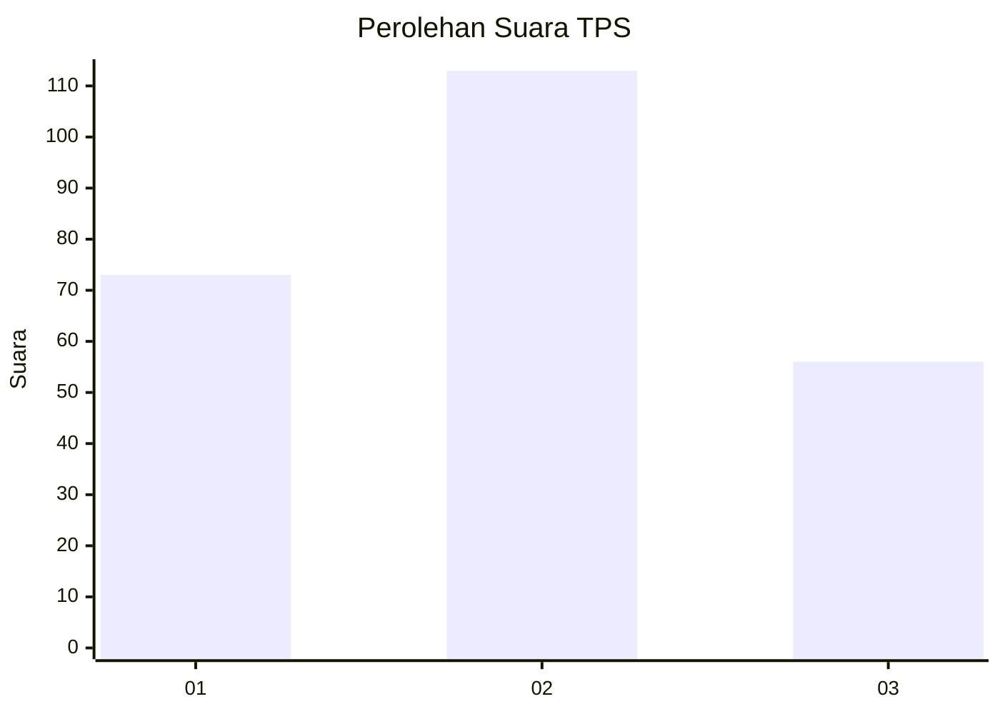
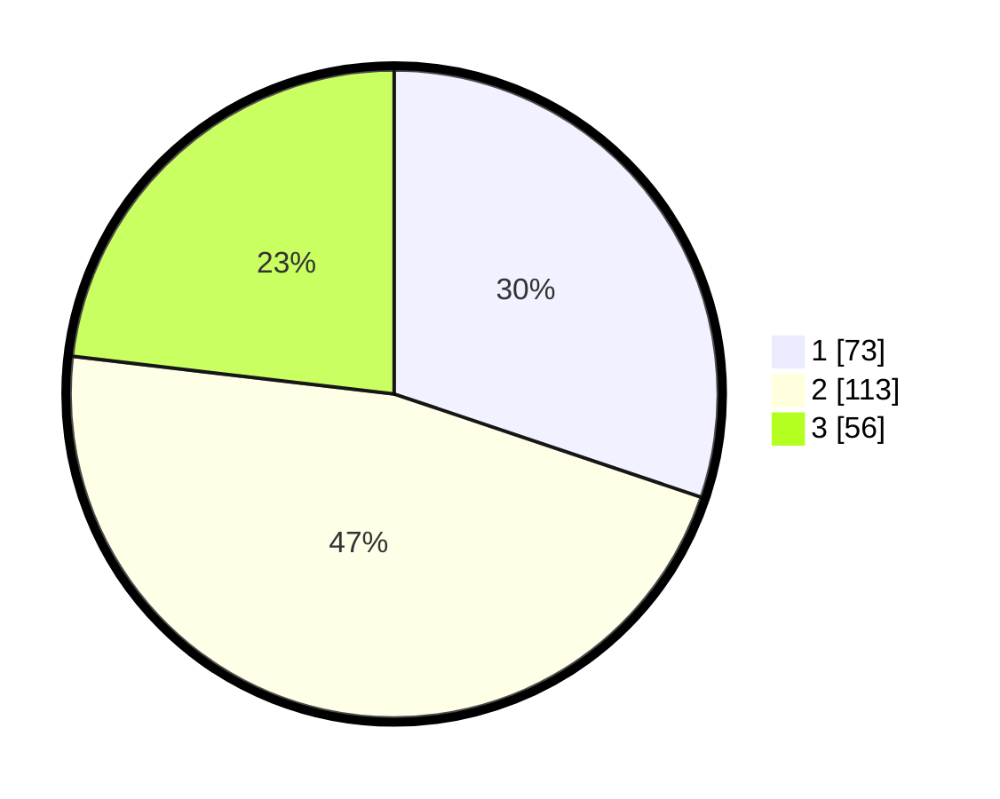

# Hasil

## Grafik

## Tabel

| No. | Nama Paslon    | Suara | Suara (raw) | Persentase |
|:--- |:-------------- | -----:| -----------:| ----------:|
| 1   | ANIES MUHAIMIN | 73    | [73][p-1]   | 30,17      |
| 2   | PRABOWO GIBRAN | 113   | [113][p-2]  | 46,69      |
| 3   | GANJAR MAHFUD  | 56    | [56][p-3]   | 23,14      |

[p-1]: https://github.com/gigit-pemilu/pemilu-2024-34-di-yogyakarta/blob/main/pilpres/hitung-suara/sub/34-di-yogyakarta/sub/02-bantul/sub/08-bantul/sub/2005-sabdodadi/sub/004-tps/sub/paslon-1.txt
[p-2]: https://github.com/gigit-pemilu/pemilu-2024-34-di-yogyakarta/blob/main/pilpres/hitung-suara/sub/34-di-yogyakarta/sub/02-bantul/sub/08-bantul/sub/2005-sabdodadi/sub/004-tps/sub/paslon-2.txt
[p-3]: https://github.com/gigit-pemilu/pemilu-2024-34-di-yogyakarta/blob/main/pilpres/hitung-suara/sub/34-di-yogyakarta/sub/02-bantul/sub/08-bantul/sub/2005-sabdodadi/sub/004-tps/sub/paslon-3.txt

## Foto C Plano

https://sirekap-obj-formc.kpu.go.id/c708/pemilu/ppwp/34/02/08/20/05/3402082005004-20240214-211839--a75dcf58-9d77-4e88-a01b-554ff3696f67.jpg

https://sirekap-obj-formc.kpu.go.id/c708/pemilu/ppwp/34/02/08/20/05/3402082005004-20240214-212012--944469d9-214a-4bc7-8ae7-149b2fea190f.jpg

https://sirekap-obj-formc.kpu.go.id/c708/pemilu/ppwp/34/02/08/20/05/3402082005004-20240214-212050--c570d907-f87c-4ceb-998e-291ec6b507a7.jpg

## Metadata

| Key        | Value               |
| ---------- | ------------------- |
| Time Stamp | 2024-02-16 16:25:10 |

