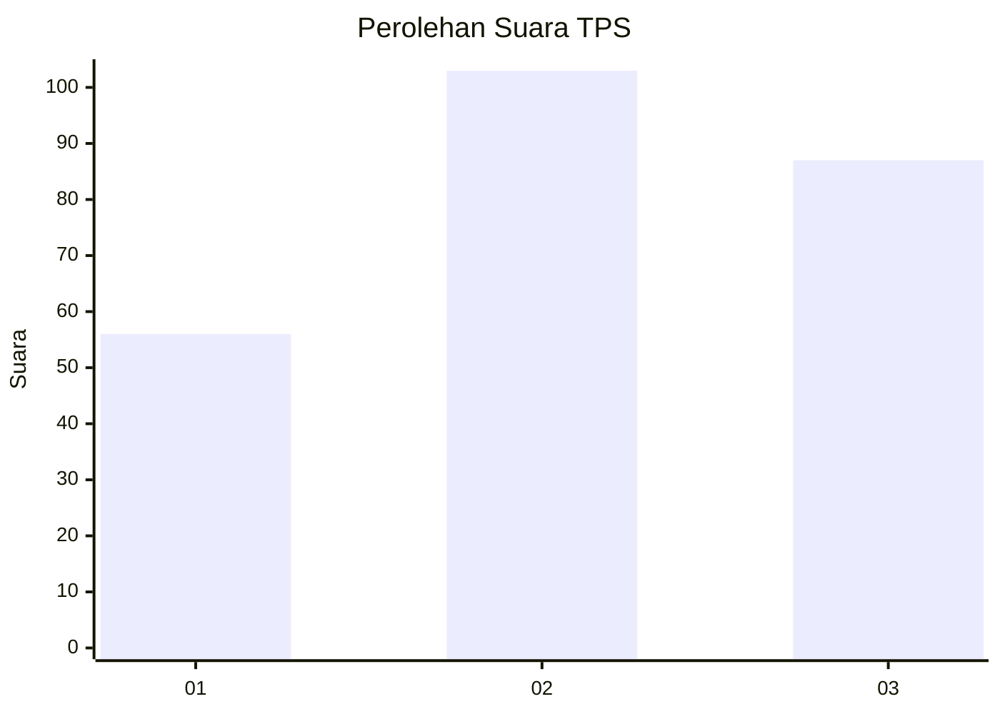
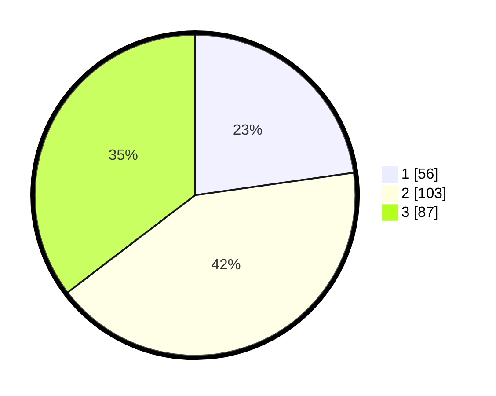

# Hasil

## Grafik

## Tabel

| No. | Nama Paslon    | Suara | Suara (raw) | Persentase |
|:--- |:-------------- | -----:| -----------:| ----------:|
| 1   | ANIES MUHAIMIN | 56    | [56][p-1]   | 22,76      |
| 2   | PRABOWO GIBRAN | 103   | [103][p-2]  | 41,87      |
| 3   | GANJAR MAHFUD  | 87    | [87][p-3]   | 35,37      |

[p-1]: https://github.com/gigit-pemilu/pemilu-2024-34-di-yogyakarta/blob/main/pilpres/hitung-suara/sub/34-di-yogyakarta/sub/02-bantul/sub/08-bantul/sub/2005-sabdodadi/sub/006-tps/sub/paslon-1.txt
[p-2]: https://github.com/gigit-pemilu/pemilu-2024-34-di-yogyakarta/blob/main/pilpres/hitung-suara/sub/34-di-yogyakarta/sub/02-bantul/sub/08-bantul/sub/2005-sabdodadi/sub/006-tps/sub/paslon-2.txt
[p-3]: https://github.com/gigit-pemilu/pemilu-2024-34-di-yogyakarta/blob/main/pilpres/hitung-suara/sub/34-di-yogyakarta/sub/02-bantul/sub/08-bantul/sub/2005-sabdodadi/sub/006-tps/sub/paslon-3.txt

## Foto C Plano

https://sirekap-obj-formc.kpu.go.id/9c54/pemilu/ppwp/34/02/08/20/05/3402082005006-20240222-000202--61cffde0-12d0-4a39-ae03-4fd27e35e8fd.jpg

https://sirekap-obj-formc.kpu.go.id/9c54/pemilu/ppwp/34/02/08/20/05/3402082005006-20240214-155530--0d3b380e-8e8f-4590-af1f-e972e4b49ea8.jpg

https://sirekap-obj-formc.kpu.go.id/9c54/pemilu/ppwp/34/02/08/20/05/3402082005006-20240214-155616--19f5de8c-79f0-42fd-9fbb-379ed35bef9f.jpg

## Metadata

| Key        | Value               |
| ---------- | ------------------- |
| Time Stamp | 2024-02-25 10:00:00 |

