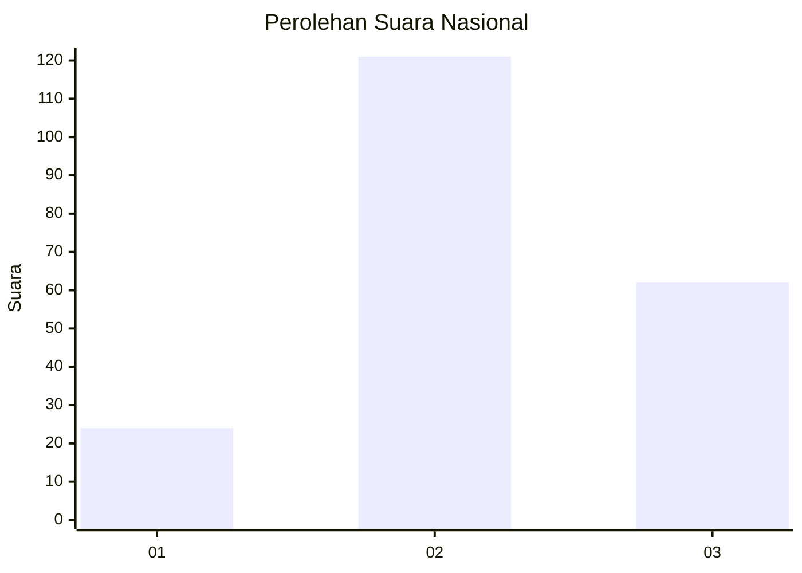
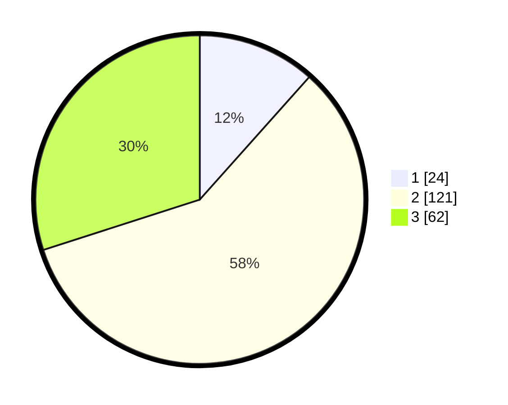

# Hasil

## Grafik

## Tabel

| No. | Nama Paslon    | Suara | Suara (raw) | Persentase |
|:--- |:-------------- | -----:| -----------:| ----------:|
| 1   | ANIES MUHAIMIN | 24    | [24][p-1]   | 11,59      |
| 2   | PRABOWO GIBRAN | 121   | [121][p-2]  | 58,45      |
| 3   | GANJAR MAHFUD  | 62    | [62][p-3]   | 29,95      |

[p-1]: https://github.com/gigit-pemilu/pemilu-2024/blob/main/pilpres/hitung-suara/sub/34-di-yogyakarta/sub/02-bantul/sub/08-bantul/sub/2005-sabdodadi/sub/007-tps/sub/paslon-1.txt
[p-2]: https://github.com/gigit-pemilu/pemilu-2024/blob/main/pilpres/hitung-suara/sub/34-di-yogyakarta/sub/02-bantul/sub/08-bantul/sub/2005-sabdodadi/sub/007-tps/sub/paslon-2.txt
[p-3]: https://github.com/gigit-pemilu/pemilu-2024/blob/main/pilpres/hitung-suara/sub/34-di-yogyakarta/sub/02-bantul/sub/08-bantul/sub/2005-sabdodadi/sub/007-tps/sub/paslon-3.txt

## Foto C Plano

https://sirekap-obj-formc.kpu.go.id/16b7/pemilu/ppwp/34/02/08/20/05/3402082005007-20240214-225515--0a0266cf-e433-4a1b-b8ed-098ca2615847.jpg

https://sirekap-obj-formc.kpu.go.id/16b7/pemilu/ppwp/34/02/08/20/05/3402082005007-20240214-195517--286a7938-0546-4c24-b723-8b3e0eaf4868.jpg

https://sirekap-obj-formc.kpu.go.id/16b7/pemilu/ppwp/34/02/08/20/05/3402082005007-20240214-213736--b70bf160-bea8-424b-b98f-1f6e08f44b73.jpg

## Metadata

| Key        | Value               |
| ---------- | ------------------- |
| Time Stamp | 2024-02-16 16:25:10 |

