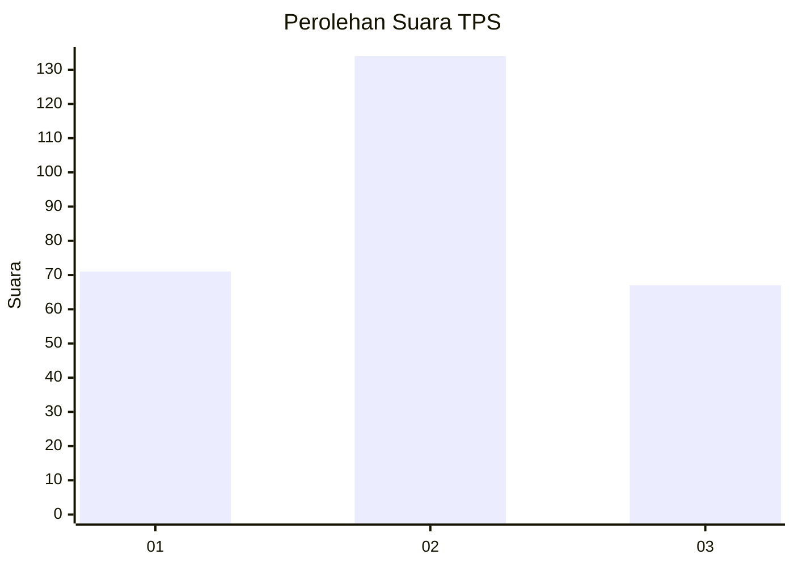
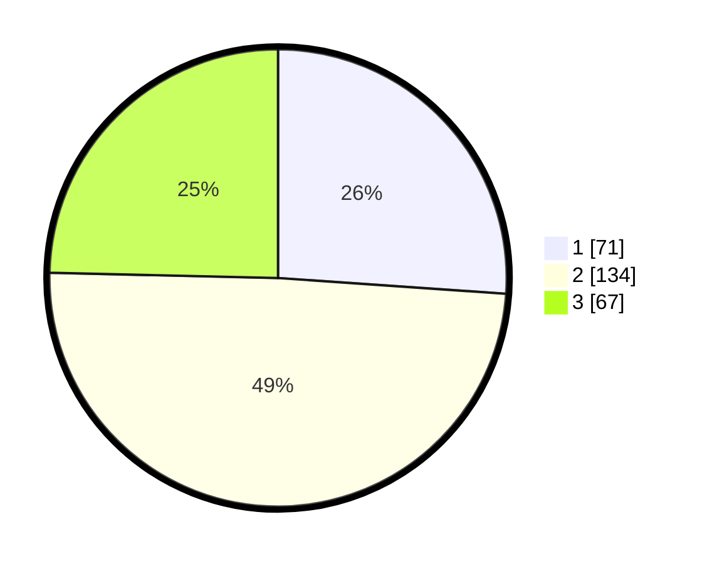

# Hasil

## Grafik

## Tabel

| No. | Nama Paslon    | Suara | Suara (raw) | Persentase |
|:--- |:-------------- | -----:| -----------:| ----------:|
| 1   | ANIES MUHAIMIN | 71    | [71][p-1]   | 26,10      |
| 2   | PRABOWO GIBRAN | 134   | [134][p-2]  | 49,26      |
| 3   | GANJAR MAHFUD  | 67    | [67][p-3]   | 24,63      |

[p-1]: https://github.com/gigit-pemilu/pemilu-2024-34-di-yogyakarta/blob/main/pilpres/hitung-suara/sub/34-di-yogyakarta/sub/02-bantul/sub/08-bantul/sub/2005-sabdodadi/sub/010-tps/sub/paslon-1.txt
[p-2]: https://github.com/gigit-pemilu/pemilu-2024-34-di-yogyakarta/blob/main/pilpres/hitung-suara/sub/34-di-yogyakarta/sub/02-bantul/sub/08-bantul/sub/2005-sabdodadi/sub/010-tps/sub/paslon-2.txt
[p-3]: https://github.com/gigit-pemilu/pemilu-2024-34-di-yogyakarta/blob/main/pilpres/hitung-suara/sub/34-di-yogyakarta/sub/02-bantul/sub/08-bantul/sub/2005-sabdodadi/sub/010-tps/sub/paslon-3.txt

## Foto C Plano

https://sirekap-obj-formc.kpu.go.id/1145/pemilu/ppwp/34/02/08/20/05/3402082005010-20240215-003450--4c93885d-0a1a-44fd-a4b9-cd7c0afea420.jpg

https://sirekap-obj-formc.kpu.go.id/1145/pemilu/ppwp/34/02/08/20/05/3402082005010-20240215-001047--169ce5da-e1a3-4412-a185-b7f40484d71a.jpg

https://sirekap-obj-formc.kpu.go.id/1145/pemilu/ppwp/34/02/08/20/05/3402082005010-20240215-004000--3d5aba3e-7834-44f2-894a-befbc2965246.jpg

## Metadata

| Key        | Value               |
| ---------- | ------------------- |
| Time Stamp | 2024-02-27 13:00:00 |

