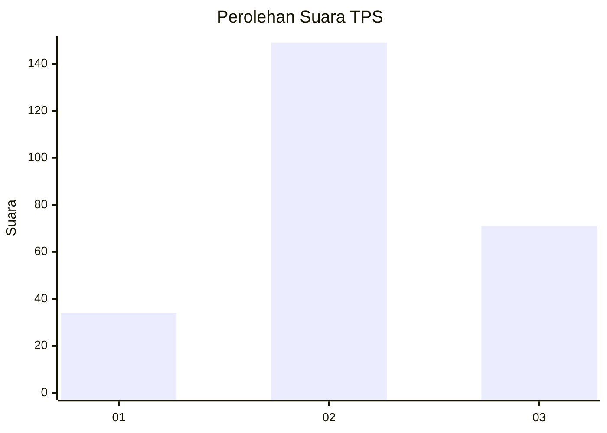
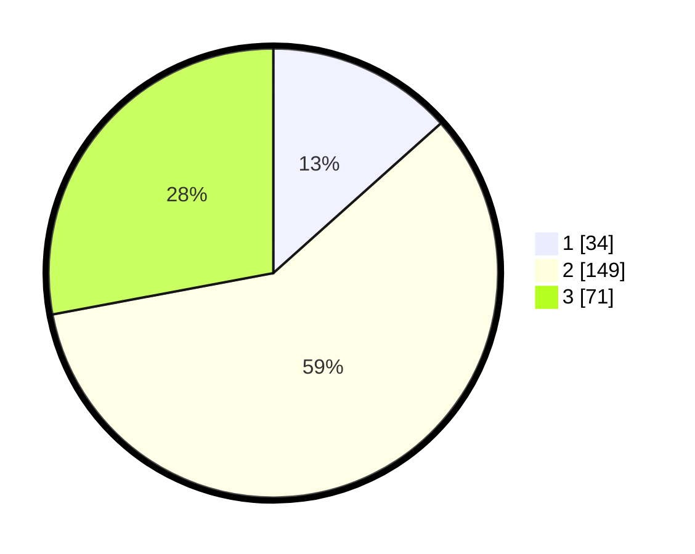

# Hasil

## Grafik

## Tabel

| No. | Nama Paslon    | Suara | Suara (raw) | Persentase |
|:--- |:-------------- | -----:| -----------:| ----------:|
| 1   | ANIES MUHAIMIN | 34    | [34][p-1]   | 13,39      |
| 2   | PRABOWO GIBRAN | 149   | [149][p-2]  | 58,66      |
| 3   | GANJAR MAHFUD  | 71    | [71][p-3]   | 27,95      |

[p-1]: https://github.com/gigit-pemilu/pemilu-2024-34-di-yogyakarta/blob/main/pilpres/hitung-suara/sub/34-di-yogyakarta/sub/02-bantul/sub/08-bantul/sub/2005-sabdodadi/sub/018-tps/sub/paslon-1.txt
[p-2]: https://github.com/gigit-pemilu/pemilu-2024-34-di-yogyakarta/blob/main/pilpres/hitung-suara/sub/34-di-yogyakarta/sub/02-bantul/sub/08-bantul/sub/2005-sabdodadi/sub/018-tps/sub/paslon-2.txt
[p-3]: https://github.com/gigit-pemilu/pemilu-2024-34-di-yogyakarta/blob/main/pilpres/hitung-suara/sub/34-di-yogyakarta/sub/02-bantul/sub/08-bantul/sub/2005-sabdodadi/sub/018-tps/sub/paslon-3.txt

## Foto C Plano

https://sirekap-obj-formc.kpu.go.id/6aef/pemilu/ppwp/34/02/08/20/05/3402082005018-20240214-212447--e2ee1f9b-5772-43be-8717-568220142dec.jpg

https://sirekap-obj-formc.kpu.go.id/6aef/pemilu/ppwp/34/02/08/20/05/3402082005018-20240214-211921--3152e3c8-6ddc-4d43-9851-6848ef726d60.jpg

https://sirekap-obj-formc.kpu.go.id/6aef/pemilu/ppwp/34/02/08/20/05/3402082005018-20240214-231419--efde4e8f-c7eb-49d6-9597-232dfa3e5a04.jpg

## Metadata

| Key        | Value               |
| ---------- | ------------------- |
| Time Stamp | 2024-02-15 20:00:44 |

