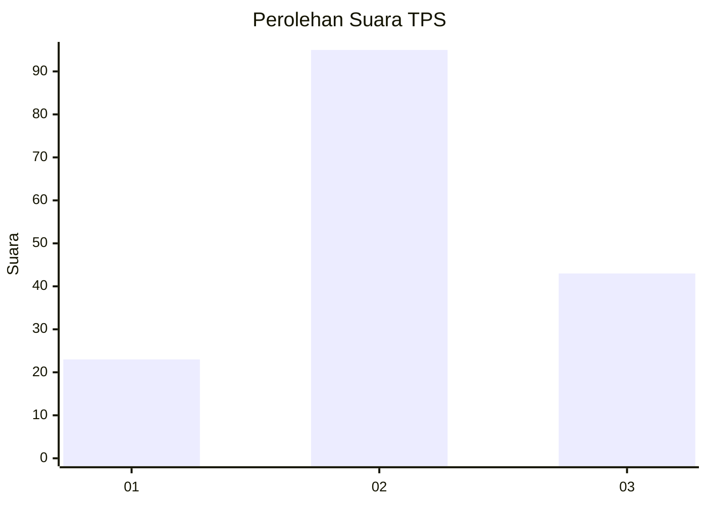
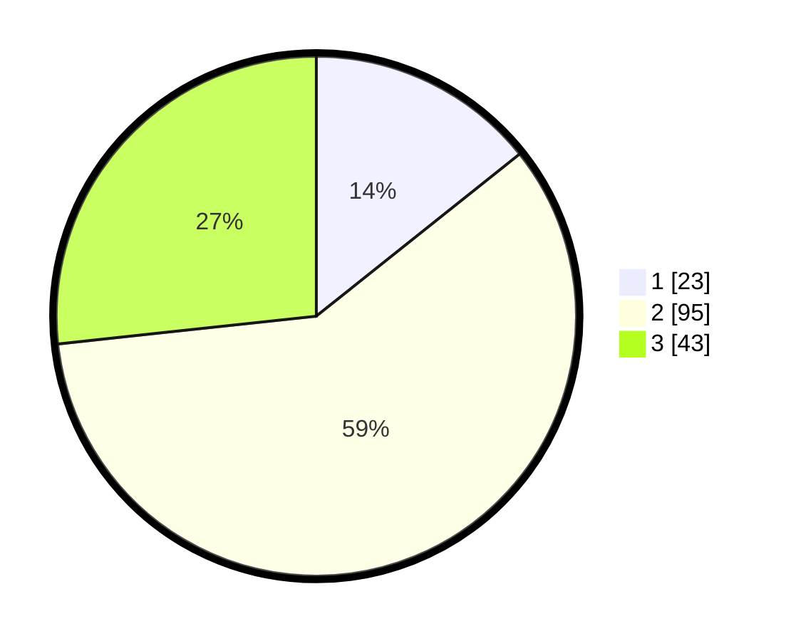

# Hasil

## Grafik

## Tabel

| No. | Nama Paslon    | Suara | Suara (raw) | Persentase |
|:--- |:-------------- | -----:| -----------:| ----------:|
| 1   | ANIES MUHAIMIN | 23    | [23][p-1]   | 14,29      |
| 2   | PRABOWO GIBRAN | 95    | [95][p-2]   | 59,01      |
| 3   | GANJAR MAHFUD  | 43    | [43][p-3]   | 26,71      |

[p-1]: https://github.com/gigit-pemilu/pemilu-2024-34-di-yogyakarta/blob/main/pilpres/hitung-suara/sub/34-di-yogyakarta/sub/02-bantul/sub/09-jetis/sub/2001-patalan/sub/001-tps/sub/paslon-1.txt
[p-2]: https://github.com/gigit-pemilu/pemilu-2024-34-di-yogyakarta/blob/main/pilpres/hitung-suara/sub/34-di-yogyakarta/sub/02-bantul/sub/09-jetis/sub/2001-patalan/sub/001-tps/sub/paslon-2.txt
[p-3]: https://github.com/gigit-pemilu/pemilu-2024-34-di-yogyakarta/blob/main/pilpres/hitung-suara/sub/34-di-yogyakarta/sub/02-bantul/sub/09-jetis/sub/2001-patalan/sub/001-tps/sub/paslon-3.txt

## Foto C Plano

https://sirekap-obj-formc.kpu.go.id/8508/pemilu/ppwp/34/02/09/20/01/3402092001001-20240215-223520--49772487-1e11-44f2-a571-bdc6afcf6ff9.jpg

https://sirekap-obj-formc.kpu.go.id/8508/pemilu/ppwp/34/02/09/20/01/3402092001001-20240214-200217--ae721c00-deb3-4fcf-bd23-4c1f62b391d4.jpg

https://sirekap-obj-formc.kpu.go.id/8508/pemilu/ppwp/34/02/09/20/01/3402092001001-20240214-200539--ce030da7-d322-4cca-bb8d-0cc4af031bc8.jpg

## Metadata

| Key        | Value               |
| ---------- | ------------------- |
| Time Stamp | 2024-02-15 22:40:13 |

## DATA PEMILIH TETAP

Jumlah pemilih dalam DPT: **184**.
 * L: **96**.
 * P: **88**.

## DATA PENGGUNA HAK PILIH

Jumlah pengguna hak pilih dalam DPT: **163**.
 * L: **85**.
 * P: **78**.

Jumlah pengguna hak pilih dalam DPTb: **1**.
 * L: **0**.
 * P: **1**.

Jumlah pengguna hak pilih dalam DPK: **2**.
 * L: **2**.
 * P: **0**.

Jumlah pengguna hak pilih: **166**.
 * L: **87**.
 * P: **79**.

## JUMLAH SUARA SAH DAN TIDAK SAH

JUMLAH SELURUH SUARA SAH: **161**.

JUMLAH SUARA TIDAK SAH: **5**.

JUMLAH SELURUH SUARA SAH DAN SUARA TIDAK SAH: **166**.

