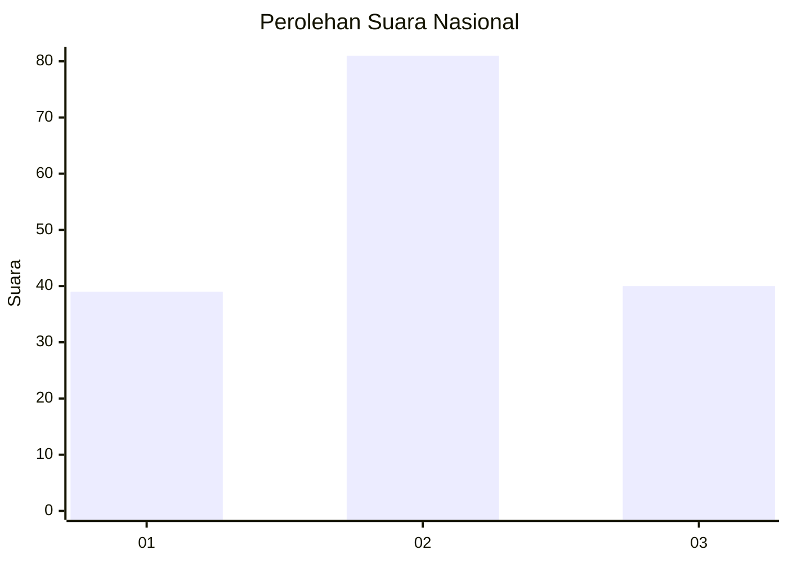
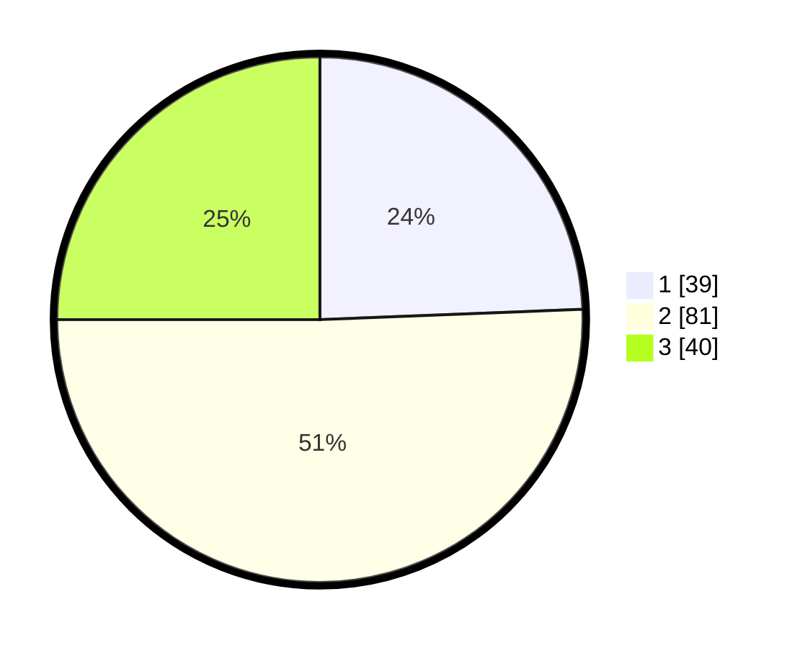

# Hasil

## Grafik

## Tabel

| No. | Nama Paslon    | Suara | Suara (raw) | Persentase |
|:--- |:-------------- | -----:| -----------:| ----------:|
| 1   | ANIES MUHAIMIN | 39    | [39][p-1]   | 24,38      |
| 2   | PRABOWO GIBRAN | 81    | [81][p-2]   | 50,63      |
| 3   | GANJAR MAHFUD  | 40    | [40][p-3]   | 25,00      |

[p-1]: https://github.com/gigit-pemilu/pemilu-2024/blob/main/pilpres/hitung-suara/sub/34-di-yogyakarta/sub/02-bantul/sub/09-jetis/sub/2001-patalan/sub/002-tps/sub/paslon-1.txt
[p-2]: https://github.com/gigit-pemilu/pemilu-2024/blob/main/pilpres/hitung-suara/sub/34-di-yogyakarta/sub/02-bantul/sub/09-jetis/sub/2001-patalan/sub/002-tps/sub/paslon-2.txt
[p-3]: https://github.com/gigit-pemilu/pemilu-2024/blob/main/pilpres/hitung-suara/sub/34-di-yogyakarta/sub/02-bantul/sub/09-jetis/sub/2001-patalan/sub/002-tps/sub/paslon-3.txt

## Foto C Plano

https://sirekap-obj-formc.kpu.go.id/ac1e/pemilu/ppwp/34/02/09/20/01/3402092001002-20240216-082656--cd9fbe0c-30ef-4a9d-9dd5-f5b57a97a59c.jpg

https://sirekap-obj-formc.kpu.go.id/ac1e/pemilu/ppwp/34/02/09/20/01/3402092001002-20240216-082705--a0e10c98-6a47-4129-b2fe-f7075f1cfeec.jpg

https://sirekap-obj-formc.kpu.go.id/ac1e/pemilu/ppwp/34/02/09/20/01/3402092001002-20240216-082704--98952a8d-56c9-4186-b6ed-bde1a41f4fa0.jpg

## Metadata

| Key        | Value               |
| ---------- | ------------------- |
| Time Stamp | 2024-02-20 12:00:00 |

## DATA PEMILIH TETAP

Jumlah pemilih dalam DPT: **178**.
 * L: **90**.
 * P: **88**.

## DATA PENGGUNA HAK PILIH

Jumlah pengguna hak pilih dalam DPT: **163**.
 * L: **80**.
 * P: **83**.

Jumlah pengguna hak pilih dalam DPTb: **2**.
 * L: **1**.
 * P: **1**.

Jumlah pengguna hak pilih dalam DPK: **1**.
 * L: **1**.
 * P: **0**.

Jumlah pengguna hak pilih: **166**.
 * L: **82**.
 * P: **84**.

## JUMLAH SUARA SAH DAN TIDAK SAH

JUMLAH SELURUH SUARA SAH: **160**.

JUMLAH SUARA TIDAK SAH: **6**.

JUMLAH SELURUH SUARA SAH DAN SUARA TIDAK SAH: **166**.

