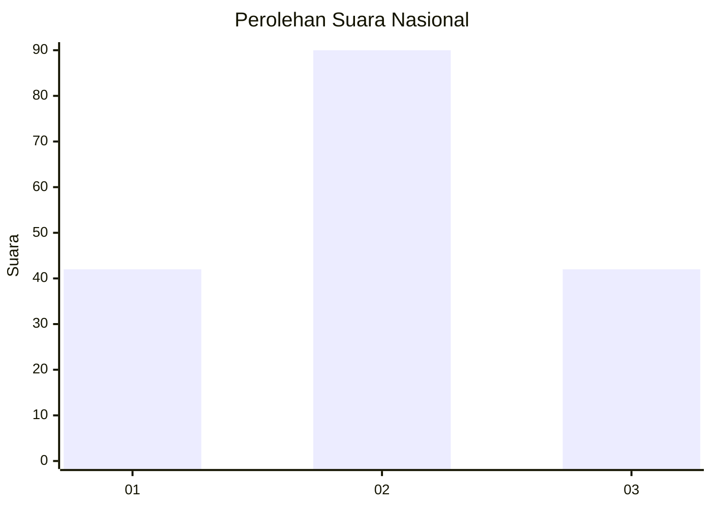
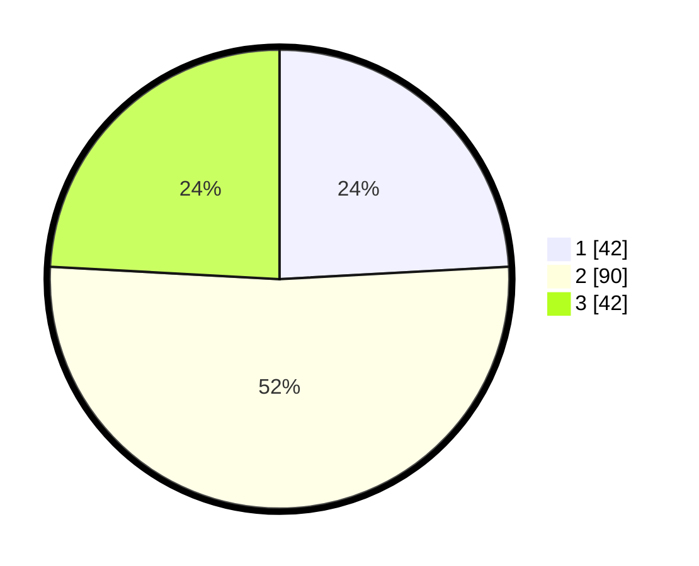

# Hasil

## Grafik

## Tabel

| No. | Nama Paslon    | Suara | Suara (raw) | Persentase |
|:--- |:-------------- | -----:| -----------:| ----------:|
| 1   | ANIES MUHAIMIN | 42    | [42][p-1]   | 24,14      |
| 2   | PRABOWO GIBRAN | 90    | [90][p-2]   | 51,72      |
| 3   | GANJAR MAHFUD  | 42    | [42][p-3]   | 24,14      |

[p-1]: https://github.com/gigit-pemilu/pemilu-2024/blob/main/pilpres/hitung-suara/sub/34-di-yogyakarta/sub/02-bantul/sub/09-jetis/sub/2001-patalan/sub/003-tps/sub/paslon-1.txt
[p-2]: https://github.com/gigit-pemilu/pemilu-2024/blob/main/pilpres/hitung-suara/sub/34-di-yogyakarta/sub/02-bantul/sub/09-jetis/sub/2001-patalan/sub/003-tps/sub/paslon-2.txt
[p-3]: https://github.com/gigit-pemilu/pemilu-2024/blob/main/pilpres/hitung-suara/sub/34-di-yogyakarta/sub/02-bantul/sub/09-jetis/sub/2001-patalan/sub/003-tps/sub/paslon-3.txt

## Foto C Plano

https://sirekap-obj-formc.kpu.go.id/23a0/pemilu/ppwp/34/02/09/20/01/3402092001003-20240216-020933--b617a6a7-4c61-4925-a4b9-414e30b8564b.jpg

https://sirekap-obj-formc.kpu.go.id/23a0/pemilu/ppwp/34/02/09/20/01/3402092001003-20240216-020934--e35b87f0-1726-4fa8-9afe-67fabe913b7a.jpg

https://sirekap-obj-formc.kpu.go.id/23a0/pemilu/ppwp/34/02/09/20/01/3402092001003-20240216-020933--ae63e76c-6440-4dc8-b4e5-396eb38033c7.jpg

## Metadata

| Key        | Value               |
| ---------- | ------------------- |
| Time Stamp | 2024-02-17 16:00:02 |

## DATA PEMILIH TETAP

Jumlah pemilih dalam DPT: **197**.
 * L: **88**.
 * P: **109**.

## DATA PENGGUNA HAK PILIH

Jumlah pengguna hak pilih dalam DPT: **168**.
 * L: **74**.
 * P: **94**.

Jumlah pengguna hak pilih dalam DPTb: **8**.
 * L: **6**.
 * P: **2**.

Jumlah pengguna hak pilih dalam DPK: **1**.
 * L: **1**.
 * P: **0**.

Jumlah pengguna hak pilih: **177**.
 * L: **81**.
 * P: **96**.

## JUMLAH SUARA SAH DAN TIDAK SAH

JUMLAH SELURUH SUARA SAH: **174**.

JUMLAH SUARA TIDAK SAH: **3**.

JUMLAH SELURUH SUARA SAH DAN SUARA TIDAK SAH: **177**.

