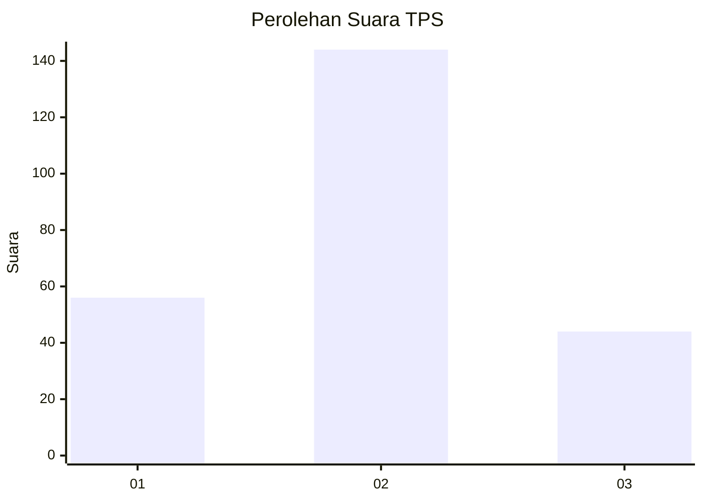
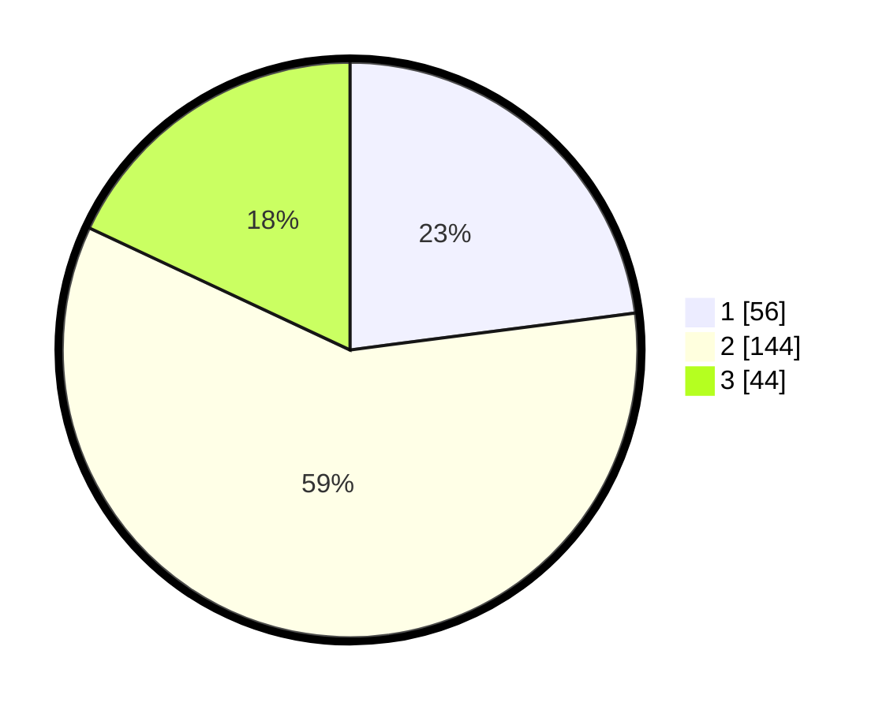

# Hasil

## Grafik

## Tabel

| No. | Nama Paslon    | Suara | Suara (raw) | Persentase |
|:--- |:-------------- | -----:| -----------:| ----------:|
| 1   | ANIES MUHAIMIN | 56    | [56][p-1]   | 22,95      |
| 2   | PRABOWO GIBRAN | 144   | [144][p-2]  | 59,02      |
| 3   | GANJAR MAHFUD  | 44    | [44][p-3]   | 18,03      |

[p-1]: https://github.com/gigit-pemilu/pemilu-2024-34-di-yogyakarta/blob/main/pilpres/hitung-suara/sub/34-di-yogyakarta/sub/02-bantul/sub/09-jetis/sub/2001-patalan/sub/004-tps/sub/paslon-1.txt
[p-2]: https://github.com/gigit-pemilu/pemilu-2024-34-di-yogyakarta/blob/main/pilpres/hitung-suara/sub/34-di-yogyakarta/sub/02-bantul/sub/09-jetis/sub/2001-patalan/sub/004-tps/sub/paslon-2.txt
[p-3]: https://github.com/gigit-pemilu/pemilu-2024-34-di-yogyakarta/blob/main/pilpres/hitung-suara/sub/34-di-yogyakarta/sub/02-bantul/sub/09-jetis/sub/2001-patalan/sub/004-tps/sub/paslon-3.txt

## Foto C Plano

https://sirekap-obj-formc.kpu.go.id/ea9d/pemilu/ppwp/34/02/09/20/01/3402092001004-20240214-141218--3407a430-78e2-490e-ba26-c658ab425f39.jpg

https://sirekap-obj-formc.kpu.go.id/ea9d/pemilu/ppwp/34/02/09/20/01/3402092001004-20240214-141246--fee866b1-1756-4a28-8654-8a09adc381d6.jpg

https://sirekap-obj-formc.kpu.go.id/ea9d/pemilu/ppwp/34/02/09/20/01/3402092001004-20240215-212709--25541b9f-96d0-4b8e-91cf-0ac1e98eb7ec.jpg

## Metadata

| Key        | Value               |
| ---------- | ------------------- |
| Time Stamp | 2024-02-15 21:30:27 |

## DATA PEMILIH TETAP

Jumlah pemilih dalam DPT: **271**.
 * L: **127**.
 * P: **144**.

## DATA PENGGUNA HAK PILIH

Jumlah pengguna hak pilih dalam DPT: **247**.
 * L: **115**.
 * P: **132**.

Jumlah pengguna hak pilih dalam DPTb: **4**.
 * L: **2**.
 * P: **2**.

Jumlah pengguna hak pilih dalam DPK: **0**.
 * L: **0**.
 * P: **0**.

Jumlah pengguna hak pilih: **251**.
 * L: **117**.
 * P: **134**.

## JUMLAH SUARA SAH DAN TIDAK SAH

JUMLAH SELURUH SUARA SAH: **244**.

JUMLAH SUARA TIDAK SAH: **7**.

JUMLAH SELURUH SUARA SAH DAN SUARA TIDAK SAH: **251**.

