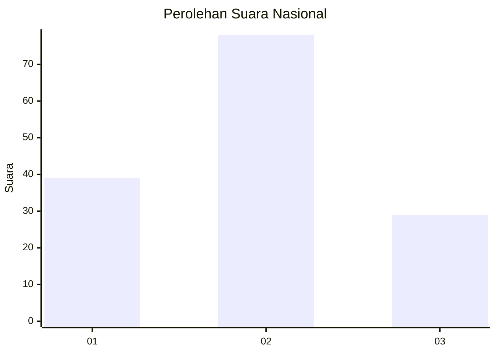
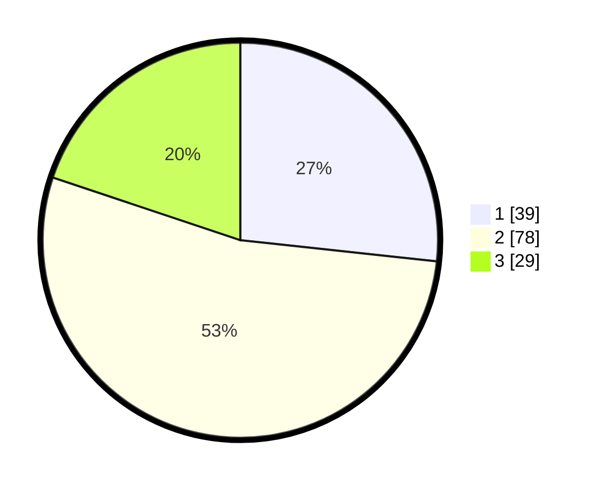

# Hasil

## Grafik

## Tabel

| No. | Nama Paslon    | Suara | Suara (raw) | Persentase |
|:--- |:-------------- | -----:| -----------:| ----------:|
| 1   | ANIES MUHAIMIN | 39    | [39][p-1]   | 26,71      |
| 2   | PRABOWO GIBRAN | 78    | [78][p-2]   | 53,42      |
| 3   | GANJAR MAHFUD  | 29    | [29][p-3]   | 19,86      |

[p-1]: https://github.com/gigit-pemilu/pemilu-2024/blob/main/pilpres/hitung-suara/sub/34-di-yogyakarta/sub/02-bantul/sub/09-jetis/sub/2001-patalan/sub/005-tps/sub/paslon-1.txt
[p-2]: https://github.com/gigit-pemilu/pemilu-2024/blob/main/pilpres/hitung-suara/sub/34-di-yogyakarta/sub/02-bantul/sub/09-jetis/sub/2001-patalan/sub/005-tps/sub/paslon-2.txt
[p-3]: https://github.com/gigit-pemilu/pemilu-2024/blob/main/pilpres/hitung-suara/sub/34-di-yogyakarta/sub/02-bantul/sub/09-jetis/sub/2001-patalan/sub/005-tps/sub/paslon-3.txt

## Foto C Plano

https://sirekap-obj-formc.kpu.go.id/ebad/pemilu/ppwp/34/02/09/20/01/3402092001005-20240214-184856--1b8d4da9-63cf-49c2-8e2b-5f63a53e1d02.jpg

https://sirekap-obj-formc.kpu.go.id/ebad/pemilu/ppwp/34/02/09/20/01/3402092001005-20240214-185259--4cc0e036-1994-419f-aa3f-02dc208fc4d8.jpg

https://sirekap-obj-formc.kpu.go.id/ebad/pemilu/ppwp/34/02/09/20/01/3402092001005-20240214-192731--09088d32-1005-4a04-bd19-ca8b9963e59e.jpg

## Metadata

| Key        | Value               |
| ---------- | ------------------- |
| Time Stamp | 2024-02-14 21:46:01 |

## DATA PEMILIH TETAP

Jumlah pemilih dalam DPT: **158**.
 * L: **73**.
 * P: **85**.

## DATA PENGGUNA HAK PILIH

Jumlah pengguna hak pilih dalam DPT: **143**.
 * L: **66**.
 * P: **77**.

Jumlah pengguna hak pilih dalam DPTb: **6**.
 * L: **2**.
 * P: **4**.

Jumlah pengguna hak pilih dalam DPK: **0**.
 * L: **0**.
 * P: **0**.

Jumlah pengguna hak pilih: **149**.
 * L: **68**.
 * P: **81**.

## JUMLAH SUARA SAH DAN TIDAK SAH

JUMLAH SELURUH SUARA SAH: **146**.

JUMLAH SUARA TIDAK SAH: **3**.

JUMLAH SELURUH SUARA SAH DAN SUARA TIDAK SAH: **149**.

