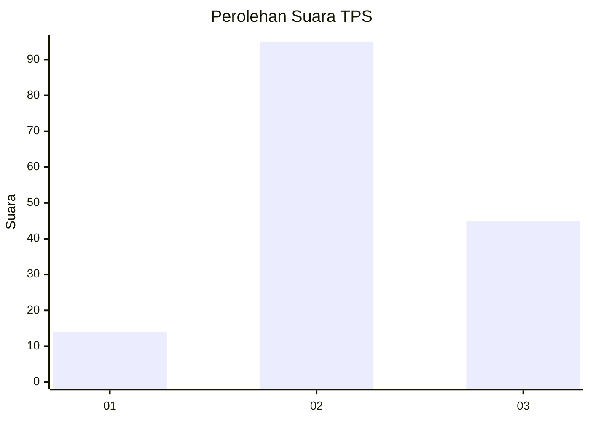
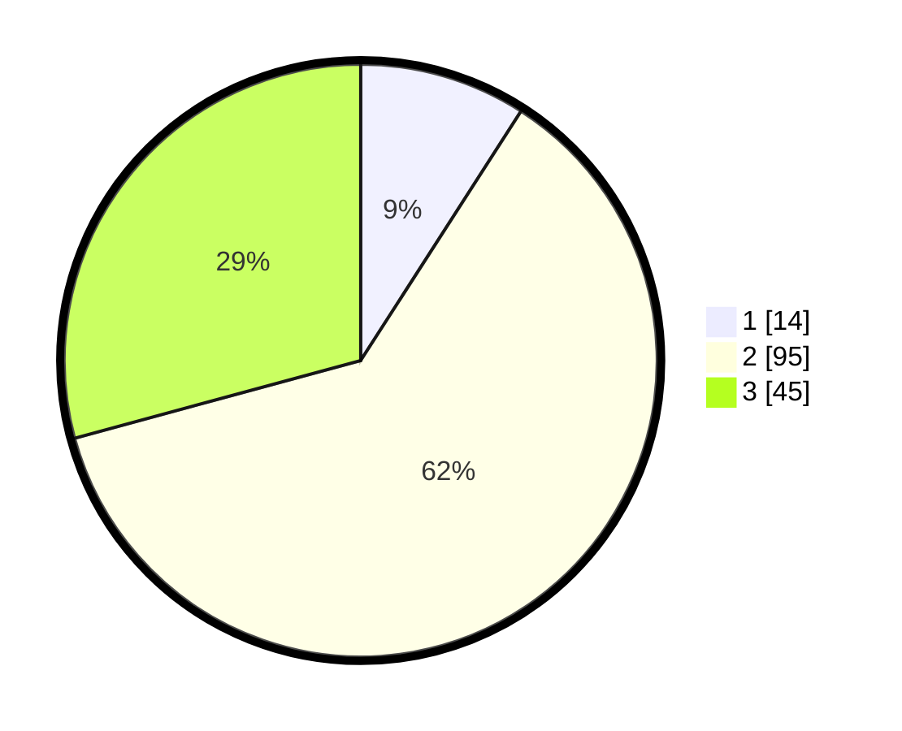

# Hasil

## Grafik

## Tabel

| No. | Nama Paslon    | Suara | Suara (raw) | Persentase |
|:--- |:-------------- | -----:| -----------:| ----------:|
| 1   | ANIES MUHAIMIN | 14    | [14][p-1]   | 9,09       |
| 2   | PRABOWO GIBRAN | 95    | [95][p-2]   | 61,69      |
| 3   | GANJAR MAHFUD  | 45    | [45][p-3]   | 29,22      |

[p-1]: https://github.com/gigit-pemilu/pemilu-2024-34-di-yogyakarta/blob/main/pilpres/hitung-suara/sub/34-di-yogyakarta/sub/02-bantul/sub/09-jetis/sub/2001-patalan/sub/011-tps/sub/paslon-1.txt
[p-2]: https://github.com/gigit-pemilu/pemilu-2024-34-di-yogyakarta/blob/main/pilpres/hitung-suara/sub/34-di-yogyakarta/sub/02-bantul/sub/09-jetis/sub/2001-patalan/sub/011-tps/sub/paslon-2.txt
[p-3]: https://github.com/gigit-pemilu/pemilu-2024-34-di-yogyakarta/blob/main/pilpres/hitung-suara/sub/34-di-yogyakarta/sub/02-bantul/sub/09-jetis/sub/2001-patalan/sub/011-tps/sub/paslon-3.txt

## Foto C Plano

https://sirekap-obj-formc.kpu.go.id/ee6d/pemilu/ppwp/34/02/09/20/01/3402092001011-20240216-143148--d8dd1556-3e9f-4d6a-a9a2-882c209e1697.jpg

https://sirekap-obj-formc.kpu.go.id/ee6d/pemilu/ppwp/34/02/09/20/01/3402092001011-20240216-143400--74209dbe-497b-4713-9dab-e660286920ae.jpg

https://sirekap-obj-formc.kpu.go.id/ee6d/pemilu/ppwp/34/02/09/20/01/3402092001011-20240216-143549--74f0ce02-4be8-4c9d-86f5-69646008d364.jpg

## Metadata

| Key        | Value               |
| ---------- | ------------------- |
| Time Stamp | 2024-02-24 22:31:28 |

