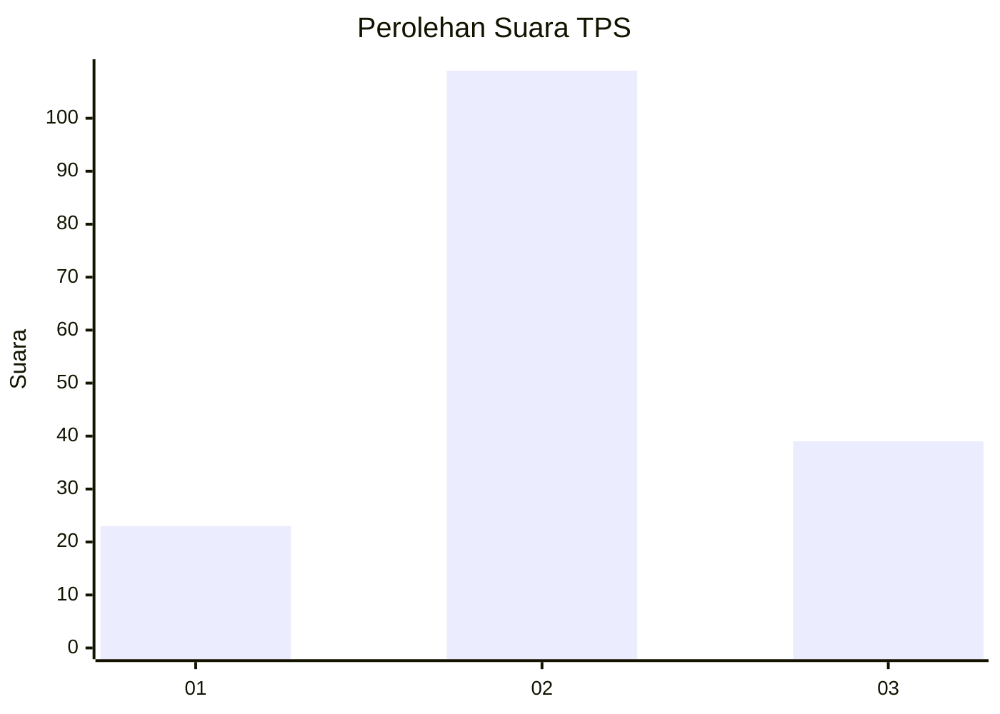
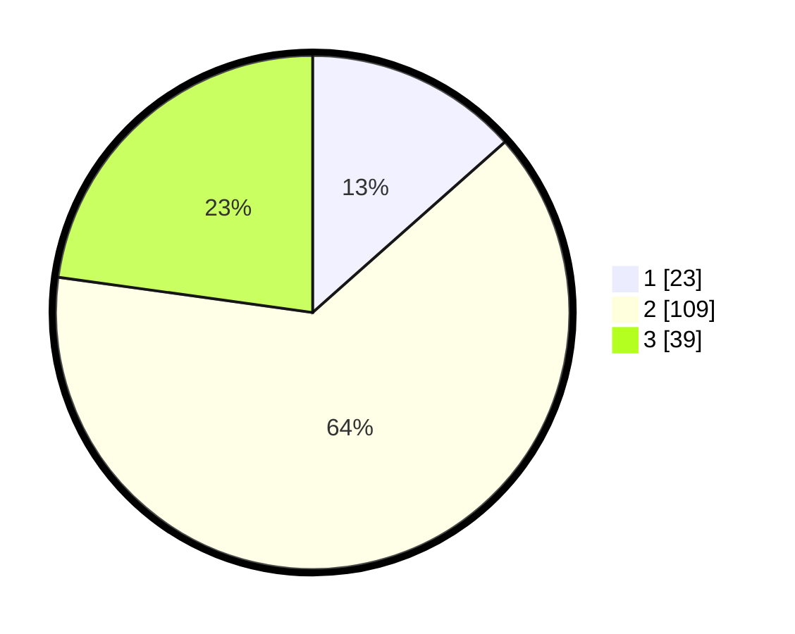

# Hasil

## Grafik

## Tabel

| No. | Nama Paslon    | Suara | Suara (raw) | Persentase |
|:--- |:-------------- | -----:| -----------:| ----------:|
| 1   | ANIES MUHAIMIN | 23    | [23][p-1]   | 13,45      |
| 2   | PRABOWO GIBRAN | 109   | [109][p-2]  | 63,74      |
| 3   | GANJAR MAHFUD  | 39    | [39][p-3]   | 22,81      |

[p-1]: https://github.com/gigit-pemilu/pemilu-2024-34-di-yogyakarta/blob/main/pilpres/hitung-suara/sub/34-di-yogyakarta/sub/02-bantul/sub/09-jetis/sub/2001-patalan/sub/012-tps/sub/paslon-1.txt
[p-2]: https://github.com/gigit-pemilu/pemilu-2024-34-di-yogyakarta/blob/main/pilpres/hitung-suara/sub/34-di-yogyakarta/sub/02-bantul/sub/09-jetis/sub/2001-patalan/sub/012-tps/sub/paslon-2.txt
[p-3]: https://github.com/gigit-pemilu/pemilu-2024-34-di-yogyakarta/blob/main/pilpres/hitung-suara/sub/34-di-yogyakarta/sub/02-bantul/sub/09-jetis/sub/2001-patalan/sub/012-tps/sub/paslon-3.txt

## Foto C Plano

https://sirekap-obj-formc.kpu.go.id/449a/pemilu/ppwp/34/02/09/20/01/3402092001012-20240216-144001--7d072dce-6399-4d52-86f8-7dad567bd757.jpg

https://sirekap-obj-formc.kpu.go.id/449a/pemilu/ppwp/34/02/09/20/01/3402092001012-20240214-222933--a7924c6a-885b-4799-ba3e-63e45deda13c.jpg

https://sirekap-obj-formc.kpu.go.id/449a/pemilu/ppwp/34/02/09/20/01/3402092001012-20240216-144202--f1c2af90-c8b6-4933-a81f-73e023234723.jpg

## Metadata

| Key        | Value               |
| ---------- | ------------------- |
| Time Stamp | 2024-02-24 22:31:28 |

