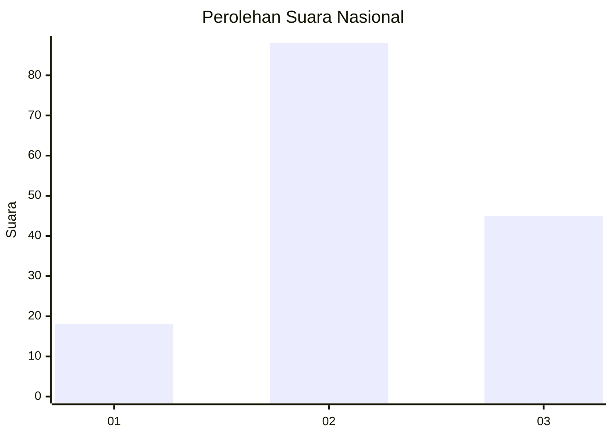
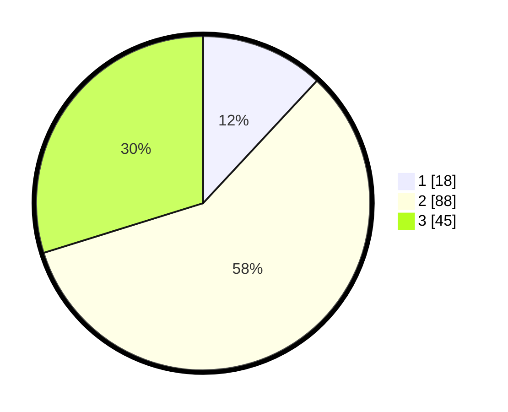

# Hasil

## Grafik

## Tabel

| No. | Nama Paslon    | Suara | Suara (raw) | Persentase |
|:--- |:-------------- | -----:| -----------:| ----------:|
| 1   | ANIES MUHAIMIN | 18    | [18][p-1]   | 11,92      |
| 2   | PRABOWO GIBRAN | 88    | [88][p-2]   | 58,28      |
| 3   | GANJAR MAHFUD  | 45    | [45][p-3]   | 29,80      |

[p-1]: https://github.com/gigit-pemilu/pemilu-2024/blob/main/pilpres/hitung-suara/sub/34-di-yogyakarta/sub/02-bantul/sub/09-jetis/sub/2001-patalan/sub/013-tps/sub/paslon-1.txt
[p-2]: https://github.com/gigit-pemilu/pemilu-2024/blob/main/pilpres/hitung-suara/sub/34-di-yogyakarta/sub/02-bantul/sub/09-jetis/sub/2001-patalan/sub/013-tps/sub/paslon-2.txt
[p-3]: https://github.com/gigit-pemilu/pemilu-2024/blob/main/pilpres/hitung-suara/sub/34-di-yogyakarta/sub/02-bantul/sub/09-jetis/sub/2001-patalan/sub/013-tps/sub/paslon-3.txt

## Foto C Plano

https://sirekap-obj-formc.kpu.go.id/0c48/pemilu/ppwp/34/02/09/20/01/3402092001013-20240216-144529--3b7d26ad-3a52-41e9-892d-311c74baae35.jpg

https://sirekap-obj-formc.kpu.go.id/0c48/pemilu/ppwp/34/02/09/20/01/3402092001013-20240216-144638--c1383bed-7986-4200-bbb5-a65c48811791.jpg

https://sirekap-obj-formc.kpu.go.id/0c48/pemilu/ppwp/34/02/09/20/01/3402092001013-20240216-144846--059e0a7c-49f3-49b5-b7f3-feab2b09aaff.jpg

## Metadata

| Key        | Value               |
| ---------- | ------------------- |
| Time Stamp | 2024-02-24 22:31:28 |

