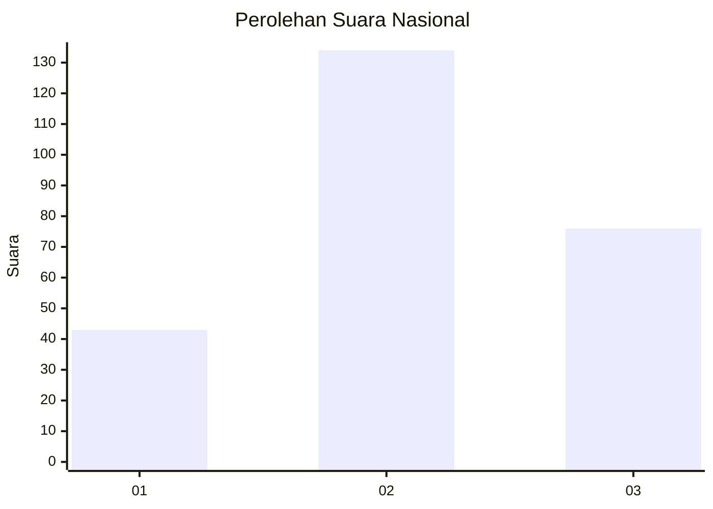
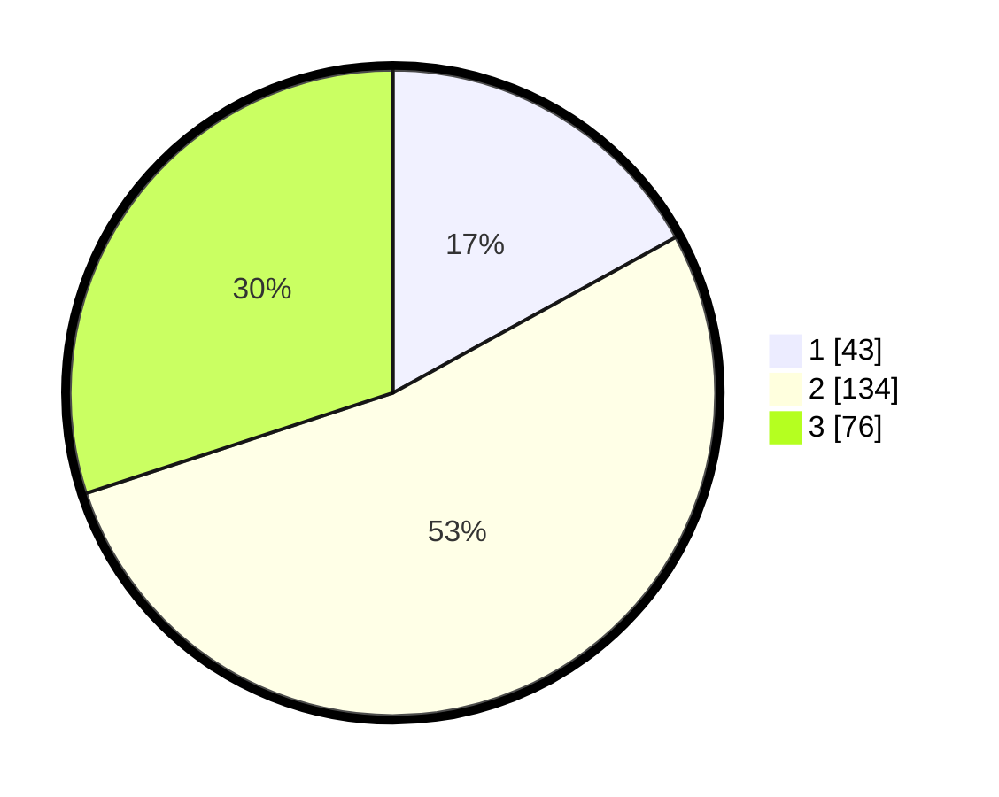

# Hasil

## Grafik

## Tabel

| No. | Nama Paslon    | Suara | Suara (raw) | Persentase |
|:--- |:-------------- | -----:| -----------:| ----------:|
| 1   | ANIES MUHAIMIN | 43    | [43][p-1]   | 17,00      |
| 2   | PRABOWO GIBRAN | 134   | [134][p-2]  | 52,96      |
| 3   | GANJAR MAHFUD  | 76    | [76][p-3]   | 30,04      |

[p-1]: https://github.com/gigit-pemilu/pemilu-2024/blob/main/pilpres/hitung-suara/sub/34-di-yogyakarta/sub/02-bantul/sub/09-jetis/sub/2001-patalan/sub/017-tps/sub/paslon-1.txt
[p-2]: https://github.com/gigit-pemilu/pemilu-2024/blob/main/pilpres/hitung-suara/sub/34-di-yogyakarta/sub/02-bantul/sub/09-jetis/sub/2001-patalan/sub/017-tps/sub/paslon-2.txt
[p-3]: https://github.com/gigit-pemilu/pemilu-2024/blob/main/pilpres/hitung-suara/sub/34-di-yogyakarta/sub/02-bantul/sub/09-jetis/sub/2001-patalan/sub/017-tps/sub/paslon-3.txt

## Foto C Plano

https://sirekap-obj-formc.kpu.go.id/f9fb/pemilu/ppwp/34/02/09/20/01/3402092001017-20240216-151243--160f4d7d-0874-45b5-8ef8-9db7dce4812e.jpg

https://sirekap-obj-formc.kpu.go.id/f9fb/pemilu/ppwp/34/02/09/20/01/3402092001017-20240216-151347--54aa6d04-d5a6-469a-9436-9e30050e96d0.jpg

https://sirekap-obj-formc.kpu.go.id/f9fb/pemilu/ppwp/34/02/09/20/01/3402092001017-20240216-151516--e4530ed1-ecf1-4de3-8bf7-eb72b994e3e3.jpg

## Metadata

| Key        | Value               |
| ---------- | ------------------- |
| Time Stamp | 2024-02-25 14:00:00 |

