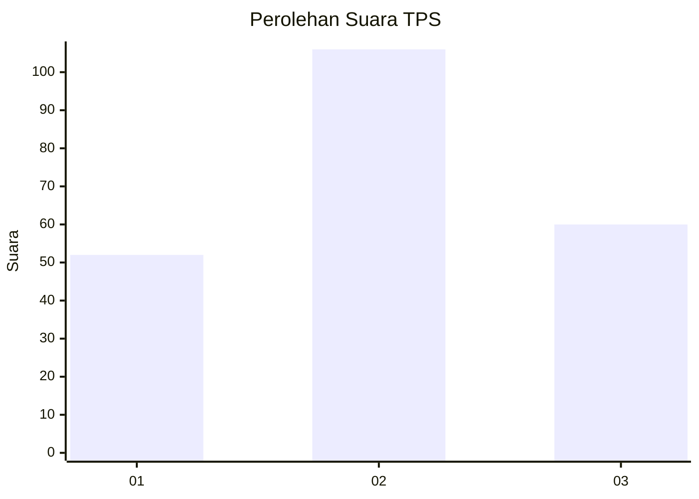
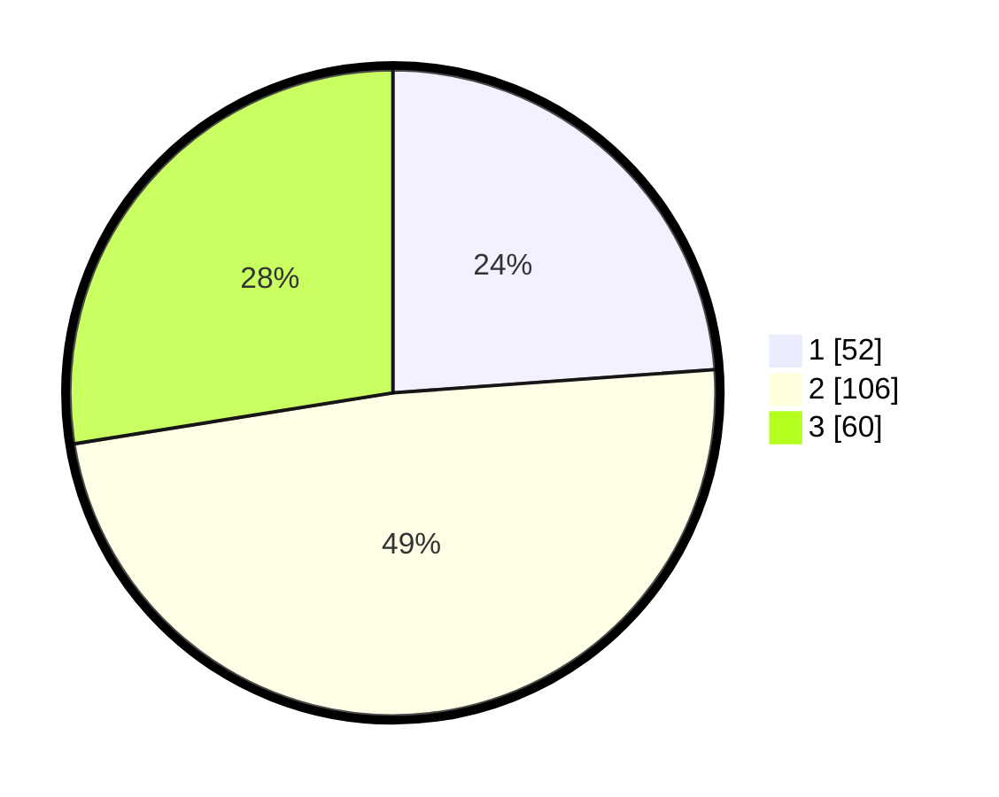

# Hasil

## Grafik

## Tabel

| No. | Nama Paslon    | Suara | Suara (raw) | Persentase |
|:--- |:-------------- | -----:| -----------:| ----------:|
| 1   | ANIES MUHAIMIN | 52    | [52][p-1]   | 23,85      |
| 2   | PRABOWO GIBRAN | 106   | [106][p-2]  | 48,62      |
| 3   | GANJAR MAHFUD  | 60    | [60][p-3]   | 27,52      |

[p-1]: https://github.com/gigit-pemilu/pemilu-2024-34-di-yogyakarta/blob/main/pilpres/hitung-suara/sub/34-di-yogyakarta/sub/02-bantul/sub/09-jetis/sub/2001-patalan/sub/020-tps/sub/paslon-1.txt
[p-2]: https://github.com/gigit-pemilu/pemilu-2024-34-di-yogyakarta/blob/main/pilpres/hitung-suara/sub/34-di-yogyakarta/sub/02-bantul/sub/09-jetis/sub/2001-patalan/sub/020-tps/sub/paslon-2.txt
[p-3]: https://github.com/gigit-pemilu/pemilu-2024-34-di-yogyakarta/blob/main/pilpres/hitung-suara/sub/34-di-yogyakarta/sub/02-bantul/sub/09-jetis/sub/2001-patalan/sub/020-tps/sub/paslon-3.txt

## Foto C Plano

https://sirekap-obj-formc.kpu.go.id/7c8b/pemilu/ppwp/34/02/09/20/01/3402092001020-20240216-152016--728603ed-fa01-4519-a6d5-f1fddefb9965.jpg

https://sirekap-obj-formc.kpu.go.id/7c8b/pemilu/ppwp/34/02/09/20/01/3402092001020-20240216-152130--cfb95cf4-871d-4540-852f-ff8f08ac6c5e.jpg

https://sirekap-obj-formc.kpu.go.id/7c8b/pemilu/ppwp/34/02/09/20/01/3402092001020-20240216-152246--abfd2c46-3c1c-4bbf-af73-da9cf99edd9e.jpg

## Metadata

| Key        | Value               |
| ---------- | ------------------- |
| Time Stamp | 2024-02-24 22:31:28 |

