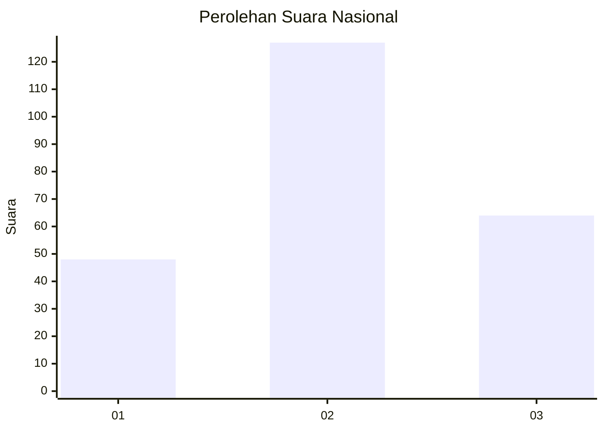
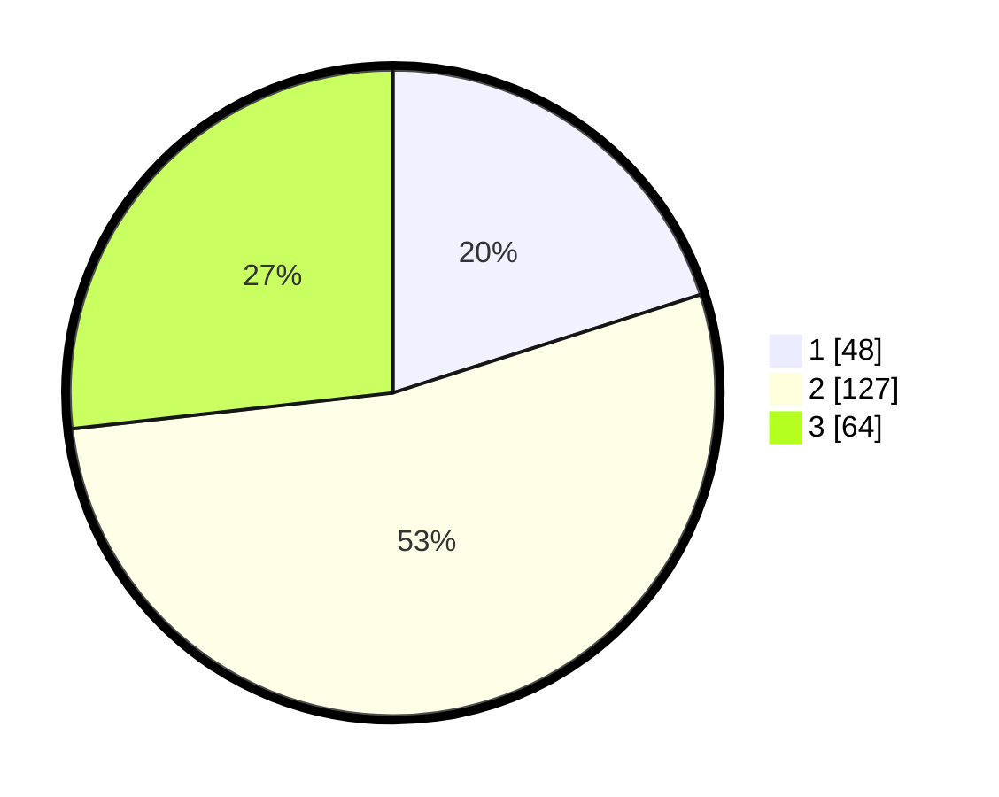

# Hasil

## Grafik

## Tabel

| No. | Nama Paslon    | Suara | Suara (raw) | Persentase |
|:--- |:-------------- | -----:| -----------:| ----------:|
| 1   | ANIES MUHAIMIN | 48    | [48][p-1]   | 20,08      |
| 2   | PRABOWO GIBRAN | 127   | [127][p-2]  | 53,14      |
| 3   | GANJAR MAHFUD  | 64    | [64][p-3]   | 26,78      |

[p-1]: https://github.com/gigit-pemilu/pemilu-2024/blob/main/pilpres/hitung-suara/sub/34-di-yogyakarta/sub/02-bantul/sub/09-jetis/sub/2001-patalan/sub/030-tps/sub/paslon-1.txt
[p-2]: https://github.com/gigit-pemilu/pemilu-2024/blob/main/pilpres/hitung-suara/sub/34-di-yogyakarta/sub/02-bantul/sub/09-jetis/sub/2001-patalan/sub/030-tps/sub/paslon-2.txt
[p-3]: https://github.com/gigit-pemilu/pemilu-2024/blob/main/pilpres/hitung-suara/sub/34-di-yogyakarta/sub/02-bantul/sub/09-jetis/sub/2001-patalan/sub/030-tps/sub/paslon-3.txt

## Foto C Plano

https://sirekap-obj-formc.kpu.go.id/5995/pemilu/ppwp/34/02/09/20/01/3402092001030-20240214-213559--29a1a362-debe-4f6d-a670-2242bd6e5b5f.jpg

https://sirekap-obj-formc.kpu.go.id/5995/pemilu/ppwp/34/02/09/20/01/3402092001030-20240214-213612--27596e8a-b0b5-4a88-ab72-8b55c810556f.jpg

https://sirekap-obj-formc.kpu.go.id/5995/pemilu/ppwp/34/02/09/20/01/3402092001030-20240214-220923--e6434e57-768f-46e6-abca-8a8c047de7bc.jpg

## Metadata

| Key        | Value               |
| ---------- | ------------------- |
| Time Stamp | 2024-02-15 00:41:44 |

