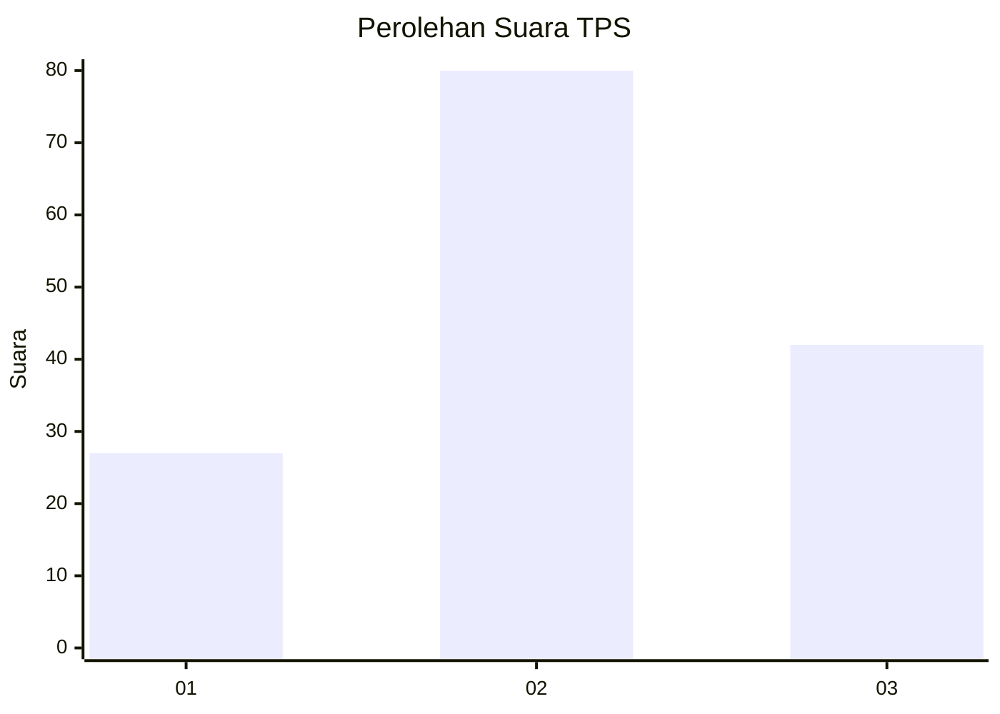
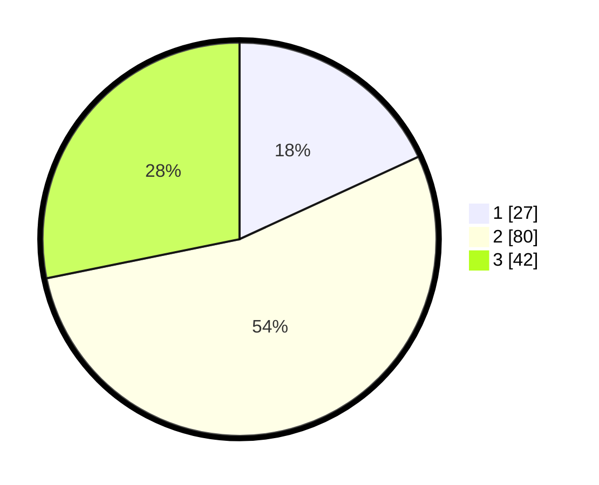

# Hasil

## Grafik

## Tabel

| No. | Nama Paslon    | Suara | Suara (raw) | Persentase |
|:--- |:-------------- | -----:| -----------:| ----------:|
| 1   | ANIES MUHAIMIN | 27    | [27][p-1]   | 18,12      |
| 2   | PRABOWO GIBRAN | 80    | [80][p-2]   | 53,69      |
| 3   | GANJAR MAHFUD  | 42    | [42][p-3]   | 28,19      |

[p-1]: https://github.com/gigit-pemilu/pemilu-2024-34-di-yogyakarta/blob/main/pilpres/hitung-suara/sub/34-di-yogyakarta/sub/02-bantul/sub/09-jetis/sub/2001-patalan/sub/040-tps/sub/paslon-1.txt
[p-2]: https://github.com/gigit-pemilu/pemilu-2024-34-di-yogyakarta/blob/main/pilpres/hitung-suara/sub/34-di-yogyakarta/sub/02-bantul/sub/09-jetis/sub/2001-patalan/sub/040-tps/sub/paslon-2.txt
[p-3]: https://github.com/gigit-pemilu/pemilu-2024-34-di-yogyakarta/blob/main/pilpres/hitung-suara/sub/34-di-yogyakarta/sub/02-bantul/sub/09-jetis/sub/2001-patalan/sub/040-tps/sub/paslon-3.txt

## Foto C Plano

https://sirekap-obj-formc.kpu.go.id/fa3d/pemilu/ppwp/34/02/09/20/01/3402092001040-20240214-194617--6073648f-4138-4aa7-b52d-743a4f5679e7.jpg

https://sirekap-obj-formc.kpu.go.id/fa3d/pemilu/ppwp/34/02/09/20/01/3402092001040-20240214-194630--ddb4cfdc-d67a-4df7-b807-d17e041ed630.jpg

https://sirekap-obj-formc.kpu.go.id/fa3d/pemilu/ppwp/34/02/09/20/01/3402092001040-20240214-194637--10404b8e-2272-441d-86db-a1c26a0a2fd7.jpg

## Metadata

| Key        | Value               |
| ---------- | ------------------- |
| Time Stamp | 2024-02-24 22:31:28 |

