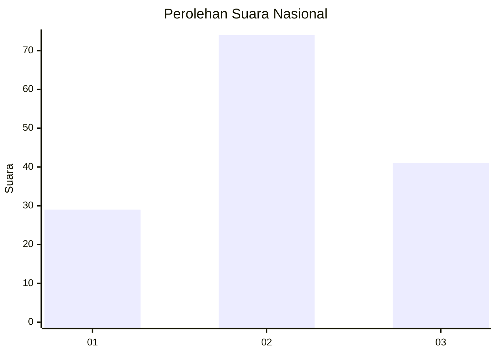
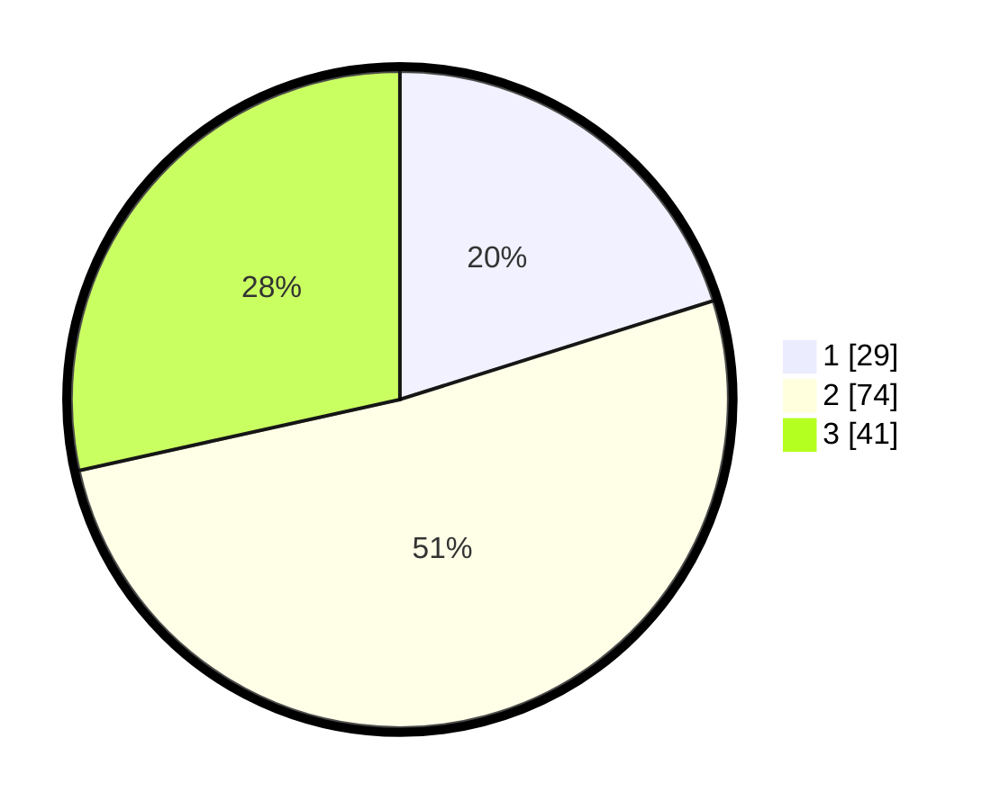

# Hasil

## Grafik

## Tabel

| No. | Nama Paslon    | Suara | Suara (raw) | Persentase |
|:--- |:-------------- | -----:| -----------:| ----------:|
| 1   | ANIES MUHAIMIN | 29    | [29][p-1]   | 20,14      |
| 2   | PRABOWO GIBRAN | 74    | [74][p-2]   | 51,39      |
| 3   | GANJAR MAHFUD  | 41    | [41][p-3]   | 28,47      |

[p-1]: https://github.com/gigit-pemilu/pemilu-2024/blob/main/pilpres/hitung-suara/sub/34-di-yogyakarta/sub/02-bantul/sub/09-jetis/sub/2002-canden/sub/004-tps/sub/paslon-1.txt
[p-2]: https://github.com/gigit-pemilu/pemilu-2024/blob/main/pilpres/hitung-suara/sub/34-di-yogyakarta/sub/02-bantul/sub/09-jetis/sub/2002-canden/sub/004-tps/sub/paslon-2.txt
[p-3]: https://github.com/gigit-pemilu/pemilu-2024/blob/main/pilpres/hitung-suara/sub/34-di-yogyakarta/sub/02-bantul/sub/09-jetis/sub/2002-canden/sub/004-tps/sub/paslon-3.txt

## Foto C Plano

https://sirekap-obj-formc.kpu.go.id/d216/pemilu/ppwp/34/02/09/20/02/3402092002004-20240214-203526--cc96fb25-28de-43b4-93c1-3e3e823e0050.jpg

https://sirekap-obj-formc.kpu.go.id/d216/pemilu/ppwp/34/02/09/20/02/3402092002004-20240214-203815--f0708802-117c-43c0-becf-bf14b42ec83d.jpg

https://sirekap-obj-formc.kpu.go.id/d216/pemilu/ppwp/34/02/09/20/02/3402092002004-20240215-010503--f7637f99-220f-40bb-bcb9-ffae8d72edf2.jpg

## Metadata

| Key        | Value               |
| ---------- | ------------------- |
| Time Stamp | 2024-02-16 17:00:00 |

