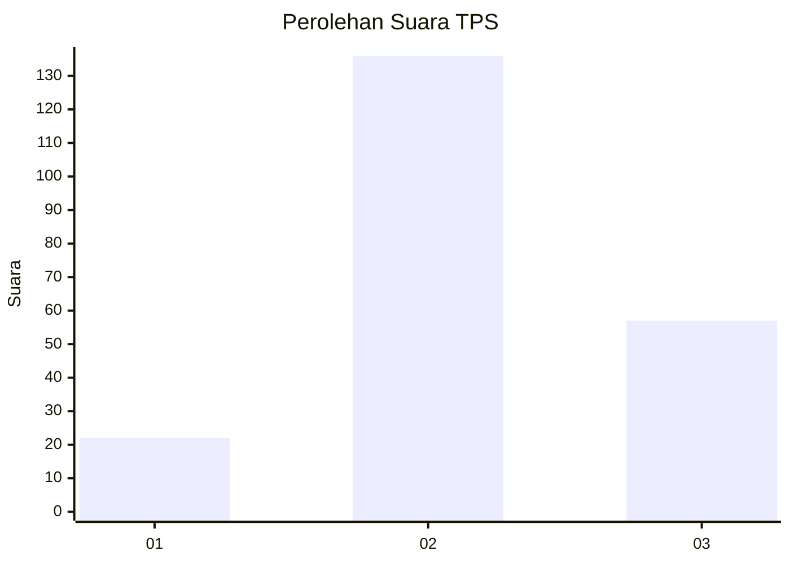
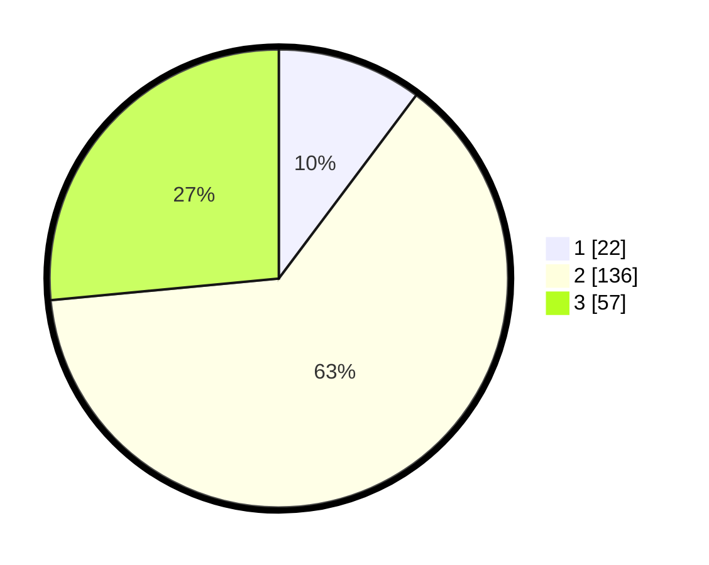

# Hasil

## Grafik

## Tabel

| No. | Nama Paslon    | Suara | Suara (raw) | Persentase |
|:--- |:-------------- | -----:| -----------:| ----------:|
| 1   | ANIES MUHAIMIN | 22    | [22][p-1]   | 10,23      |
| 2   | PRABOWO GIBRAN | 136   | [136][p-2]  | 63,26      |
| 3   | GANJAR MAHFUD  | 57    | [57][p-3]   | 26,51      |

[p-1]: https://github.com/gigit-pemilu/pemilu-2024-34-di-yogyakarta/blob/main/pilpres/hitung-suara/sub/34-di-yogyakarta/sub/02-bantul/sub/09-jetis/sub/2002-canden/sub/009-tps/sub/paslon-1.txt
[p-2]: https://github.com/gigit-pemilu/pemilu-2024-34-di-yogyakarta/blob/main/pilpres/hitung-suara/sub/34-di-yogyakarta/sub/02-bantul/sub/09-jetis/sub/2002-canden/sub/009-tps/sub/paslon-2.txt
[p-3]: https://github.com/gigit-pemilu/pemilu-2024-34-di-yogyakarta/blob/main/pilpres/hitung-suara/sub/34-di-yogyakarta/sub/02-bantul/sub/09-jetis/sub/2002-canden/sub/009-tps/sub/paslon-3.txt

## Foto C Plano

https://sirekap-obj-formc.kpu.go.id/e77f/pemilu/ppwp/34/02/09/20/02/3402092002009-20240214-225209--e91fa063-1aeb-4f1b-a7b7-0a7646c701b9.jpg

https://sirekap-obj-formc.kpu.go.id/e77f/pemilu/ppwp/34/02/09/20/02/3402092002009-20240214-224946--2f79554a-225b-4372-9d26-e22550e3fab8.jpg

https://sirekap-obj-formc.kpu.go.id/e77f/pemilu/ppwp/34/02/09/20/02/3402092002009-20240214-225622--0d1f04d4-ec0d-4fad-888b-467b6b9d8293.jpg

## Metadata

| Key        | Value               |
| ---------- | ------------------- |
| Time Stamp | 2024-02-24 22:31:28 |

