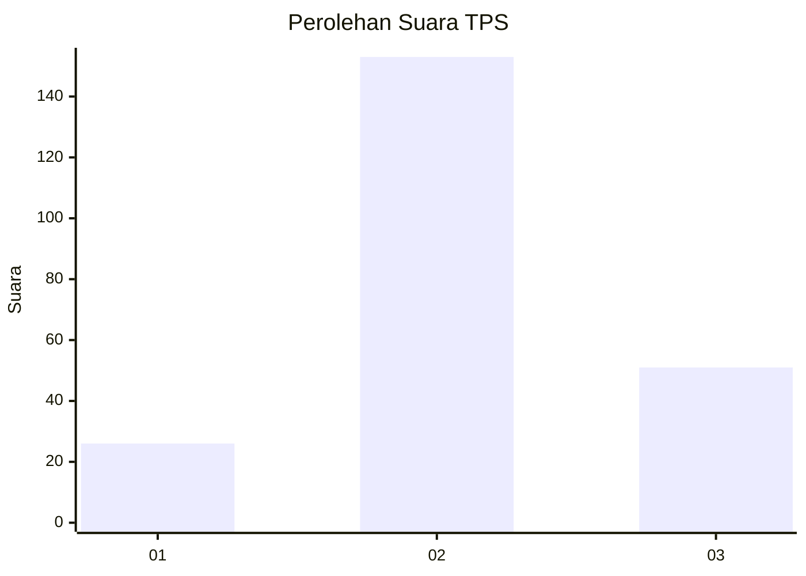
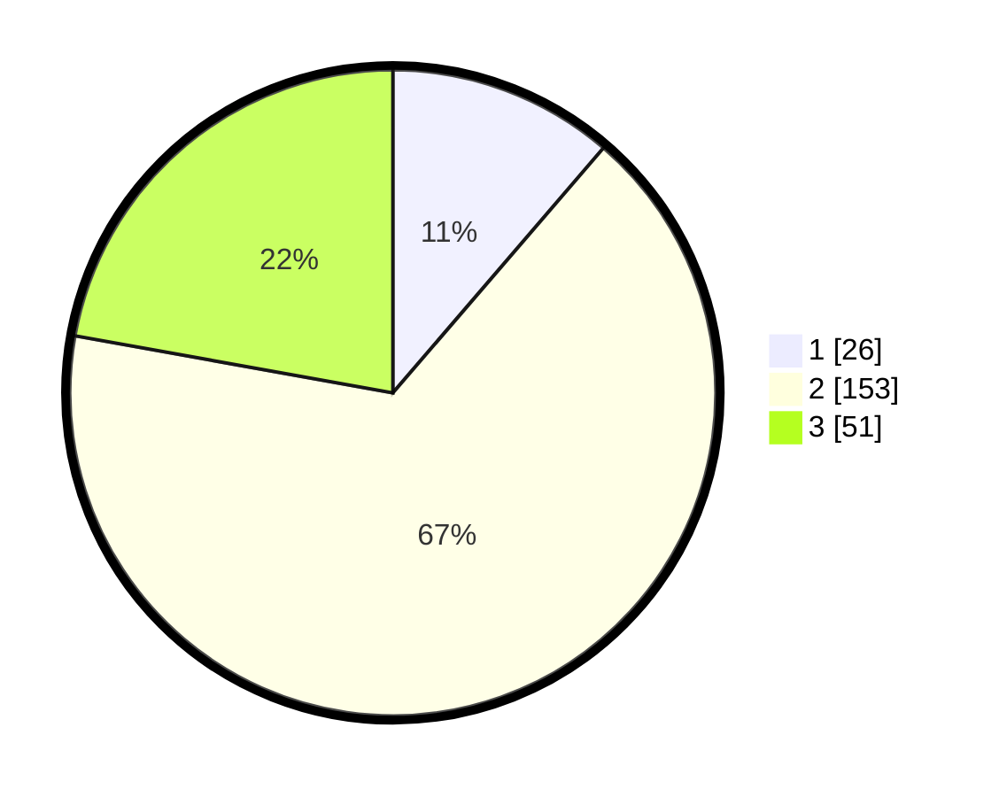

# Hasil

## Grafik

## Tabel

| No. | Nama Paslon    | Suara | Suara (raw) | Persentase |
|:--- |:-------------- | -----:| -----------:| ----------:|
| 1   | ANIES MUHAIMIN | 26    | [26][p-1]   | 11,30      |
| 2   | PRABOWO GIBRAN | 153   | [153][p-2]  | 66,52      |
| 3   | GANJAR MAHFUD  | 51    | [51][p-3]   | 22,17      |

[p-1]: https://github.com/gigit-pemilu/pemilu-2024-34-di-yogyakarta/blob/main/pilpres/hitung-suara/sub/34-di-yogyakarta/sub/02-bantul/sub/09-jetis/sub/2002-canden/sub/030-tps/sub/paslon-1.txt
[p-2]: https://github.com/gigit-pemilu/pemilu-2024-34-di-yogyakarta/blob/main/pilpres/hitung-suara/sub/34-di-yogyakarta/sub/02-bantul/sub/09-jetis/sub/2002-canden/sub/030-tps/sub/paslon-2.txt
[p-3]: https://github.com/gigit-pemilu/pemilu-2024-34-di-yogyakarta/blob/main/pilpres/hitung-suara/sub/34-di-yogyakarta/sub/02-bantul/sub/09-jetis/sub/2002-canden/sub/030-tps/sub/paslon-3.txt

## Foto C Plano

https://sirekap-obj-formc.kpu.go.id/bd7f/pemilu/ppwp/34/02/09/20/02/3402092002030-20240215-024136--eabfe1b8-1dbe-408e-bfc1-422ac8b9106c.jpg

https://sirekap-obj-formc.kpu.go.id/bd7f/pemilu/ppwp/34/02/09/20/02/3402092002030-20240215-024404--113ee9a6-a3dc-4577-a2cc-1182ffc541a4.jpg

https://sirekap-obj-formc.kpu.go.id/bd7f/pemilu/ppwp/34/02/09/20/02/3402092002030-20240215-024254--1bb54832-6e95-406b-8cb6-9e8a660d25cb.jpg

## Metadata

| Key        | Value               |
| ---------- | ------------------- |
| Time Stamp | 2024-02-25 16:00:00 |

