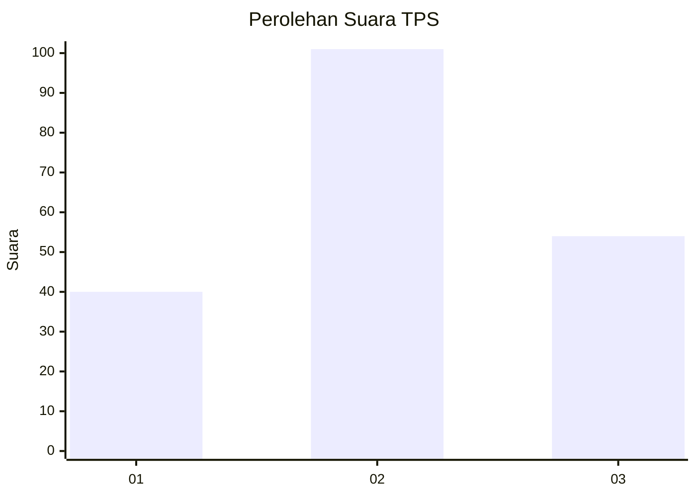
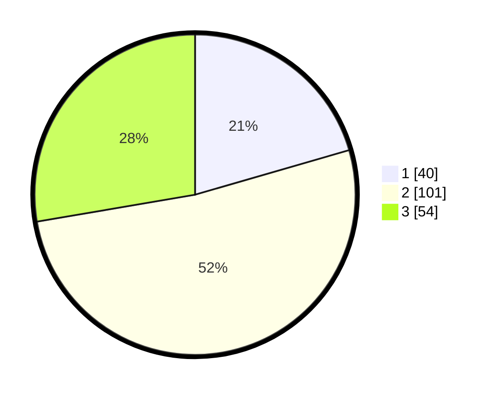

# Hasil

## Grafik

## Tabel

| No. | Nama Paslon    | Suara | Suara (raw) | Persentase |
|:--- |:-------------- | -----:| -----------:| ----------:|
| 1   | ANIES MUHAIMIN | 40    | [40][p-1]   | 20,51      |
| 2   | PRABOWO GIBRAN | 101   | [101][p-2]  | 51,79      |
| 3   | GANJAR MAHFUD  | 54    | [54][p-3]   | 27,69      |

[p-1]: https://github.com/gigit-pemilu/pemilu-2024-34-di-yogyakarta/blob/main/pilpres/hitung-suara/sub/34-di-yogyakarta/sub/02-bantul/sub/09-jetis/sub/2002-canden/sub/033-tps/sub/paslon-1.txt
[p-2]: https://github.com/gigit-pemilu/pemilu-2024-34-di-yogyakarta/blob/main/pilpres/hitung-suara/sub/34-di-yogyakarta/sub/02-bantul/sub/09-jetis/sub/2002-canden/sub/033-tps/sub/paslon-2.txt
[p-3]: https://github.com/gigit-pemilu/pemilu-2024-34-di-yogyakarta/blob/main/pilpres/hitung-suara/sub/34-di-yogyakarta/sub/02-bantul/sub/09-jetis/sub/2002-canden/sub/033-tps/sub/paslon-3.txt

## Foto C Plano

https://sirekap-obj-formc.kpu.go.id/4b97/pemilu/ppwp/34/02/09/20/02/3402092002033-20240214-162222--db7e6f6e-b46f-4368-a164-0ee34f96a006.jpg

https://sirekap-obj-formc.kpu.go.id/4b97/pemilu/ppwp/34/02/09/20/02/3402092002033-20240216-144826--41887a14-21f3-4ced-843f-8e6a7653d97b.jpg

https://sirekap-obj-formc.kpu.go.id/4b97/pemilu/ppwp/34/02/09/20/02/3402092002033-20240218-133916--e1893883-55cb-43f4-b857-8ba678d2b93f.jpg

## Metadata

| Key        | Value               |
| ---------- | ------------------- |
| Time Stamp | 2024-02-21 09:00:00 |

