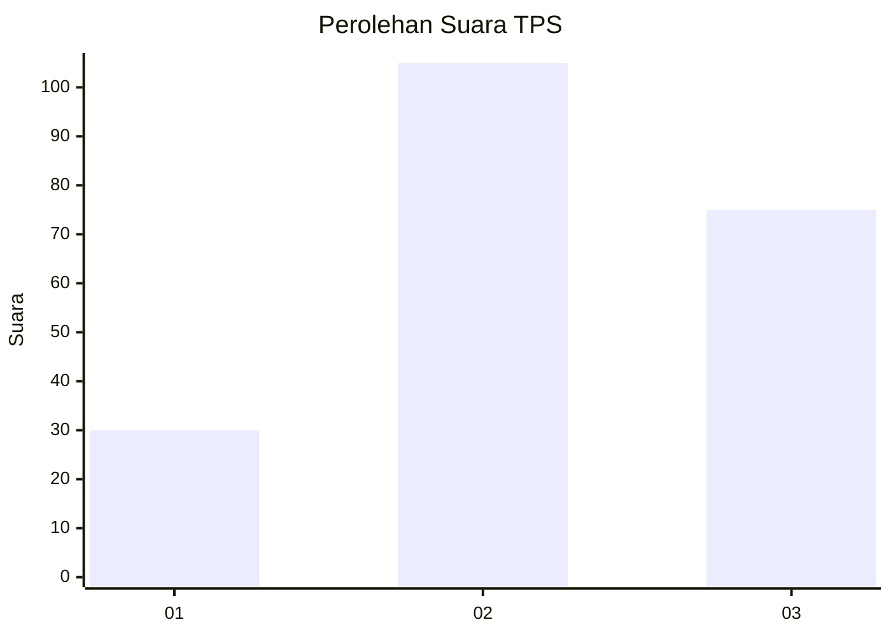
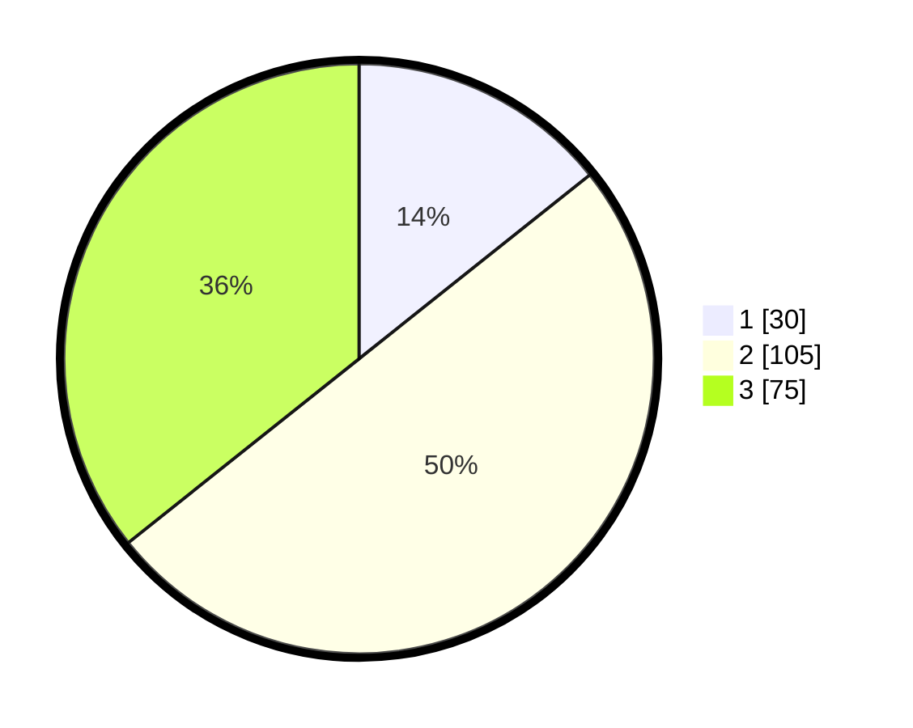

# Hasil

## Grafik

## Tabel

| No. | Nama Paslon    | Suara | Suara (raw) | Persentase |
|:--- |:-------------- | -----:| -----------:| ----------:|
| 1   | ANIES MUHAIMIN | 30    | [30][p-1]   | 14,29      |
| 2   | PRABOWO GIBRAN | 105   | [105][p-2]  | 50,00      |
| 3   | GANJAR MAHFUD  | 75    | [75][p-3]   | 35,71      |

[p-1]: https://github.com/gigit-pemilu/pemilu-2024-34-di-yogyakarta/blob/main/pilpres/hitung-suara/sub/34-di-yogyakarta/sub/02-bantul/sub/09-jetis/sub/2003-sumberagung/sub/005-tps/sub/paslon-1.txt
[p-2]: https://github.com/gigit-pemilu/pemilu-2024-34-di-yogyakarta/blob/main/pilpres/hitung-suara/sub/34-di-yogyakarta/sub/02-bantul/sub/09-jetis/sub/2003-sumberagung/sub/005-tps/sub/paslon-2.txt
[p-3]: https://github.com/gigit-pemilu/pemilu-2024-34-di-yogyakarta/blob/main/pilpres/hitung-suara/sub/34-di-yogyakarta/sub/02-bantul/sub/09-jetis/sub/2003-sumberagung/sub/005-tps/sub/paslon-3.txt

## Foto C Plano

https://sirekap-obj-formc.kpu.go.id/e964/pemilu/ppwp/34/02/09/20/03/3402092003005-20240216-142040--287e2176-9257-4b76-afe0-a3a2d0ef4a57.jpg

https://sirekap-obj-formc.kpu.go.id/e964/pemilu/ppwp/34/02/09/20/03/3402092003005-20240216-141254--d43f1e37-7aad-4bb1-9ead-40d54cf30f55.jpg

https://sirekap-obj-formc.kpu.go.id/e964/pemilu/ppwp/34/02/09/20/03/3402092003005-20240216-141348--10a5a6b1-4091-4e0a-ba49-41909165752a.jpg

## Metadata

| Key        | Value               |
| ---------- | ------------------- |
| Time Stamp | 2024-02-24 22:31:28 |

