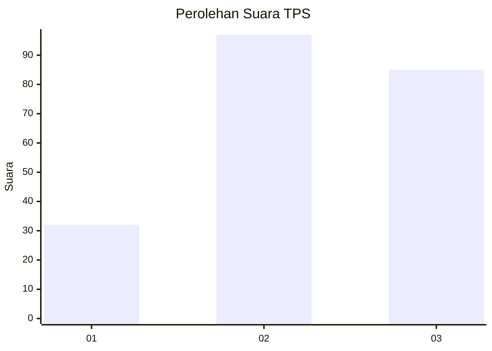
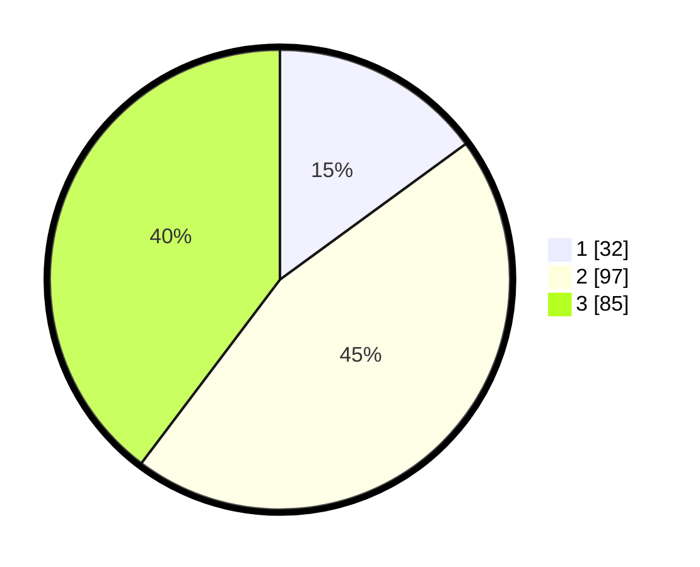

# Hasil

## Grafik

## Tabel

| No. | Nama Paslon    | Suara | Suara (raw) | Persentase |
|:--- |:-------------- | -----:| -----------:| ----------:|
| 1   | ANIES MUHAIMIN | 32    | [32][p-1]   | 14,95      |
| 2   | PRABOWO GIBRAN | 97    | [97][p-2]   | 45,33      |
| 3   | GANJAR MAHFUD  | 85    | [85][p-3]   | 39,72      |

[p-1]: https://github.com/gigit-pemilu/pemilu-2024-34-di-yogyakarta/blob/main/pilpres/hitung-suara/sub/34-di-yogyakarta/sub/02-bantul/sub/09-jetis/sub/2003-sumberagung/sub/010-tps/sub/paslon-1.txt
[p-2]: https://github.com/gigit-pemilu/pemilu-2024-34-di-yogyakarta/blob/main/pilpres/hitung-suara/sub/34-di-yogyakarta/sub/02-bantul/sub/09-jetis/sub/2003-sumberagung/sub/010-tps/sub/paslon-2.txt
[p-3]: https://github.com/gigit-pemilu/pemilu-2024-34-di-yogyakarta/blob/main/pilpres/hitung-suara/sub/34-di-yogyakarta/sub/02-bantul/sub/09-jetis/sub/2003-sumberagung/sub/010-tps/sub/paslon-3.txt

## Foto C Plano

https://sirekap-obj-formc.kpu.go.id/50e7/pemilu/ppwp/34/02/09/20/03/3402092003010-20240214-190519--dd23ffb1-42e8-4e91-a18e-a634a8ba909a.jpg

https://sirekap-obj-formc.kpu.go.id/50e7/pemilu/ppwp/34/02/09/20/03/3402092003010-20240214-190017--5d8e90ad-07bc-466d-9574-444154809a8e.jpg

https://sirekap-obj-formc.kpu.go.id/50e7/pemilu/ppwp/34/02/09/20/03/3402092003010-20240214-193834--91774698-a10b-41e4-9391-083fc3459cab.jpg

## Metadata

| Key        | Value               |
| ---------- | ------------------- |
| Time Stamp | 2024-02-25 18:00:00 |

